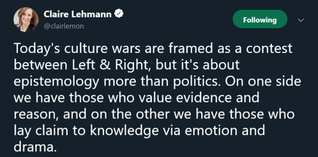
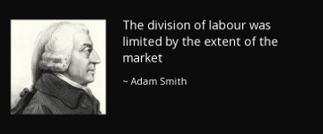

```{r setup, include=FALSE}
library(knitr)
library(tidyverse)
library(dplyr)
library(kableExtra)
library(knitr)
knitr::opts_chunk$set(echo = FALSE)

###Color Themes
color1 <- "#FFFFFF" # white
color2 <- "#00205B" # med blue
color3 <- "#0A863D" # green
color4 <- "#99999A" # gray
color5 <- "#041C2C" # Navy
```

## What is being measured here?
<center>
```{r  out.width = "77%"}
 
```
</center>

## Economic Freedom
<center>
```{r out.width = "77%"}

```
</center>

## What is Economics?

- We need to start with definitions of **resources** and **scarcity**

    - **Resources** are things that people want, either for their own sake or to use in production.
    
    - **Scarcity** is the notion that the amount resources people want is significantly less than the amount of resources that actually exist.

- **Economics**, then is the study of how people choose attain their goals in a world of scarcity.

- Considering that nearly everything is a resource, perhaps a simpler definition is:

- **Economics** is the study of all purposive human action.

## Economics has two very Different Categories

- Microeconomics
- Macroeconomics

## Microeconomics  

- Typically focuses on decisions of small (typically) economic units…
    - Individuals
    - Firms
- And how those decisions interact with the decisions of other economic units…
    - Equilibrium
    - Game Theory
    - “Law of Unintended Consequences”
- And what, if anything, to do about the outcomes
    - Free markets/Socialism
    - Regulation
    - Public goods/externalities

##  Macroeconomics 

- Looks at the economy at the aggregate level…
    - $C+I+G+NX$
    - $\dot {M} + \dot {V} = \dot {P} + \dot {Y}$
- In an attempt to understand economy-wide phenomena…
    - Unemployment
    - Inflation
    - Recessions/depressions
- And how they might be affected by policy
    - Taxation
    - Central Banking
    - Stimulus

---

### Positive vs. Normative Economics

```{r}
positive <- read.csv("texttables/positivenormative.csv")
positive <- as_tibble(positive)
positive %>% 
    kable(format = "html", table.attr = "class=\"rmdtable\"") %>% 
    column_spec(1, background = color2, color = color1)
```

## Positive vs. Normative Economics

<div style="float: left; width: 50%;">
<center>

### Positive Paradigm

<br>
<br>
<br>
<br>

```{r out.width = "80%"}

```
</center>
</div>

<div style="float: right; width: 50%;">
<center>

### Normative Paradigm

<br>

```{r out.width = "80%"}

```
</center>
</div>

## Positive vs. Normative Economics

- Which is more important—being correct factually (positive) or correct morally (normative)?

- Being correct normatively but not positively often leads to the **Law of Unintended Consequences**. 

    - **Law of Unintended Consequences**:  The notion that actions of people, and especially of governments, always have effects that are unanticipated or "unintended.“ 

- Is there a danger in being too positive?

## Positive vs. Normative Economics


```{r out.width = "49%", out.extra='style="float:right; padding:1px"'}

```


Understanding the distinction between positive and normative is often seen to be important beyond economics.

<br>
<br>

```{r out.width = "49%", out.extra='style="float:left; padding:1px"'}

```

## Positive vs. Normative Economics

- Ideally, you:
    1. Focus on getting the positive economics right, ...
    2. ... and only then do you use the positive economics to inform your normative economics.
    
- Going into the other direction leads to disastrous economic policy.
    - Recall the **Law of Unintended Consequences**.
    
## Positive vs. Normative Economics    

<div style="float: left; width: 50%;">

### Examples of Positive Statements

- A fall in incomes will lead to a rise in demand for generic, supermarket-brand food.
- Marijuana legalization will lead to lower alcohol sales.
- Higher interest rates will reduce house prices.
- If gasoline prices fall, more people will buy SUVs. 

</div>

<div style="float: right; width: 50%;">

### Examples of Normative Statements

- Socialism is the best economic system.
- The government should increase the minimum wage to $15 per hour to reduce poverty.
- Unemployment is a bigger macroeconomic problem than inflation.
- Resources are best allocated in a free market economy.

</div>

# Important Economic Concepts 

## Thinking on the Margin

Economists talk about the **margin** a lot, and it has a lot of different meanings.

- Most generally, it means "additional." Some examples in use:
  - **Marginal Cost** is the change in cost for producing one more thing.
  - **Marginal Tax Rate** is the change in total taxes owed if your income goes up by a dollar.
  - **Marginal Revenue** is the extra revenue earned by selling one more unit.

## Resources and Scarcity

Economic **resources** are used to produce goods and services. There are many categories of economic resources:

- land: raw materials and natural resources
- labor: workers
- human capital: the experience, education, skills posessed by labor
- physical capital: buildings, machinery, factories, equipment
- time
- ideas: technology, scientific know-how, etc

For the most part, each of the resources exists in a finite, limited quantity.

## Resources and Scarcity

- Economists assume that people have **unlimited wants**. 
    - There is always something that people want more of. 
- How can unlimited wants be satisfied with limited resources? 
- This concept is what we define as scarcity and much of economics looks at how people cope with scarcity.

## Resources and Scarcity

<center>
```{r out.width = "80%"}

```
</center>

## Opportunity Cost

- An implication of scarcity is **Opportunity Cost**.

- **Opportunity Cost** refers to the value of the next best opportunity and is how economists think of cost.

- There is a big difference between opportunity cost and how most people think about cost.

## Opportunity Cost

"There ain't no such thing as a free lunch." 

<center>
```{r out.width = "80%"}

```
</center>

## Tradeoffs

```{r out.width = "39%", out.extra='style="float:right; padding:1px"'}

```

- Another way to think about the ideas of **Scarcity** and **Opportunity Cost** together is that they imply that all human action involves tradeoffs.

- Because everybody is different, we all face different tradeoffs and opportunity costs for the things we do, *even if we are doing the same thing*.

- This fact gives rise to the concept of **Comparative Advantage**

---

### Comparative Advantage vs. Absolute Advantage

The "normal" concept of being "better than" somebody else at doing things is called **Absolute Advantage**.

- **Absolute Advantage**: The ability to produce something more cheaply than someone else, where more cheaply means using less time or resources.  This *is not* opportunity cost.

---

### Comparative Advantage vs. Absolute Advantage

But opportunity cost implies that **Comparative Advantage**, not absolute advantage, is the more important idea.

- **Comparative Advantage**: The ability to produce an item more cheaply than someone else, where cheaply means giving up producing fewer other goods.  This *is* opportunity cost.

---

### Comparative Advantage vs. Absolute Advantage

Assume a 2 country, 2 good world in which the only resource needed for production is time.

- Let's say that in Japan it takes 1 hour to produce a computer or 1 hour to produce a shirt.
- Assume that in Vietnam, it takes 12 hours to produce a computer and 2 hours to produce a shirt.

```{r}
d <- read.csv("texttables/compadvantage1.csv")
d <- as_tibble(d)
d %>% 
    kable(format = "html", table.attr = "class=\"rmdtable\"", col.names = c("Country",
                           "Labor to make 1 Computer", "Labor to make 1 Shirt")) %>% 
    column_spec(1, background = color2, color = color1)
```


---

### Comparative Advantage vs. Absolute Advantage

```{r}
d %>% 
    kable(format = "html", table.attr = "class=\"rmdtable\"", col.names = c("Country",
                           "Labor to make 1 Computer", "Labor to make 1 Shirt")) %>% 
    column_spec(1, background = color2, color = color1)
```

In this example: 

- Who has an absolute advantage in making computers? Shirts?
- Who has the comparative advantage in making computers? Shirts?

---

### Comparative Advantage vs. Absolute Advantage

```{r}
d %>% 
    kable(format = "html", table.attr = "class=\"rmdtable\"", col.names = c("Country",
                           "Labor to make 1 Computer", "Labor to make 1 Shirt")) %>% 
    column_spec(1, background = color2, color = color1)
```

<br>

Suppose that both Japan and Vietnam are allocating 12 hours to each task.

Output is:

- Japan produces 12 computers and 12 shirts
- Vietnam produces 1 computer and 6 shirts 
- World production is 13 computers and 18 shirts

---

### Comparative Advantage vs. Absolute Advantage

```{r}
d %>% 
    kable(format = "html", table.attr = "class=\"rmdtable\"", col.names = c("Country",
                           "Labor to make 1 Computer", "Labor to make 1 Shirt")) %>% 
    column_spec(1, background = color2, color = color1)
```

<br>

What if each country **specializes** in what they are good at? Suppose Japan spends 14 hours making computers and 10 making shirts and Vietnam spends 24 hours making shirts.

Total output goes up! 

- from 13 computers to 14 computers 
- from 18 shirts up to 22.  


---

### Comparative Advantage vs. Absolute Advantage

<div style="float: left; width: 40%;">

Before Specialization:

```{r}
d <- read.csv("texttables/compadvantage2.csv")
d <- as_tibble(d)
d %>% 
    kable(format = "html", table.attr = "class=\"rmdtable\"", col.names = c("Country",
                           "Computers", "Shirts")) %>% 
    column_spec(1, background = color2, color = color1)
```


</div>

<div style="float: right; width: 40%;">

After Specialization:

```{r}
d <- read.csv("texttables/compadvantage3.csv")
d <- as_tibble(d)
d %>% 
    kable(format = "html", table.attr = "class=\"rmdtable\"", col.names = c("Country",
                           "Computers", "Shirts")) %>% 
    column_spec(1, background = color2, color = color1)
```

</div>

<div style="float: center; width: 100%;">

<br>
<br>
<br>
<br>
<br>
<br>
<br>


What if Japan trades 1 computer for 3 shirts?

```{r}
d <- read.csv("texttables/compadvantage4.csv")
d <- as_tibble(d)
d %>% 
    kable(format = "html", table.attr = "class=\"rmdtable\"", col.names = c("Country",
                           "Computers", "Shirts")) %>% 
    column_spec(1, background = color2, color = color1)
```

*Now, both Japan AND Vietnam have more stuff than before!*

</div>

## The Nature of Exchange

This example highlights some important observations about trade and exchange:

- Trade is nearly always **mutually beneficial**.
- Trade is not **zero-sum**.
  - **Zero-sum** refers to a “game” or situation in which whatever is gained by one side is lost by the other.

As a result, it makes little sense to talk about “winners” and “losers” of trade because both sides tend to win.


## Division of Labor

The gains from **Specialization** & **Trade** here is due to differing innate abilities.

Further gains are likely to come from:

```{r out.width = "49%", out.extra='style="float:right; padding:1px"'}

```
<br>

- Learning by Doing
- Economies of Scale
- Competition generated by trade

<br>

Each of which will tend to increase the comparative advantage of *both* countries, increasing the gains from trade.


