```{r setup, include=FALSE}
library(knitr)
library(tidyverse)
library(dplyr)
library(kableExtra)
library(ggthemes)
library(ggpubr)
library(quantmod) # Gets FRED data
library(WDI) # World Development Indicators
theme_set(theme_classic())
knitr::opts_chunk$set(echo = FALSE, dev.args=list(bg="transparent"))

demand <- tibble(p = c(2,8), q = c(8,2))
demandright <- tibble(p = c(3,9), q = c(9,3))
demandleft <- tibble(p = c(1,7), q = c(7,1))
supply <- tibble(p=c(2,8), q=c(2,8))
supplyright <- tibble(p=c(1,7), q=c(3,9))
supplyleft <- tibble(p = c(3,9), q = c(1, 7))

###Color Themes
color1 <- "#FFFFFF" # white
color2 <- "#00205B" # med blue
color3 <- "#0A863D" # green
color4 <- "#99999A" # gray
color5 <- "#041C2C" # Navy

######
# 
# demand <- tibble(p= c(2,8), q=c(8,2))
# demandright <- tibble(p = c(3,9), q = c(9,3))
# demandleft <- tibble(p = c(1,7), q = c(7,1))
# supply <- tibble(p=c(2,8), q=c(2,8))
# supplyright <- tibble(p=c(1,7), q=c(3,9))
# supplyleft <- tibble(p = c(3,9), q = c(1, 7))

```
# Supply and Demand
## Demand

- **Demand**: The relationship between the price of a good and the amount of that good that consumers are willing and able to purchase.

- **Demand Schedule**: A table that shows the relationship between the price of a good and the quantity demanded at each price. 

- **Demand Curve**: A graphical representation of demand, drawn with **price** on the y-axis and **quantity** on the x-axis

## Demand Schedules, Demand Curves


```{r}
q <- 1:10
d <- tibble(q, p = 55 - 5*q)
rm(q)
d %>% 
    kable(format = "html", table.attr = "class=\"rmdtable\"", col.names = c("Quantity",
                           "Price")) %>% 
    kable_styling(full_width = F, position = "float_left")

```
```{r, fig.width=5,fig.height=5, out.extra='style="float:right; padding:1px"'}

d %>% 
    ggplot(aes(y = p, x = q)) +
    geom_point(size = 4, color = color2) +
    geom_line(color = color3) +
    labs(y = "Price",
         x = "Quantity") +
    scale_x_continuous(breaks=c(0,2,4,6,8,10)) +
    scale_y_continuous(breaks=c(0,10,20,30,40,50)) +
    annotate(geom = "text", x = 8.7, y = 20, label = "Demand", color = color2) +
    theme_classic()

```

The demand curve on the right...
<br>
<br>
<br>
...plots the data from the demand schedule on the left.

## The Law of Demand

All Demand curves slope downward. There are two primary reasons for this phenomenon

- **Substitution Effect**: The more expensive a good is, the more consumers switch and purchase a substitute product. 
- **Income Effect**: The more expensive a good is, the less consumers can afford.

## Supply

- **Supply**: The relationship between the price of a good and the amount of that good that producers are willing and able to sell.

- **Supply Schedule**: A table that shows the relationship between the price of a good and the quantity supplied at each price. 

- **Supply Curve**: A graphical representation of supply, drawn with **price** on the y-axis and **quantity** on the x-axis

## Supply Schedules, Supply Curves


```{r}
q <- 1:10
s <- tibble(q, p = 5*q)
rm(q)
s %>% 
    kable(format = "html", table.attr = "class=\"rmdtable\"", col.names = c("Quantity",
                           "Price")) %>% 
    kable_styling(full_width = F, position = "float_left")

```
```{r, fig.width=5,fig.height=5, out.extra='style="float:right; padding:1px"'}

s %>% 
    ggplot(aes(y = p, x = q)) +
    geom_point(size = 4, color = color2) +
    geom_line(color = color3) +
    labs(y = "Price",
         x = "Quantity") +
    scale_x_continuous(breaks=c(0,2,4,6,8,10)) +
    scale_y_continuous(breaks=c(0,10,20,30,40,50)) +

theme_classic()

```

The supply curve on the right...
<br>
<br>
<br>
...plots the data from the supply schedule on the left.

## The Law of Supply

All Supply curves slope upward. The primary reason for this phenomenon is:

- **Increasing Opportunity Costs**: As the price of a product rises, more people find it profitable to produce it. 

## Equilibrium
<div style="float: left; width: 50%;">

- The intersection of supply and demand is called the market’s **equilibrium** 
- In **equilibrium**, quantity supplied equals quantity demanded
- This quantity is called the **equilibrium quantity** 
- Note that this only occurs at a specific price 
- This price is called the **equilibrium price**, or the **market price**
- Markets have a tendency to converge toward the **equilibrium**

</div>
```{r fig.width=5,fig.height=5, out.extra='style="float:right; padding:1px"'}


ggplot(mapping = aes(x = q, y = p)) + 
    ## Base Graph Begin**
    geom_path(data = demand, color = color2, size = 1.2) + 
    annotate("text", x=8.4, y=2, label = "D[1]", color = color2, size = 6, parse = TRUE) +
    geom_path(data = supply, color = color3, size = 1.2) + 
    annotate("text", x=8.4, y=8, label = "S[1]", color = color3, size = 6, parse = TRUE) +
    coord_equal() +
    theme_classic(base_family = "sans") +
    theme(plot.title = element_text(size = rel(1.4))) +
    ## End Base Graph ##
    ## Graph Labels -- Change title and subtitle as needed ##
    labs(x = "Quantity", y = "Price",
         title = "Supply and Demand",
         subtitle = "Markets tend toward equilibrium") + # Subtitle
    
    ##editing the x and y axes for the equilibria.  If dots aren't needed, still need to keep limit and expand##
    scale_x_continuous(expand = c(0,0), limit = c(0,10), breaks = c(5), labels = expression(Q[1])) + ## Set breaks = equilibrium Q
    scale_y_continuous(expand = c(0,0), limit = c(0,10), breaks = c(5), labels = expression(P[1])) + ## Set breaks = equilibrium Q
  
    ## Dashed Lines for equilibria
    
    annotate("segment", x=0, xend = 5, y = 5, yend = 5, linetype = "dotted") + # horizontal line
    annotate("segment", x=5, xend = 5, y = 0, yend = 5, linetype = "dotted") # vertical line


```

## Equilibrium

The fact that markets tend toward equilibrium is a very powerful result

- This means that the model of Supply and Demand is **predictive**.

What creates this tendency?

- This is the role of **prices** in the economy

## Prices and Equilibrium

<div style="float: left; width: 50%;">

To see how prices lead to equilibrium, imagine the price is not $P_{1}$ but rather is higher: $P_{H}$.

- At price $P_{H}$, the quantity buyers want to purchase is $Q_{D}$, which is considerably less than the amount Suppliers want to sell, which is $Q_{S}$
  - This is called a **Surplus** or **Excess Supply**
- In order to sell their products, suppliers are forced to compete with each other. 


</div>
```{r fig.width=5,fig.height=5, out.extra='style="float:right; padding:1px"'}


ggplot(mapping = aes(x = q, y = p)) + 
    ## Base Graph Begin**
    geom_path(data = demand, color = color2, size = 1.2) + 
    annotate("text", x=8.4, y=2, label = "D[1]", color = color2, size = 6, parse = TRUE) +
    geom_path(data = supply, color = color3, size = 1.2) + 
    annotate("text", x=8.4, y=8, label = "S[1]", color = color3, size = 6, parse = TRUE) +
    geom_bracket(xmin = 3, xmax = 7, y.position = 7.5, label = "Surplus", tip.length = .05) +
    coord_equal() +
    theme_classic(base_family = "sans") +
    theme(plot.title = element_text(size = rel(1.4))) +
    ## End Base Graph ##
    ## Graph Labels -- Change title and subtitle as needed ##
    labs(x = "Quantity", y = "Price",
         title = "Supply and Demand",
         subtitle = expression(paste("If ", Q[D], "<", Q[S], ", there is a surplus"))) + # Subtitle
    
    ##editing the x and y axes for the equilibria.  If dots aren't needed, still need to keep limit and expand##
    scale_x_continuous(expand = c(0,0), limit = c(0,10), breaks = c(3,5,7), labels = expression(Q[D],Q[1], Q[S])) + ## Set breaks = equilibrium Q
    scale_y_continuous(expand = c(0,0), limit = c(0,10), breaks = c(5,7), labels = expression(P[1], P[H])) + ## Set breaks = equilibrium Q
  
    ## Dashed Lines for equilibria
    
    annotate("segment", x=0, xend = 5, y = 5, yend = 5, linetype = "dotted") + # horizontal line
    annotate("segment", x=5, xend = 5, y = 0, yend = 5, linetype = "dotted") + # vertical line
    annotate("segment", x=0, xend = 7, y = 7, yend = 7, linetype = "dotted") + # horizontal line
    annotate("segment", x=3, xend = 3, y = 0, yend = 7, linetype = "dotted") + # vertical line
    annotate("segment", x=7, xend = 7, y = 0, yend = 7, linetype = "dotted") # vertical line


```


## Prices and Equilibrium

<div style="float: left; width: 50%;">

- While there are many ways suppliers compete with each other, one of the simplest is to simply lower your price.
- As prices fall from $P_{H}$ toward $P_{1}$, $Q_{S}$ and $Q_{D}$ converge back toward $Q_{1}$
- The downward pressure on prices ends when the price is $P_{1}$

</div>
```{r fig.width=5,fig.height=5, out.extra='style="float:right; padding:1px"'}


ggplot(mapping = aes(x = q, y = p)) + 
    ## Base Graph Begin**
    geom_path(data = demand, color = color2, size = 1.2) + 
    annotate("text", x=8.4, y=2, label = "D[1]", color = color2, size = 6, parse = TRUE) +
    geom_path(data = supply, color = color3, size = 1.2) + 
    annotate("text", x=8.4, y=8, label = "S[1]", color = color3, size = 6, parse = TRUE) +
    geom_bracket(xmin = 3, xmax = 7, y.position = 7.5, label = "Surplus", tip.length = .05) +
    coord_equal() +
    theme_classic(base_family = "sans") +
    theme(plot.title = element_text(size = rel(1.4))) +
    ## End Base Graph ##
    ## Graph Labels -- Change title and subtitle as needed ##
    labs(x = "Quantity", y = "Price",
         title = "Supply and Demand",
         subtitle = "Market forces push prices down when there is a surplus") + # Subtitle
    ## Down arrow
       annotate("segment", x = .4, xend = .4, y = 6.8, yend = 5.2,
             arrow = arrow(length = unit(1, "lines")), colour = color4, size = 1) +    
    ##editing the x and y axes for the equilibria.  If dots aren't needed, still need to keep limit and expand##
    scale_x_continuous(expand = c(0,0), limit = c(0,10), breaks = c(3,5,7), labels = expression(Q[D],Q[1], Q[S])) + ## Set breaks = equilibrium Q
    scale_y_continuous(expand = c(0,0), limit = c(0,10), breaks = c(5,7), labels = expression(P[1], P[H])) + ## Set breaks = equilibrium Q
  
    ## Dashed Lines for equilibria

    annotate("segment", x=0, xend = 5, y = 5, yend = 5, linetype = "dotted") + # horizontal line
    annotate("segment", x=5, xend = 5, y = 0, yend = 5, linetype = "dotted") + # vertical line
    annotate("segment", x=0, xend = 7, y = 7, yend = 7, linetype = "dotted") + # horizontal line
    annotate("segment", x=3, xend = 3, y = 0, yend = 7, linetype = "dotted") + # vertical line
    annotate("segment", x=7, xend = 7, y = 0, yend = 7, linetype = "dotted") # vertical line


```


## Prices and Equilibrium

<div style="float: left; width: 50%;">

What happens if the price is too low?  Now, imagine the price is not $P_{1}$ but instead is lower: $P_{L}$.

- At price $P_{L}$, the quantity buyers want to purchase is $Q_{D}$, which is a lot more than the amount Suppliers want to sell, which is $Q_{S}$
  - This is called a **Shortage** or **Excess Demand**
- Now, buyers are forced to compete with each other to convince sellers to sell to them.


</div>
```{r fig.width=5,fig.height=5, out.extra='style="float:right; padding:1px"'}


ggplot(mapping = aes(x = q, y = p)) + 
    ## Base Graph Begin**
    geom_path(data = demand, color = color2, size = 1.2) + 
    annotate("text", x=8.4, y=2, label = "D[1]", color = color2, size = 6, parse = TRUE) +
    geom_path(data = supply, color = color3, size = 1.2) + 
    annotate("text", x=8.4, y=8, label = "S[1]", color = color3, size = 6, parse = TRUE) +
    geom_bracket(xmin = 3, xmax = 7, y.position = 2.5, label = "Shortage", tip.length = -.05, vjust = 3) +
    coord_equal() +
    theme_classic(base_family = "sans") +
    theme(plot.title = element_text(size = rel(1.4))) +
    ## End Base Graph ##
    ## Graph Labels -- Change title and subtitle as needed ##
    labs(x = "Quantity", y = "Price",
         title = "Supply and Demand",
         subtitle = expression(paste("If ", Q[S], "<", Q[D], ", there is a shortage"))) + # Subtitle
    
    ##editing the x and y axes for the equilibria.  If dots aren't needed, still need to keep limit and expand##
    scale_x_continuous(expand = c(0,0), limit = c(0,10), breaks = c(3,5,7), labels = expression(Q[S],Q[1], Q[D])) + ## Set breaks = equilibrium Q
    scale_y_continuous(expand = c(0,0), limit = c(0,10), breaks = c(5,3), labels = expression(P[1], P[L])) + ## Set breaks = equilibrium Q
  
    ## Dashed Lines for equilibria
    
    annotate("segment", x=0, xend = 5, y = 5, yend = 5, linetype = "dotted") + # horizontal line
    annotate("segment", x=5, xend = 5, y = 0, yend = 5, linetype = "dotted") + # vertical line
    annotate("segment", x=0, xend = 7, y = 3, yend = 3, linetype = "dotted") + # horizontal line
    annotate("segment", x=3, xend = 3, y = 0, yend = 3, linetype = "dotted") + # vertical line
    annotate("segment", x=7, xend = 7, y = 0, yend = 3, linetype = "dotted") # vertical line


```

## Prices and Equilibrium

<div style="float: left; width: 50%;">

- Demanders competing against each other creates a bidding war, putting upward pressure on the price.
- As prices rise from $P_{L}$ toward $P_{1}$, $Q_{S}$ and $Q_{D}$ converge back toward $Q_{1}$
- The upward pressure on prices ends when the price is $P_{1}$


</div>

```{r fig.width=5,fig.height=5, out.extra='style="float:right; padding:1px"'}


ggplot(mapping = aes(x = q, y = p)) + 
    ## Base Graph Begin**
    geom_path(data = demand, color = color2, size = 1.2) + 
    annotate("text", x=8.4, y=2, label = "D[1]", color = color2, size = 6, parse = TRUE) +
    geom_path(data = supply, color = color3, size = 1.2) + 
    annotate("text", x=8.4, y=8, label = "S[1]", color = color3, size = 6, parse = TRUE) +
    geom_bracket(xmin = 3, xmax = 7, y.position = 2.5, label = "Shortage", tip.length = -.05, vjust = 3) +
    coord_equal() +
    theme_classic(base_family = "sans") +
    theme(plot.title = element_text(size = rel(1.4))) +
    ## End Base Graph ##
    ## Down arrow
   annotate("segment", x = .4, xend = .4, y = 3.2, yend = 4.8,
             arrow = arrow(length = unit(1, "lines")), colour = color4, size = 1) +    

    ## Graph Labels -- Change title and subtitle as needed ##
    labs(x = "Quantity", y = "Price",
         title = "Supply and Demand",
         subtitle = "Market forces push prices up when there is a shortage") + # Subtitle
    
    ##editing the x and y axes for the equilibria.  If dots aren't needed, still need to keep limit and expand##
    scale_x_continuous(expand = c(0,0), limit = c(0,10), breaks = c(3,5,7), labels = expression(Q[S],Q[1], Q[D])) + ## Set breaks = equilibrium Q
    scale_y_continuous(expand = c(0,0), limit = c(0,10), breaks = c(5,3), labels = expression(P[1], P[L])) + ## Set breaks = equilibrium Q
  
    ## Dashed Lines for equilibria
    
    annotate("segment", x=0, xend = 5, y = 5, yend = 5, linetype = "dotted") + # horizontal line
    annotate("segment", x=5, xend = 5, y = 0, yend = 5, linetype = "dotted") + # vertical line
    annotate("segment", x=0, xend = 7, y = 3, yend = 3, linetype = "dotted") + # horizontal line
    annotate("segment", x=3, xend = 3, y = 0, yend = 3, linetype = "dotted") + # vertical line
    annotate("segment", x=7, xend = 7, y = 0, yend = 3, linetype = "dotted") # vertical line


```

# Ceteris Paribus
## Ceteris Paribus

**Ceteris Paribus** is a Latin phrase that means "all else equal."  Economists use the expression *ceteris paribus* a lot!

- A demand curve only looks at the relationship between the price of a product and how much people will buy, but price is not the only thing that affects how much of that product people will buy!  

  -This is true of supply as well
  
## Ceteris Paribus
  
- When we draw a supply or demand curve, we are holding all those other factors constant, hence *ceteris paribus*

- If these other factors change, the entire curve shifts.

  - An *increase* in demand and/or supply is modelled as a shift to the *right*

  - A *decrease* in demand and/or supply is modelled as a shift to the *left*

## Increases in Supply/Demand

```{r fig.width=5,fig.height=5, out.extra='style="float:left; padding:1px"'}
ggplot(mapping = aes(x = q, y = p)) + 
    ## Base Graph Begin**
    geom_path(data = demand, color = color2, size = 1.2) + 
    annotate("text", x=8.4, y=2, label = "D[1]", color = color2, size = 6, parse = TRUE) +
    geom_path(data = supply, color = color3, size = 1.2) + 
    annotate("text", x=8.4, y=8, label = "S[1]", color = color3, size = 6, parse = TRUE) +
    coord_equal() +
    theme_classic(base_family = "sans") +
    theme(plot.title = element_text(size = rel(1.4))) +
    ## End Base Graph ##
    
    ## Demand Right Shift ##
    geom_path(data = demandright, color = color2, size = 1.2, linetype = "dashed") + 
    annotate("text", x=9.4, y=3, label = "D[2]", color = color2, size = 6, parse = TRUE) +
    annotate("segment", x = 3.2, xend = 3.8, y = 7.2, yend = 7.8,
             arrow = arrow(length = unit(.5, "lines")), colour = color4, size = 1) +
    annotate("segment", x = 7.2, xend = 7.8, y = 3.2, yend = 3.8,
             arrow = arrow(length = unit(.5, "lines")), colour = color4, size = 1) +
    
        ## Graph Labels -- Change title and subtitle as needed ##
    labs(x = "Quantity", y = "Price",
         title = "Increase in Demand",
         subtitle = "Price and quantity both rise") + # Subtitle
    
    ##editing the x and y axes for the equilibria.  If dots aren't needed, still need to keep limit and expand##
    scale_x_continuous(expand = c(0,0), limit = c(0,10), breaks = c(5,6), labels = expression(Q[1], Q[2])) + ## Set breaks = equilibrium Q
    scale_y_continuous(expand = c(0,0), limit = c(0,10), breaks = c(5,6), labels = expression(P[1], P[2])) + ## Set breaks = equilibrium Q
    ## Arrows
       annotate("segment", x = .4, xend = .4, y = 5.2, yend = 5.8,
             arrow = arrow(length = unit(.5, "lines")), colour = color4, size = 1) +    
       annotate("segment", y = .4, yend = .4, x = 5.2, xend = 5.8,
             arrow = arrow(length = unit(.51, "lines")), colour = color4, size = 1) +    
    ## Dashed Lines for equilibria
    annotate("segment", x=0, xend = 5, y = 5, yend = 5, linetype = "dotted") + # horizontal line
    annotate("segment", x=5, xend = 5, y = 0, yend = 5, linetype = "dotted") + # vertical line
    annotate("segment", x=0, xend = 6, y = 6, yend = 6, linetype = "dotted") + # horizontal line
    annotate("segment", x=6, xend = 6, y = 0, yend = 6, linetype = "dotted") # vertical line

```

```{r fig.width=5,fig.height=5, out.extra='style="float:right; padding:1px"'}

ggplot(mapping = aes(x = q, y = p)) + 
    ## Base Graph Begin**
    geom_path(data = demand, color = color2, size = 1.2) + 
    annotate("text", x=8.4, y=2, label = "D[1]", color = color2, size = 6, parse = TRUE) +
    geom_path(data = supply, color = color3, size = 1.2) + 
    annotate("text", x=8.4, y=8, label = "S[1]", color = color3, size = 6, parse = TRUE) +
    coord_equal() +
    theme_classic(base_family = "sans") +
    theme(plot.title = element_text(size = rel(1.4))) +
    ## End Base Graph ##
    ##SUpply Right Shift ##
    geom_path(data = supplyright, color = color3, size = 1.2, linetype = "dashed") + 
    annotate("text", x=9.4, y=7, label = "S[2]", color = color3, size = 6, parse = TRUE) +
    annotate("segment", x = 3.2, xend = 3.8, y = 2.8, yend = 2.2,
             arrow = arrow(length = unit(.5, "lines")), colour = color4, size = 1) +
    annotate("segment", x = 7.2, xend = 7.8, y = 6.8, yend = 6.2,
             arrow = arrow(length = unit(.5, "lines")), colour = color4, size = 1) +
    ## Graph Labels -- Change title and subtitle as needed ##
    labs(x = "Quantity", y = "Price",
         title = "Increase in Supply",
         subtitle = "Price falls and quantity rises") + # Subtitle
    
    ##editing the x and y axes for the equilibria.  If dots aren't needed, still need to keep limit and expand##
    scale_x_continuous(expand = c(0,0), limit = c(0,10), breaks = c(5,6), labels = expression(Q[1], Q[2])) + ## Set breaks = equilibrium Q
    scale_y_continuous(expand = c(0,0), limit = c(0,10), breaks = c(5,4), labels = expression(P[1], P[2])) + ## Set breaks = equilibrium Q
    ## P/Q Arrows
       annotate("segment", x = .4, xend = .4, y = 4.8, yend = 4.2,
             arrow = arrow(length = unit(.5, "lines")), colour = color4, size = 1) +    
       annotate("segment", y = .4, yend = .4, x = 5.2, xend = 5.8,
             arrow = arrow(length = unit(.51, "lines")), colour = color4, size = 1) +    
  
    ## Dashed Lines for equilibria
    
    annotate("segment", x=0, xend = 5, y = 5, yend = 5, linetype = "dotted") + # horizontal line
    annotate("segment", x=5, xend = 5, y = 0, yend = 5, linetype = "dotted") + # vertical line
    annotate("segment", x=0, xend = 6, y = 4, yend = 4, linetype = "dotted") + # horizontal line
    annotate("segment", x=6, xend = 6, y = 0, yend = 4, linetype = "dotted") # vertical line
```

## Decreases in Supply/Demand

```{r fig.width=5,fig.height=5, out.extra='style="float:left; padding:1px"'}

ggplot(mapping = aes(x = q, y = p)) + 
    ## Base Graph Begin**
    geom_path(data = demand, color = color2, size = 1.2) + 
    annotate("text", x=8.4, y=2, label = "D[1]", color = color2, size = 6, parse = TRUE) +
    geom_path(data = supply, color = color3, size = 1.2) + 
    annotate("text", x=8.4, y=8, label = "S[1]", color = color3, size = 6, parse = TRUE) +
    coord_equal() +
    theme_classic(base_family = "sans") +
    theme(plot.title = element_text(size = rel(1.4))) +
    ## End Base Graph ##
    
    ## Demand Left Shift ##
    geom_path(data = demandleft, color = color2, size = 1.2, linetype = "dashed") + 
    annotate("text", x=7.4, y=1, label = "D[2]", color = color2, size = 6, parse = TRUE) +
    annotate("segment", x = 2.8, xend = 2.2, y = 6.8, yend = 6.2,
             arrow = arrow(length = unit(.5, "lines")), colour = color4, size = 1) +
    annotate("segment", x = 6.8, xend = 6.2, y = 2.8, yend = 2.2,
             arrow = arrow(length = unit(.5, "lines")), colour = color4, size = 1) +

    ## Graph Labels -- Change title and subtitle as needed ##
    labs(x = "Quantity", y = "Price",
         title = "Decrease in Demand",
         subtitle = "Price and quantity both fall") + # Subtitle
    
    ##editing the x and y axes for the equilibria.  If dots aren't needed, still need to keep limit and expand##
    scale_x_continuous(expand = c(0,0), limit = c(0,10), breaks = c(5,4), labels = expression(Q[1], Q[2])) + ## Set breaks = equilibrium Q
    scale_y_continuous(expand = c(0,0), limit = c(0,10), breaks = c(5,4), labels = expression(P[1], P[2])) + ## Set breaks = equilibrium Q
  
    ## P/Q Arrows (delete if no changes, edit points otherwise. 
    ## Leave .4 from axes and 0.2 from start/end point 
    annotate("segment", x = .4, xend = .4, y = 4.8, yend = 4.2,
             arrow = arrow(length = unit(.5, "lines")), colour = color4, size = 1) +    
    annotate("segment", y = .4, yend = .4, x = 4.8, xend = 4.2,
             arrow = arrow(length = unit(.51, "lines")), colour = color4, size = 1) +    

    ## Dashed Lines for equilibria
    annotate("segment", x=0, xend = 5, y = 5, yend = 5, linetype = "dotted") + # horizontal line
    annotate("segment", x=5, xend = 5, y = 0, yend = 5, linetype = "dotted") + # vertical line
    annotate("segment", x=0, xend = 4, y = 4, yend = 4, linetype = "dotted") + # horizontal line
    annotate("segment", x=4, xend = 4, y = 0, yend = 4, linetype = "dotted") # vertical line


```

```{r fig.width=5,fig.height=5, out.extra='style="float:right; padding:1px"'}
ggplot(mapping = aes(x = q, y = p)) + 
    ## Base Graph Begin**
    geom_path(data = demand, color = color2, size = 1.2) + 
    annotate("text", x=8.4, y=2, label = "D[1]", color = color2, size = 6, parse = TRUE) +
    geom_path(data = supply, color = color3, size = 1.2) + 
    annotate("text", x=8.4, y=8, label = "S[1]", color = color3, size = 6, parse = TRUE) +
    coord_equal() +
    theme_classic(base_family = "sans") +
    theme(plot.title = element_text(size = rel(1.4))) +
    ## End Base Graph ##
    ##Supply Left Shift ##
    geom_path(data = supplyleft, color = color3, size = 1.2, linetype = "dashed") +
    annotate("text", x=7.4, y=9, label = "S[2]", color = color3, size = 6, parse = TRUE) +
    annotate("segment", x =2.8, xend = 2.2, y = 3.2, yend = 3.8,
             arrow = arrow(length = unit(.5, "lines")), colour = color4, size = 1) +
    annotate("segment", x = 6.8, xend = 6.2, y = 7.2, yend = 7.8,
             arrow = arrow(length = unit(.5, "lines")), colour = color4, size = 1) +
    
    ## Graph Labels -- Change title and subtitle as needed ##
    labs(x = "Quantity", y = "Price",
         title = "Decrease in Supply",
         subtitle = "Price rises and quantity falls") + # Subtitle
    
    ##editing the x and y axes for the equilibria.  If dots aren't needed, still need to keep limit and expand##
    scale_x_continuous(expand = c(0,0), limit = c(0,10), breaks = c(5,4), labels = expression(Q[1], Q[2])) + ## Set breaks = equilibrium Q
    scale_y_continuous(expand = c(0,0), limit = c(0,10), breaks = c(5,6), labels = expression(P[1], P[2])) + ## Set breaks = equilibrium Q
  
    ## P/Q Arrows (delete if no changes, edit points otherwise. 
    ## Leave .4 from axes and 0.2 from start/end point 
    annotate("segment", x = .4, xend = .4, y = 5.2, yend = 5.8,
             arrow = arrow(length = unit(.5, "lines")), colour = color4, size = 1) +    
    annotate("segment", y = .4, yend = .4, x = 4.8, xend = 4.2,
             arrow = arrow(length = unit(.51, "lines")), colour = color4, size = 1) +    

  
      ## Dashed Lines for equilibria

    annotate("segment", x=0, xend = 5, y = 5, yend = 5, linetype = "dotted") + # horizontal line
    annotate("segment", x=5, xend = 5, y = 0, yend = 5, linetype = "dotted") + # vertical line
    annotate("segment", x=0, xend = 4, y = 6, yend = 6, linetype = "dotted") + # horizontal line
    annotate("segment", x=4, xend = 4, y = 0, yend = 6, linetype = "dotted") # vertical line


```

## Determinants of Demand

- Income
- Price of *other* goods
- Taste
- Expectations
- Number of Demanders

## Income

- A **normal good** is a good you consume more of as your income rises
- An **inferior good** is a good you consume less of as your income rises

<br>
<br>

```{r}
income <- tibble(Blank = c("Increase in Income", "Decrease in Income"), Normal= c("Demand Shifts Right", "Demand Shifts Left"), Inferior = c("Demand Shifts Left", "Demand Shifts Right"))
income %>% 
    kable(format = "html", table.attr = "class=\"rmdtable\"", col.names = c("", "Normal Good",
                           "Inferior Good")) %>% 
    kable_styling(full_width = F, position = "center") %>% 
    column_spec(1, background = color2, color = color1)

```

## Income

Most goods are normal goods. What goods might be inferior?

- cheap beer
- ramen
- spam
- store brand/generic products

## Income

<div style="float: left; width: 50%;">
<br>
<br>
Is fast food an inferior good?

A 2018 study from the CDC found that fast food consumption increases with income, so perhaps not!
</div>

```{r  out.width = "40%", out.extra='style="float:right; padding:1px"'}
 
```

## Prices of other Goods


- Goods are **substitutes** if you generally choose between one or the other.  
- Goods are **complements** if you generally consume them together.  

<br>
<br>

```{r}
subcom <- tibble(Blank = c("Other Good Increases in Price", "Other Good Decreases in Price"), Substitutes= c("Demand Shifts Right", "Demand Shifts Left"), Complements = c("Demand Shifts Left", "Demand Shifts Right"))
subcom %>% 
    kable(format = "html", table.attr = "class=\"rmdtable\"", col.names = c("", "Other Good is Substitute",
                           "Other Good is Complement")) %>% 
    kable_styling(full_width = F, position = "center") %>% 
    column_spec(1, background = color2, color = color1)

```

## Substitutes and Complements

<div style="float: left; width: 50%;">

### Examples of Substitutes

- Xbox and Playstation
- Coke and Pepsi
- butter and margarine
- Jordans and Yeezys

</div>

<div style="float: right; width: 50%;">

### Examples of Complements 

- cars and gasoline
- peanut butter and jelly
- cell phone and carrier service
- guns and ammunition

</div>

## Tastes and Preferences

People tend to buy what they like, and what they like can change.  

- You might simply decide that you like a product more (or less) than before--this would change your demand for that good.
- You could discover a new product that you didn't know existed.

## Tastes and Preferences

The increasingly common calling for boycotts of various companies (for any number of reasons) can radically alter preferences.

<div style="float: left; width: 50%;">
<center>

```{r out.width = "80%"}

```
</center>
</div>

<div style="float: right; width: 50%;">
<center>

```{r out.width = "80%"}

```
</center>
</div>

## Tastes and Preferences

<div style="float: left; width: 50%;">
<center>

```{r out.width = "40%", out.extra='style="float:left; padding:1px"'}
knitr::include_graphics("images/famousdogs.png")
```
</center>
</div>

<div style="float: right; width: 50%;">
<br>
Changes in preferences can come from crazy places.

You often see swings in preferences for dog breeds based on celebrity animals!

</div>


## Number of Demanders

<br>

- Increasing the number of demanders shifts the demand curve to the right.
- Decreasing the number of demanders shifts the demand curve to the left.

## Number of Demanders 

<div style="float: left; width: 50%;">

<br>
<br>
<br>

```{r out.width = "100%", out.extra='style="float:left; padding:1px"'}

```


</div>


```{r fig.width=5,fig.height=5, out.extra='style="float:left; padding:1px"'}

ggplot(mapping = aes(x = q, y = p)) + 
    ## Base Graph Begin**
    geom_path(data = demand, color = color2, size = 1.2) + 
    annotate("text", x=8.4, y=2, label = "D[1]", color = color2, size = 6, parse = TRUE) +
    geom_path(data = supply, color = color3, size = 1.2) + 
    annotate("text", x=8.4, y=8, label = "S[1]", color = color3, size = 6, parse = TRUE) +
    coord_equal() +
    theme_classic(base_family = "sans") +
    theme(plot.title = element_text(size = rel(1.4))) +
    ## End Base Graph ##
    
    ## Demand Left Shift ##
    geom_path(data = demandleft, color = color2, size = 1.2, linetype = "dashed") + 
    annotate("text", x=7.4, y=1, label = "D[2]", color = color2, size = 6, parse = TRUE) +
    annotate("segment", x = 2.8, xend = 2.2, y = 6.8, yend = 6.2,
             arrow = arrow(length = unit(.5, "lines")), colour = color4, size = 1) +
    annotate("segment", x = 6.8, xend = 6.2, y = 2.8, yend = 2.2,
             arrow = arrow(length = unit(.5, "lines")), colour = color4, size = 1) +

    ## Graph Labels -- Change title and subtitle as needed ##
    labs(x = "Quantity", y = "Price",
         title = "Demand for Pumpkins",
         subtitle = "Fewer people purchase pumpkins after Halloween") + # Subtitle
    
    ##editing the x and y axes for the equilibria.  If dots aren't needed, still need to keep limit and expand##
    scale_x_continuous(expand = c(0,0), limit = c(0,10), breaks = c(5,4), labels = expression(Q[1], Q[2])) + ## Set breaks = equilibrium Q
    scale_y_continuous(expand = c(0,0), limit = c(0,10), breaks = c(5,4), labels = expression(P[1], P[2])) + ## Set breaks = equilibrium Q
  
    ## P/Q Arrows (delete if no changes, edit points otherwise. 
    ## Leave .4 from axes and 0.2 from start/end point 
    annotate("segment", x = .4, xend = .4, y = 4.8, yend = 4.2,
             arrow = arrow(length = unit(.5, "lines")), colour = color4, size = 1) +    
    annotate("segment", y = .4, yend = .4, x = 4.8, xend = 4.2,
             arrow = arrow(length = unit(.51, "lines")), colour = color4, size = 1) +    

    ## Dashed Lines for equilibria
    annotate("segment", x=0, xend = 5, y = 5, yend = 5, linetype = "dotted") + # horizontal line
    annotate("segment", x=5, xend = 5, y = 0, yend = 5, linetype = "dotted") + # vertical line
    annotate("segment", x=0, xend = 4, y = 4, yend = 4, linetype = "dotted") + # horizontal line
    annotate("segment", x=4, xend = 4, y = 0, yend = 4, linetype = "dotted") # vertical line


```


## Number of Demanders 

<div style="float: left; width: 50%;">

<br>
<br>
<br>

```{r out.width = "100%", out.extra='style="float:left; padding:1px"'}
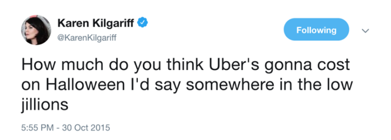
```


</div>

```{r fig.width=5,fig.height=5, out.extra='style="float:left; padding:1px"'}
ggplot(mapping = aes(x = q, y = p)) + 
    ## Base Graph Begin**
    geom_path(data = demand, color = color2, size = 1.2) + 
    annotate("text", x=8.4, y=2, label = "D[1]", color = color2, size = 6, parse = TRUE) +
    geom_path(data = supply, color = color3, size = 1.2) + 
    annotate("text", x=8.4, y=8, label = "S[1]", color = color3, size = 6, parse = TRUE) +
    coord_equal() +
    theme_classic(base_family = "sans") +
    theme(plot.title = element_text(size = rel(1.4))) +
    ## End Base Graph ##
    
    ## Demand Right Shift ##
    geom_path(data = demandright, color = color2, size = 1.2, linetype = "dashed") + 
    annotate("text", x=9.4, y=3, label = "D[2]", color = color2, size = 6, parse = TRUE) +
    annotate("segment", x = 3.2, xend = 3.8, y = 7.2, yend = 7.8,
             arrow = arrow(length = unit(.5, "lines")), colour = color4, size = 1) +
    annotate("segment", x = 7.2, xend = 7.8, y = 3.2, yend = 3.8,
             arrow = arrow(length = unit(.5, "lines")), colour = color4, size = 1) +
    
        ## Graph Labels -- Change title and subtitle as needed ##
    labs(x = "Quantity", y = "Price",
         title = "Demand for Uber",
         subtitle = "Uber's surge pricing is based on supply and demand") + # Subtitle
    
    ##editing the x and y axes for the equilibria.  If dots aren't needed, still need to keep limit and expand##
    scale_x_continuous(expand = c(0,0), limit = c(0,10), breaks = c(5,6), labels = expression(Q[1], Q[2])) + ## Set breaks = equilibrium Q
    scale_y_continuous(expand = c(0,0), limit = c(0,10), breaks = c(5,6), labels = expression(P[1], P[2])) + ## Set breaks = equilibrium Q
    ## Arrows
       annotate("segment", x = .4, xend = .4, y = 5.2, yend = 5.8,
             arrow = arrow(length = unit(.5, "lines")), colour = color4, size = 1) +    
       annotate("segment", y = .4, yend = .4, x = 5.2, xend = 5.8,
             arrow = arrow(length = unit(.51, "lines")), colour = color4, size = 1) +    
    ## Dashed Lines for equilibria
    annotate("segment", x=0, xend = 5, y = 5, yend = 5, linetype = "dotted") + # horizontal line
    annotate("segment", x=5, xend = 5, y = 0, yend = 5, linetype = "dotted") + # vertical line
    annotate("segment", x=0, xend = 6, y = 6, yend = 6, linetype = "dotted") + # horizontal line
    annotate("segment", x=6, xend = 6, y = 0, yend = 6, linetype = "dotted") # vertical line

```

## Determinants of Supply

- Input prices
- Technology
- Expectations
- Number of Suppliers

## Input Prices

Input prices are the main driver of shifts to supply curves.

- Decreased input prices shift supply to the right.
- Increase input prices shift supply to the left.

## Technology and Expectations

<br> 

- Positive technological shocks tend to shift the supply curve to the right (increase in supply).
- Expectations of future input prices, future technological shocks may effect supply curves.

## Number of Suppliers

<br>

- Increasing the number of suppliers shifts the supply curve to the right.
- Decreasing the number of suppliers shifts the supply curve to the left.


## Comparative Statics

Comparative statics is comparing equilibria.

1. Start with a market in equlibrium.
2. Determine whether or not some **shock** shifts the supply curve, demand curve, or both.
      - Remember: curves only shift when something *other* than the price of the good changes!
3. Shift the curve as appropriate
4. Compare the new equilibrium with the old equilibrium

## Comparative Statics

<div style="float: left; width: 50%;">
What happens in the market for gasoline when the price of petroleum goes up?

1. Start with the market for gasoline in equilibrium.
2. Gasoline is made of petroleum, so petroleum is an input--this affects the supply curve.
3. The price of the input went up, so supply should shift left.
4. The price of gas should rise and the quantity bought and sold should fall.


</div>

```{r fig.width=5,fig.height=5, out.extra='style="float:right; padding:1px"'}
ggplot(mapping = aes(x = q, y = p)) + 
    ## Base Graph Begin**
    geom_path(data = demand, color = color2, size = 1.2) + 
    annotate("text", x=8.4, y=2, label = "D[1]", color = color2, size = 6, parse = TRUE) +
    geom_path(data = supply, color = color3, size = 1.2) + 
    annotate("text", x=8.4, y=8, label = "S[1]", color = color3, size = 6, parse = TRUE) +
    coord_equal() +
    theme_classic(base_family = "sans") +
    theme(plot.title = element_text(size = rel(1.4))) +
    ## End Base Graph ##
    ##Supply Left Shift ##
    geom_path(data = supplyleft, color = color3, size = 1.2, linetype = "dashed") +
    annotate("text", x=7.4, y=9, label = "S[2]", color = color3, size = 6, parse = TRUE) +
    annotate("segment", x =2.8, xend = 2.2, y = 3.2, yend = 3.8,
             arrow = arrow(length = unit(.5, "lines")), colour = color4, size = 1) +
    annotate("segment", x = 6.8, xend = 6.2, y = 7.2, yend = 7.8,
             arrow = arrow(length = unit(.5, "lines")), colour = color4, size = 1) +
    
    ## Graph Labels -- Change title and subtitle as needed ##
    labs(x = "Quantity", y = "Price",
         title = "Market for Gasoline",
         subtitle = "The rising price of petroleum increases the price of gasoline") + # Subtitle
    
    ##editing the x and y axes for the equilibria.  If dots aren't needed, still need to keep limit and expand##
    scale_x_continuous(expand = c(0,0), limit = c(0,10), breaks = c(5,4), labels = expression(Q[1], Q[2])) + ## Set breaks = equilibrium Q
    scale_y_continuous(expand = c(0,0), limit = c(0,10), breaks = c(5,6), labels = expression(P[1], P[2])) + ## Set breaks = equilibrium Q
  
    ## P/Q Arrows (delete if no changes, edit points otherwise. 
    ## Leave .4 from axes and 0.2 from start/end point 
    annotate("segment", x = .4, xend = .4, y = 5.2, yend = 5.8,
             arrow = arrow(length = unit(.5, "lines")), colour = color4, size = 1) +    
    annotate("segment", y = .4, yend = .4, x = 4.8, xend = 4.2,
             arrow = arrow(length = unit(.51, "lines")), colour = color4, size = 1) +    

  
      ## Dashed Lines for equilibria

    annotate("segment", x=0, xend = 5, y = 5, yend = 5, linetype = "dotted") + # horizontal line
    annotate("segment", x=5, xend = 5, y = 0, yend = 5, linetype = "dotted") + # vertical line
    annotate("segment", x=0, xend = 4, y = 6, yend = 6, linetype = "dotted") + # horizontal line
    annotate("segment", x=4, xend = 4, y = 0, yend = 6, linetype = "dotted") # vertical line


```

## Comparative Statics

- What happens in the market for vacations if income levels rise?
- What happens in the market for the current generation iPhone if Apple announces the next generation will come out in a month?
- What happens in the market for Big Macs if the price of beef falls and Burger King raises the price of a Whopper?
- What happens in the market for BMWs if the price of steel falls and the economy goes into a recession?

# Welfare Analysis
## Welfare Analysis

**Welfare Analysis** seeks to examine the costs and benefits of various economic policies to the participants within the economy.

This means we need a way to measure the economic well-being of people in the economy. 

- Consumer Surplus
- Producer Surplus

## Consumer Surplus

- **Consumer Surplus** is the difference between the a person's reservation price and the actual price.
  - **Reservation Price**: The highest price a person is willing to pay for a product.
- Consumer surplus measures consumers' gains from trade.

## Consumer Surplus

<div style="float: left; width: 50%;">
Consumer surplus is easy to find on our supply and demand graph. It is the area:

- Under the demand curve, 
- above the price paid, and
- bounded on the right by the quantity purchased.

</div>

```{r fig.width=5,fig.height=5, out.extra='style="float:right; padding:1px"'}
rect1 <- tibble(q = c(0,5,5,0), p = (c(0,0,5,5)))
cs <- tibble(q = c(0,5,0), p = c(5,5,10))
demand2 <- tibble(p= c(1,10), q= c(9,0))
supply2 <- tibble(p= c(0,9), q= c(0,9))

ggplot(mapping = aes(x = q, y = p)) + 
  ## Base Graph Begin**
  geom_path(data = demand2, color = color2, size = 1.2) + 
  annotate("text", x=9.2, y=.9, label = "D", color = color2, size = 6) +
  geom_polygon(data = rect1, color = color3, fill = color3, alpha = .7)+
  annotate("text", x= 1, y = 2.5, label = "Amount Spent", hjust = "inward", color = color1) +
  geom_polygon(data = cs, color = color2, fill = color2, alpha = .7) +
  annotate("text", x = 1, y = 6, label = "Consumer\nSurplus", hjust = "inward", color = color1) +

  coord_equal() +
  theme_classic(base_family = "sans") +
  theme(plot.title = element_text(size = rel(1.4))) +
  ## End Base Graph ##

    ## Graph Labels -- Change title and subtitle as needed ##
  labs(x = "Quantity", y = "Price",
       title = "Consumer Surplus",
       subtitle = "Consumer surplus measures consumers' gains from trade") + # Subtitle
  
  ##editing the x and y axes for the equilibria.  If dots aren't needed, still need to keep limit and expand##
  scale_x_continuous(expand = c(0,0), limit = c(0,10), breaks = c(5), labels = expression(Q[1])) + ## Set breaks = equilibrium Q
  scale_y_continuous(expand = c(0,0), limit = c(0,10), breaks = c(5), labels = expression(P[1])) + ## Set breaks = equilibrium Q
  
  ## Dashed Lines for initial equilibrium
  annotate("segment", x=0, xend = 5, y = 5, yend = 5, linetype = "dotted") + # horizontal line
  annotate("segment", x=5, xend = 5, y = 0, yend = 5, linetype = "dotted") # vertical line

```

## Producer Surplus

**Producer Surplus** is the difference between the a seller's reservation price and the actual price.

- **Reservation Price**: The lowest price a seller is willing to accept for a product.
- Producer surplus is analogous to consumer surplus and measures producers' gains from trade.

## Producer Surplus

<div style="float: left; width: 50%;">

Producer surplus is also easy to find on our supply and demand graph. It is the area:

- Under price received, 
- above the supply curve, and
- bounded on the right by the quantity sold.

Total Revenue here is producer surplus **plus** the area beneath it.

</div>

```{r fig.width=5,fig.height=5, out.extra='style="float:right; padding:1px"'}
ps <- tibble(q = c(0,5,0), p = c(0,5,5))
demand2 <- tibble(p= c(1,10), q= c(9,0))
supply2 <- tibble(p= c(0,9), q= c(0,9))

ggplot(mapping = aes(x = q, y = p)) + 
  ## Base Graph Begin**
  geom_path(data = supply2, color = color3, size = 1.2) + 
  annotate("text", x=9.2, y=9.1, label = "S", color = color3, size = 6, parse = TRUE) +
  geom_polygon(data = ps, color = color3, fill = color3, alpha = .7) +
  annotate("text", x = 1, y = 4, label = "Producer\nSurplus", hjust = "inward", color = color1) +

  coord_equal() +
  theme_classic(base_family = "sans") +
  theme(plot.title = element_text(size = rel(1.4))) +
  ## End Base Graph ##

    ## Graph Labels -- Change title and subtitle as needed ##
  labs(x = "Quantity", y = "Price",
       title = "Producer Surplus",
       subtitle = "Producer surplus measures producers' gains from trade") + # Subtitle
  
  ##editing the x and y axes for the equilibria.  If dots aren't needed, still need to keep limit and expand##
  scale_x_continuous(expand = c(0,0), limit = c(0,10), breaks = c(5), labels = expression(Q[1])) + ## Set breaks = equilibrium Q
  scale_y_continuous(expand = c(0,0), limit = c(0,10), breaks = c(5), labels = expression(P[1])) + ## Set breaks = equilibrium Q
  
  ## Dashed Lines for initial equilibrium
  annotate("segment", x=0, xend = 5, y = 5, yend = 5, linetype = "dotted") + # horizontal line
  annotate("segment", x=5, xend = 5, y = 0, yend = 5, linetype = "dotted") # vertical line

```

## Total Surplus

<div style="float: left; width: 50%;">

Total gains from trade in a particular market are captured by the *combined* consumer and producer surplus.

- To say that one is *more important* or *better* than the other is inherently normative.

In a competitive market, the free market price of $P_{1}$ and $Q_{1}$ maximize total surplus.

- Not all markets are competitive, however

</div>

```{r fig.width=5,fig.height=5, out.extra='style="float:right; padding:1px"'}
ps <- tibble(q = c(0,5,0), p = c(0,5,5))
demand2 <- tibble(p= c(1,10), q= c(9,0))
supply2 <- tibble(p= c(0,9), q= c(0,9))

ggplot(mapping = aes(x = q, y = p)) + 
  ## Base Graph Begin**
  geom_path(data = demand2, color = color2, size = 1.2) + 
  annotate("text", x=9.2, y=.9, label = "D", color = color2, size = 6) +
  geom_path(data = supply2, color = color3, size = 1.2) + 
  annotate("text", x=9.2, y=9.1, label = "S", color = color3, size = 6, parse = TRUE) +
  geom_polygon(data = ps, color = color3, fill = color3, alpha = .7) +
  annotate("text", x = 1, y = 4, label = "Producer\nSurplus", hjust = "inward", color = color1) +
  geom_polygon(data = cs, color = color2, fill = color2, alpha = .7) +
  annotate("text", x = 1, y = 6, label = "Consumer\nSurplus", hjust = "inward", color = color1) +

  coord_equal() +
  theme_classic(base_family = "sans") +
  theme(plot.title = element_text(size = rel(1.4))) +
  ## End Base Graph ##

    ## Graph Labels -- Change title and subtitle as needed ##
  labs(x = "Quantity", y = "Price",
       title = "Total Surplus",
       subtitle = expression(paste("The free market equilibrium maximizes economic well-being"))) + # Subtitle
  
  ##editing the x and y axes for the equilibria.  If dots aren't needed, still need to keep limit and expand##
  scale_x_continuous(expand = c(0,0), limit = c(0,10), breaks = c(5), labels = expression(Q[1])) + ## Set breaks = equilibrium Q
  scale_y_continuous(expand = c(0,0), limit = c(0,10), breaks = c(5), labels = expression(P[1])) + ## Set breaks = equilibrium Q
  
  ## Dashed Lines for initial equilibrium
  annotate("segment", x=0, xend = 5, y = 5, yend = 5, linetype = "dotted") + # horizontal line
  annotate("segment", x=5, xend = 5, y = 0, yend = 5, linetype = "dotted") # vertical line

```

## Total Surplus

<div style="float: left; width: 50%;">

Government policies that prevent market forces from getting to $P_{1}$ and $Q_{1}$ necessarily reduce aggregate economic well being.

They may, however, have differential impacts on consumer relative to producer surplus

Such policies include:

- **Price Controls**: **Price Floors** and **Price Ceilings**
- **Quantity Controls**
- **Tariffs** and **Import Quotas**


</div>

```{r fig.width=5,fig.height=5, out.extra='style="float:right; padding:1px"'}
ps <- tibble(q = c(0,5,0), p = c(0,5,5))
demand2 <- tibble(p= c(1,10), q= c(9,0))
supply2 <- tibble(p= c(0,9), q= c(0,9))

ggplot(mapping = aes(x = q, y = p)) + 
  ## Base Graph Begin**
  geom_path(data = demand2, color = color2, size = 1.2) + 
  annotate("text", x=9.2, y=.9, label = "D", color = color2, size = 6) +
  geom_path(data = supply2, color = color3, size = 1.2) + 
  annotate("text", x=9.2, y=9.1, label = "S", color = color3, size = 6, parse = TRUE) +
  geom_polygon(data = ps, color = color3, fill = color3, alpha = .7) +
  annotate("text", x = 1, y = 4, label = "Producer\nSurplus", hjust = "inward", color = color1) +
  geom_polygon(data = cs, color = color2, fill = color2, alpha = .7) +
  annotate("text", x = 1, y = 6, label = "Consumer\nSurplus", hjust = "inward", color = color1) +

  coord_equal() +
  theme_classic(base_family = "sans") +
  theme(plot.title = element_text(size = rel(1.4))) +
  ## End Base Graph ##

    ## Graph Labels -- Change title and subtitle as needed ##
  labs(x = "Quantity", y = "Price",
       title = "Total Surplus",
       subtitle = expression(paste("The free market equilibrium maximizes economic well-being"))) + # Subtitle
  
  ##editing the x and y axes for the equilibria.  If dots aren't needed, still need to keep limit and expand##
  scale_x_continuous(expand = c(0,0), limit = c(0,10), breaks = c(5), labels = expression(Q[1])) + ## Set breaks = equilibrium Q
  scale_y_continuous(expand = c(0,0), limit = c(0,10), breaks = c(5), labels = expression(P[1])) + ## Set breaks = equilibrium Q
  
  ## Dashed Lines for initial equilibrium
  annotate("segment", x=0, xend = 5, y = 5, yend = 5, linetype = "dotted") + # horizontal line
  annotate("segment", x=5, xend = 5, y = 0, yend = 5, linetype = "dotted") # vertical line

```

## Price Controls

Price controls are government mandated legal minimum or maximum prices set on specific goods.

- **Price Ceilings** are legal maximum prices.
  - Governments typically use price ceilings to maintain the affordability of various items.
  - Examples include: 
    - staple goods (gas, water, etc) during an emergency
    - rent in high cost-of-living cities 
- **Price Floors** are legal minimum prices.
  - The most common price floor is a minimum wage
  
## Price Floors
<div style="float: left; width: 50%;">

Consider a labor market in which the equilibrium wage for workers is$P_{1}$, but the government sets a minimum wage at $P_{mw}$.

At $P_{mw}$, the quantity of labor demanded, $Q_{D}$, is less than the quantity of labor supplied, $Q_{S}$.

When $Q_{S} > Q_{D}$ there is a surplus of labor and competition should put downward pressure on prices, but the minimum wage prevents this from occurring so the price stays at  $P_{mw}$.

</div>

```{r fig.width=5,fig.height=5, out.extra='style="float:right; padding:1px"'}
demand2 <- tibble(p= c(1,10), q= c(9,0))
supply2 <- tibble(p= c(0,9), q= c(0,9))

ggplot(mapping = aes(x = q, y = p)) + 
  ## Base Graph Begin**
  geom_path(data = demand2, color = color2, size = 1.2) + 
  annotate("text", x=9.2, y=.9, label = "D", color = color2, size = 6, parse = TRUE) +
  geom_path(data = supply2, color = color3, size = 1.2) + 
  annotate("text", x=9.2, y=9.1, label = "S", color = color3, size = 6, parse = TRUE) +
  geom_bracket(xmin = 3, xmax = 7, y.position = 7.5, label = "Surplus", tip.length = .05) +
  coord_equal() +
  theme_classic(base_family = "sans") +
  theme(plot.title = element_text(size = rel(1.4))) +
  ## End Base Graph ##

    ## Graph Labels -- Change title and subtitle as needed ##
  labs(x = "Quantity", y = "Wage",
       title = "Minimum Wage",
       subtitle = "Minimum wages are a common example of a price floor") + # Subtitle
  
  ##editing the x and y axes for the equilibria.  If dots aren't needed, still need to keep limit and expand##
  scale_x_continuous(expand = c(0,0), limit = c(0,10), breaks = c(5,3,7), labels = expression(Q[1], Q[D], Q[S])) + ## Set breaks = equilibrium Q
  scale_y_continuous(expand = c(0,0), limit = c(0,10), breaks = c(5,7), labels = expression(P[1], P[mw])) + ## Set breaks = equilibrium P
  
  ## P/Q Arrows (delete if no changes, edit points otherwise. 
  ## Leave .4 from axes and 0.2 from start/end point 
  annotate("segment", x = .4, xend = .4, y = 5.2, yend = 6.8,
           arrow = arrow(length = unit(.5, "lines")), colour = color4, size = 1) +    
  
  
  ## Dashed Lines for initial equilibrium
  annotate("segment", x=0, xend = 5, y = 5, yend = 5, linetype = "dotted") + # horizontal line
  annotate("segment", x=5, xend = 5, y = 0, yend = 5, linetype = "dotted") + # vertical line
  annotate("segment", x=0, xend = 7, y = 7, yend = 7, linetype = "dotted") + # horizontal line
  annotate("segment", x=3, xend = 3, y = 0, yend = 7, linetype = "dotted") + # vertical line
  annotate("segment", x=7, xend = 7, y = 0, yend = 7, linetype = "dotted") # vertical line


```


## Price Floors

<div style="float: left; width: 50%;">

$Q_{D}$ represents hours that employers hire workers to work, but workers actually are willing and able to work $Q_{S}$ hours.

Thus, the minimum wage will generate **unemployment** and/or **underemployment**.

- $Q_{S} - Q_{D}$ represents the amount of underemployment

</div>

```{r fig.width=5,fig.height=5, out.extra='style="float:right; padding:1px"'}
demand2 <- tibble(p= c(1,10), q= c(9,0))
supply2 <- tibble(p= c(0,9), q= c(0,9))

ggplot(mapping = aes(x = q, y = p)) + 
  ## Base Graph Begin**
  geom_path(data = demand2, color = color2, size = 1.2) + 
  annotate("text", x=9.2, y=.9, label = "D", color = color2, size = 6, parse = TRUE) +
  geom_path(data = supply2, color = color3, size = 1.2) + 
  annotate("text", x=9.2, y=9.1, label = "S", color = color3, size = 6, parse = TRUE) +
  geom_bracket(xmin = 3, xmax = 7, y.position = 7.5, label = "Surplus", tip.length = .05) +
  coord_equal() +
  theme_classic(base_family = "sans") +
  theme(plot.title = element_text(size = rel(1.4))) +
  ## End Base Graph ##

    ## Graph Labels -- Change title and subtitle as needed ##
  labs(x = "Quantity", y = "Wage",
       title = "Minimum Wage",
       subtitle = expression(paste("The distance between ", Q[S], "&", Q[D], " represents underemployment"))) + # Subtitle
  
  ##editing the x and y axes for the equilibria.  If dots aren't needed, still need to keep limit and expand##
  scale_x_continuous(expand = c(0,0), limit = c(0,10), breaks = c(5,3,7), labels = expression(Q[1], Q[D], Q[S])) + ## Set breaks = equilibrium Q
  scale_y_continuous(expand = c(0,0), limit = c(0,10), breaks = c(5,7), labels = expression(P[1], P[mw])) + ## Set breaks = equilibrium P
  
  ## P/Q Arrows (delete if no changes, edit points otherwise. 
  ## Leave .4 from axes and 0.2 from start/end point 
  annotate("segment", x = .4, xend = .4, y = 5.2, yend = 6.8,
           arrow = arrow(length = unit(.5, "lines")), colour = color4, size = 1) +    
  
  
  ## Dashed Lines for initial equilibrium
  annotate("segment", x=0, xend = 5, y = 5, yend = 5, linetype = "dotted") + # horizontal line
  annotate("segment", x=5, xend = 5, y = 0, yend = 5, linetype = "dotted") + # vertical line
  annotate("segment", x=0, xend = 7, y = 7, yend = 7, linetype = "dotted") + # horizontal line
  annotate("segment", x=3, xend = 3, y = 0, yend = 7, linetype = "dotted") + # vertical line
  annotate("segment", x=7, xend = 7, y = 0, yend = 7, linetype = "dotted") # vertical line
```

## Price Floors


<div style="float: left; width: 50%;">

We can compare consumer and producer surplus in the cases of free market vs. minimum wage.

```{r out.extra='style:"float:center"'}
floor <- tibble(x = c("Consumer Surplus", "Producer Surplus", "Dead Weight Loss"),
                y = c("1, 2, & 3", "4 & 5", ""),
                z = c("1", "2 & 4", "3 & 5"))

floor %>% 
    kable(format = "html", table.attr = "class=\"rmdtable\"", col.names = c("", "Free Market",
                           "Minimum Wage")) %>% 
    kable_styling(full_width = F, position = "center") %>% 
    column_spec(1, background = color2, color = color1)


```

<br>

Some producers gain, ALL consumers lose, and the losses are bigger than the gains. This phenomenon is called **Dead Weight Loss**

</div>

```{r fig.width=5,fig.height=5, out.extra='style="float:right; padding:1px"'}
demand2 <- tibble(p= c(1,10), q= c(9,0))
supply2 <- tibble(p= c(0,9), q= c(0,9))


# Define areas of CS/PS/DWL
areaa <- tibble(p = c(10, 7, 7), q = c(0, 0, 3))
areab <- tibble(p = c(7, 7, 5, 5), q = c(0, 3, 3, 0))
areac <- tibble(p = c(7, 5, 5), q = c(3, 3, 5))
aread <- tibble(p = c(5, 5, 3), q = c(3, 5, 3))
areae <- tibble(p = c(5, 5, 3, 0), q = c(0, 3, 3, 0))


ggplot(mapping = aes(x = q, y = p)) + 
  ## Base Graph Begin**
  geom_path(data = demand2, color = color2, size = 1.2) + 
  annotate("text", x=9.2, y=.9, label = "D", color = color2, size = 6, parse = TRUE) +
  geom_path(data = supply2, color = color3, size = 1.2) + 
  annotate("text", x=9.2, y=9.1, label = "S", color = color3, size = 6, parse = TRUE) +
  geom_bracket(xmin = 3, xmax = 7, y.position = 7.5, label = "Underemployment", tip.length = .05) +
  coord_equal() +
  theme_classic(base_family = "sans") +
  theme(plot.title = element_text(size = rel(1.4))) +
  ## End Base Graph ##
  ## Shading in Surplus
  geom_polygon(data = areaa, fill = color2, alpha = .9) +
  geom_polygon(data = areab, fill = color4, alpha = .7) +
  geom_polygon(data = areac, fill = color2, alpha = .5) +
  geom_polygon(data = aread, fill = color3, alpha = .5) +
  geom_polygon(data = areae, fill = color3, alpha = .9) +
  ## Label Surplus
  annotate("text", x=1, y=8, label = "1", color = color1, size = 6, hjust = .5, vjust = .5) +
  annotate("text", x=1, y=6, label = "2", color = color1, size = 6, hjust = .5, vjust = .5) +
  annotate("text", x=1, y=4, label = "4", color = color1, size = 6, hjust = .5, vjust = .5) +
  annotate("text", x=3.5, y=5.6, label = "3", color = color1, size = 6, hjust = .5, vjust = .5) +
  annotate("text", x=3.5, y=4.4, label = "5", color = color1, size = 6, hjust = .5, vjust = .5) +

  ## Graph Labels -- Change title and subtitle as needed ##
  labs(x = "Quantity", y = "Wage",
       title = "Minimum Wage",
       subtitle = expression(paste("Minimum wages reduce overall welfare"))) + # Subtitle
  
  ##editing the x and y axes for the equilibria.  If dots aren't needed, still need to keep limit and expand##
  scale_x_continuous(expand = c(0,0), limit = c(0,10), breaks = c(5,3,7), labels = expression(Q[1], Q[D], Q[S])) + ## Set breaks = equilibrium Q
  scale_y_continuous(expand = c(0,0), limit = c(0,10), breaks = c(5,7), labels = expression(P[1], P[mw])) + ## Set breaks = equilibrium P
  
  
  ## Dashed Lines for initial equilibrium
  annotate("segment", x=0, xend = 5, y = 5, yend = 5, linetype = "dotted") + # horizontal line
  annotate("segment", x=5, xend = 5, y = 0, yend = 5, linetype = "dotted") + # vertical line
  annotate("segment", x=0, xend = 7, y = 7, yend = 7, linetype = "dotted") + # horizontal line
  annotate("segment", x=3, xend = 3, y = 0, yend = 7, linetype = "dotted") + # vertical line
  annotate("segment", x=7, xend = 7, y = 0, yend = 7, linetype = "dotted") # vertical line
```


## Price Ceilings
<div style="float: left; width: 50%;">

Consider a market for apartments in which the equilibrium rent for an apartment is $P_{1}$, but the government sets a maximum rent at $P_{rc}$.

At $P_{rc}$, the quantity of apartments demanded, $Q_{D}$, is more than the quantity of apartments supplied, $Q_{S}$.

When $Q_{D} > Q_{S}$ there is a shortage of housing and competition should put upward pressure on prices, but the rent control prevents this from occurring so the price stays at  $P_{rc}$.

</div>

```{r fig.width=5,fig.height=5, out.extra='style="float:right; padding:1px"'}
demand2 <- tibble(p= c(1,10), q= c(9,0))
supply2 <- tibble(p= c(0,9), q= c(0,9))

ggplot(mapping = aes(x = q, y = p)) + 
  ## Base Graph Begin**
  geom_path(data = demand2, color = color2, size = 1.2) + 
  annotate("text", x=9.2, y=.9, label = "D", color = color2, size = 6, parse = TRUE) +
  geom_path(data = supply2, color = color3, size = 1.2) + 
  annotate("text", x=9.2, y=9.1, label = "S", color = color3, size = 6, parse = TRUE) +
  geom_bracket(xmin = 3, xmax = 7, y.position = 2.5, label = "Shortage", tip.length = -.05, vjust = 3) +
  coord_equal() +
  theme_classic(base_family = "sans") +
  theme(plot.title = element_text(size = rel(1.4))) +
  ## End Base Graph ##

    ## Graph Labels -- Change title and subtitle as needed ##
  labs(x = "Quantity", y = "Rent",
       title = "Rent Control",
       subtitle = "Rent control is a common example of a price ceiling") + # Subtitle
  
  ##editing the x and y axes for the equilibria.  If dots aren't needed, still need to keep limit and expand##
  scale_x_continuous(expand = c(0,0), limit = c(0,10), breaks = c(5,3,7), labels = expression(Q[1], Q[S], Q[D])) + ## Set breaks = equilibrium Q
  scale_y_continuous(expand = c(0,0), limit = c(0,10), breaks = c(5,3), labels = expression(P[1], P[rc])) + ## Set breaks = equilibrium P
  
  ## P/Q Arrows (delete if no changes, edit points otherwise. 
  ## Leave .4 from axes and 0.2 from start/end point 
  annotate("segment", x = .4, xend = .4, y = 4.8, yend = 3.2,
           arrow = arrow(length = unit(.5, "lines")), colour = color4, size = 1) +    
  
  
  ## Dashed Lines for initial equilibrium
  annotate("segment", x=0, xend = 5, y = 5, yend = 5, linetype = "dotted") + # horizontal line
  annotate("segment", x=5, xend = 5, y = 0, yend = 5, linetype = "dotted") + # vertical line
  annotate("segment", x=0, xend = 7, y = 3, yend = 3, linetype = "dotted") + # horizontal line
  annotate("segment", x=3, xend = 3, y = 0, yend = 3, linetype = "dotted") + # vertical line
  annotate("segment", x=7, xend = 7, y = 0, yend = 3, linetype = "dotted") # vertical line


```

## Price Ceilings

<div style="float: left; width: 50%;">

$Q_{S}$ represents the number of units that apartment owners make available to rent at a price of $P_{rc}$, but at that price people want to rent more than that, they want to rent $Q_{D}$ units.

Thus, rent control will generate a **housing shortage**.

- $Q_{D} - Q_{S}$ represents the shortage amount.

</div>

```{r fig.width=5,fig.height=5, out.extra='style="float:right; padding:1px"'}
demand2 <- tibble(p= c(1,10), q= c(9,0))
supply2 <- tibble(p= c(0,9), q= c(0,9))

ggplot(mapping = aes(x = q, y = p)) + 
  ## Base Graph Begin**
  geom_path(data = demand2, color = color2, size = 1.2) + 
  annotate("text", x=9.2, y=.9, label = "D", color = color2, size = 6, parse = TRUE) +
  geom_path(data = supply2, color = color3, size = 1.2) + 
  annotate("text", x=9.2, y=9.1, label = "S", color = color3, size = 6, parse = TRUE) +
  geom_bracket(xmin = 3, xmax = 7, y.position = 2.5, label = "Shortage", tip.length = -.05, vjust = 3) +
  coord_equal() +
  theme_classic(base_family = "sans") +
  theme(plot.title = element_text(size = rel(1.4))) +
  ## End Base Graph ##

    ## Graph Labels -- Change title and subtitle as needed ##
  labs(x = "Quantity", y = "Rent",
       title = "Rent Control",
       subtitle = "Rent control is a major cause of housing shortages") + # Subtitle
  
  ##editing the x and y axes for the equilibria.  If dots aren't needed, still need to keep limit and expand##
  scale_x_continuous(expand = c(0,0), limit = c(0,10), breaks = c(5,3,7), labels = expression(Q[1], Q[S], Q[D])) + ## Set breaks = equilibrium Q
  scale_y_continuous(expand = c(0,0), limit = c(0,10), breaks = c(5,3), labels = expression(P[1], P[rc])) + ## Set breaks = equilibrium P
  
  ## P/Q Arrows (delete if no changes, edit points otherwise. 
  ## Leave .4 from axes and 0.2 from start/end point 
  annotate("segment", x = .4, xend = .4, y = 4.8, yend = 3.2,
           arrow = arrow(length = unit(.5, "lines")), colour = color4, size = 1) +    
  
  
  ## Dashed Lines for initial equilibrium
  annotate("segment", x=0, xend = 5, y = 5, yend = 5, linetype = "dotted") + # horizontal line
  annotate("segment", x=5, xend = 5, y = 0, yend = 5, linetype = "dotted") + # vertical line
  annotate("segment", x=0, xend = 7, y = 3, yend = 3, linetype = "dotted") + # horizontal line
  annotate("segment", x=3, xend = 3, y = 0, yend = 3, linetype = "dotted") + # vertical line
  annotate("segment", x=7, xend = 7, y = 0, yend = 3, linetype = "dotted") # vertical line


```

## Price Ceilings

<div style="float: left; width: 50%;">

We can compare consumer and producer surplus in the cases of free market vs. rent control.

```{r out.extra='style:"float:center"'}
floor <- tibble(x = c("Consumer Surplus", "Producer Surplus", "Dead Weight Loss"),
                y = c("1 & 2", "3, 4 & 5", ""),
                z = c("1 & 3", "5", "2 & 4"))

floor %>% 
    kable(format = "html", table.attr = "class=\"rmdtable\"", col.names = c("", "Free Market",
                           "Rent Control")) %>% 
    kable_styling(full_width = F, position = "center") %>% 
    column_spec(1, background = color2, color = color1)


```

<br>

Some consumers gain, ALL producers lose, and the losses are bigger than the gain, again due to  **Dead Weight Loss**

</div>

```{r fig.width=5,fig.height=5, out.extra='style="float:right; padding:1px"'}
demand2 <- tibble(p= c(1,10), q= c(9,0))
supply2 <- tibble(p= c(0,9), q= c(0,9))

# Define areas of CS/PS/DWL
areaa <- tibble(p = c(10, 7, 5, 5), q = c(0, 3, 3, 0))
areab <- tibble(p = c(7, 5, 5), q = c(3, 5, 3))
areac <- tibble(p = c(5, 5, 3, 3), q = c(0, 3, 3, 0))
aread <- tibble(p = c(5, 5, 3), q = c(3, 5, 3))
areae <- tibble(p = c(3, 3, 0), q = c(0, 3, 0))


ggplot(mapping = aes(x = q, y = p)) + 
  ## Base Graph Begin**
  geom_path(data = demand2, color = color2, size = 1.2) + 
  annotate("text", x=9.2, y=.9, label = "D", color = color2, size = 6, parse = TRUE) +
  geom_path(data = supply2, color = color3, size = 1.2) + 
  annotate("text", x=9.2, y=9.1, label = "S", color = color3, size = 6, parse = TRUE) +
  geom_bracket(xmin = 3, xmax = 7, y.position = 2.5, label = "Shortage", tip.length = -.05, vjust = 3) +
  coord_equal() +
  theme_classic(base_family = "sans") +
  theme(plot.title = element_text(size = rel(1.4))) +
  ## End Base Graph ##

    ## Shading in Surplus
  geom_polygon(data = areaa, fill = color2, alpha = .9) +
  geom_polygon(data = areab, fill = color2, alpha = .5) +
  geom_polygon(data = areac, fill = color4, alpha = .7) +
  geom_polygon(data = aread, fill = color3, alpha = .5) +
  geom_polygon(data = areae, fill = color3, alpha = .9) +
  ## Label Surplus
  annotate("text", x=1, y=6, label = "1", color = color1, size = 6, hjust = .5, vjust = .5) +
  annotate("text", x=3.5, y=5.6, label = "2", color = color1, size = 6, hjust = .5, vjust = .5) +
  annotate("text", x=1, y=4, label = "3", color = color1, size = 6, hjust = .5, vjust = .5) +
  annotate("text", x=3.5, y=4.4, label = "4", color = color1, size = 6, hjust = .5, vjust = .5) +
  annotate("text", x=1, y=2, label = "5", color = color1, size = 6, hjust = .5, vjust = .5) +

    ## Graph Labels -- Change title and subtitle as needed ##
  labs(x = "Quantity", y = "Rent",
       title = "Rent Control",
       subtitle = "Rent control reduces overall welfare") + # Subtitle
  
  ##editing the x and y axes for the equilibria.  If dots aren't needed, still need to keep limit and expand##
  scale_x_continuous(expand = c(0,0), limit = c(0,10), breaks = c(5,3,7), labels = expression(Q[1], Q[S], Q[D])) + ## Set breaks = equilibrium Q
  scale_y_continuous(expand = c(0,0), limit = c(0,10), breaks = c(5,3), labels = expression(P[1], P[rc])) + ## Set breaks = equilibrium P

  
  ## Dashed Lines for initial equilibrium
  annotate("segment", x=0, xend = 5, y = 5, yend = 5, linetype = "dotted") + # horizontal line
  annotate("segment", x=5, xend = 5, y = 0, yend = 5, linetype = "dotted") + # vertical line
  annotate("segment", x=0, xend = 7, y = 3, yend = 3, linetype = "dotted") + # horizontal line
  annotate("segment", x=3, xend = 3, y = 0, yend = 3, linetype = "dotted") + # vertical line
  annotate("segment", x=7, xend = 7, y = 0, yend = 3, linetype = "dotted") # vertical line


```

## Price Controls

<br>

```{r out.extra='style:"float:center"'}
floor <- tibble(x = c("Who Gains?", "Who Loses?"),
                y = c("Some Suppliers", "All Demanders"),
                z = c("Some Demanders", "All Suppliers"))

floor %>% 
    kable(format = "html", table.attr = "class=\"rmdtable\"", col.names = c("", "Price Floor",
                           "Price Ceiling")) %>% 
    kable_styling(full_width = F, position = "center") %>% 
    column_spec(1, background = color2, color = color1)


```

<br>
<br>

Overall, the impact of these policies is that the economic losses will outweigh the economic benefit due to deadweight loss.

## Price Controls

Because price controls prevent prices from rationing the available supply, some other mechanism must take its place. Examples incldue:

- Government Rationing
- Lines
- Corruption
- Discrimination
- A Change in the Nature of the Product
- A Change in the Forms of Payment

## Minimum Wage

That minimum wages generate unemployment or underemployment is often thought to be an instance of the **law of unintended consequences**.  

Many people who advocate for the minimum wage do so **precisely because** it generates unemployment!

## Minimum Wage

- In the late 1960s, Otis Elevator pushed for an increase in the minimum wage in New York state because it had begun to specialize in converting human-operated elevators to automatic elevators and wanted an increase in demand for its services.

- Most union members make substantially more than the minimum wage yet they push for it. Perhaps it is not because they care about low income individuals but rather to make them more expensive so people will hire union labor instead.

## Minimum Wage

The Progressive movement, particularly in the early 20th century, had a strong eugenic element. They argued for the minimum wage to help create a racially pure society. 

> The operation of the minimum wage requirement would merely extend the definition of defectives to embrace all individuals [who are] incapable of adequate self-support…If we are to maintain a race that is to be made of up of capable, efficient and independent individuals and family groups we must courageously cut off lines of heredity that have been proved to be undesirable by isolation or sterilization. 
> <br>
> ---Henry Rogers Seager, 1913


## Minimum Wage

Some have argued that John F. Kennedy's advocacy for the  minimum wage in the 1950s had racial undertones as well.

> Of course, having on the market a rather large source of cheap labor depresses wages outside of that group, too – the wages of the white worker who has to compete. And when an employer can substitute a colored worker at a lower wage – and there are, as you pointed out, these hundreds of thousands looking for decent work – it affects the whole wage structure of an area, doesn’t it? 
> <br>
> ---John F. Kennedy speaking in favor of minimum wages, 1957  


## Minimum Wage

Does the minimum wage at least help the poor?

The evidence is mixed at best.  For example, Sabia and Burkhauser (2010) argued that if the minimum wage were increased by roughly $2:

- Nearly 	$\frac{2}{3}$ of the people who gain live in middle/high income homes. 
  - e.g. they are 2nd/3rd earners in households.
- Only 11% of those who would gain live in poor households.
- The majority of minimum wage earners are high school/college aged young adults who live at home with their parents.


## Rent Control

The public popularity of rent control is on the rise.

<div style="float: left; width: 50%;">

```{r out.width="80%"}
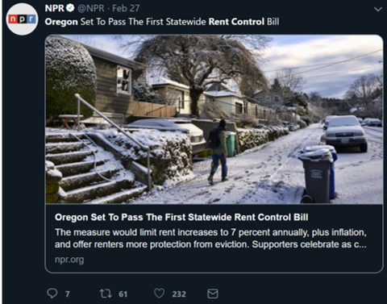
```

</div>

<div style="float: right; width:50%;">

```{r out.width = "70%"}
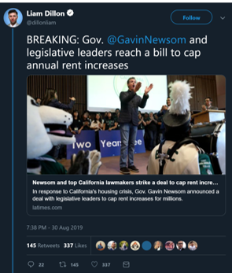 
```
</div>

## Rent Control

And with predictable consequences.

<div style="float: left; width: 50%;">

```{r out.width="80%"}
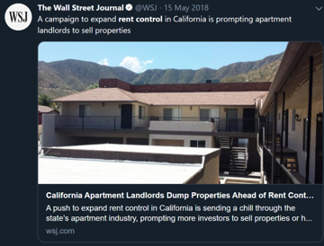
```

</div>

<div style="float: right; width:50%;">

```{r out.width = "70%"}
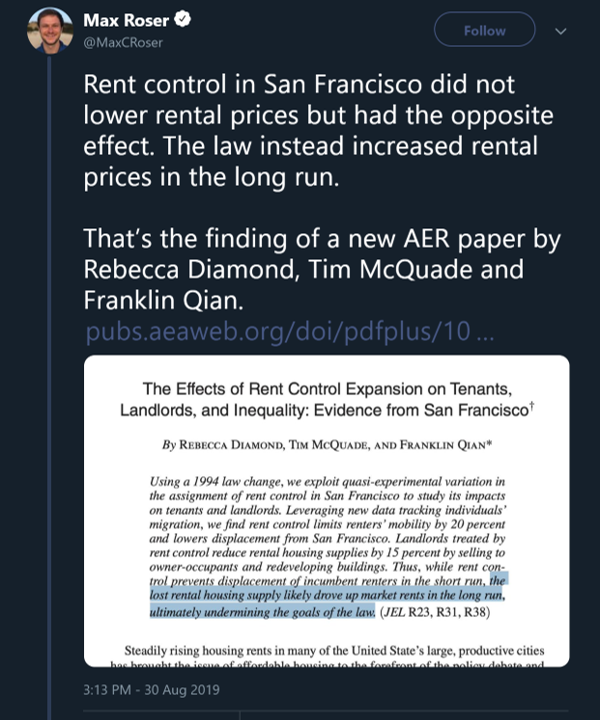 
```
</div>

## Rent Control

<div style="float: left; width: 50%;">

The destructiveness of rent controls is the rare issue that practically all economists agree upon—Myrdal and Lindbeck were two of the most prominent socialist economists in the latter half of the 20th century.

</div>

<div style="float: right; width:50%;">

```{r out.width = "90%"}
 
 

```
</div>

## Gas Price Controls -- 1970s

<div style="float: left; width: 33%;">

In an effort to thwart rising gas prices in the 70s, the US government put price ceilings on gasoline.

```{r out.width="100%"}
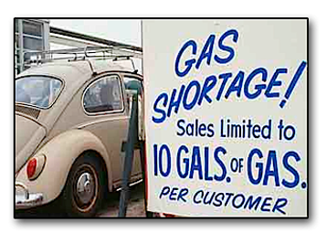
```

</div>

<div style="float: right; width:67%;">

```{r out.width = "48%", out.extra='style="float:left; padding:1px"'}
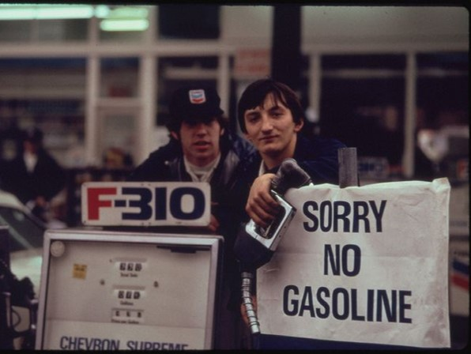 


```
```{r out.width = "48%", out.extra='style="float:right; padding:1px"'}

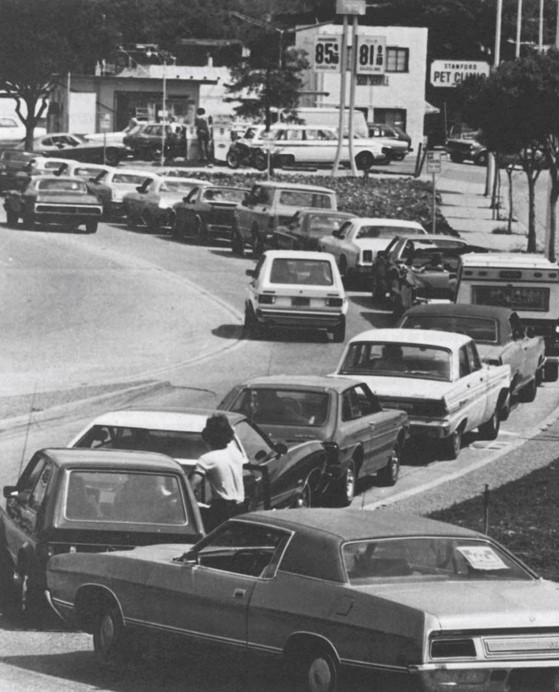

```

The results were predictable: shortages leading to rationing schemes and extremely long lines.

## Gas Price Controls - 2012 NY/NJ

<div style="float: left; width: 45%;">

In most states, price gouging laws go into effect when the government declares a state of emergency.  

For example, NC Law § 75-38 prohibits "excessive pricing during states of disaster, states of emergency, or abnormal market disruptions"


```{r out.width = "48%", out.extra='style="float:left; padding:1px"'}
 


```
```{r out.width = "48%", out.extra='style="float:right; padding:1px"'}


```

</div>

<div style="float: right; width:55%;">

```{r out.width="100%"}
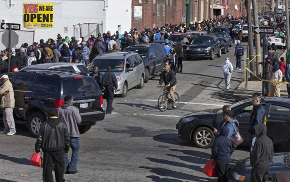
```

Demand shifts right and supply shifts left, putting upward pressure on prices. But a price gouging law prevents rising prices.

## Black Market Gas - 2012 NY/NJ

Thanks to Craigslist, we have a decent idea of what gas prices might have risen to.

<div style="float: left; width: 55%;">


```{r out.width = "70%"}
 


```
```{r out.width = "70%", out.extra='style="float:left; padding:1px"'}

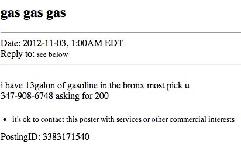

```

</div>

<div style="float: right; width:45%;">


```{r out.width = "75%", out.extra='style="align:left; padding:1px"'}
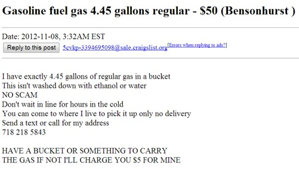 


```

```{r out.width = "75%", out.extra='style="float:left; padding:1px"'}

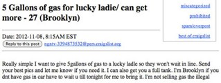

```
Craigslist also provides an example of a shift in the forms of payment.


## Quantity Controls

<div style="float: left; width: 50%;">

Quantity controls, sometimes called production quotas, are when the government sets a maximum amount of production at $Q_{qc} < Q_{1}$.

At the restricted quantity $Q_{qc}$, the price consumers are willing and able to pay is $P_{qc} > P_{1}$.

A widespread variant of this type of policy is occupational licensing.  

Other examples include agricultural quotas and *Certificate of Need* laws.

</div>

```{r fig.width=5,fig.height=5, out.extra='style="float:right; padding:1px"'}
demand2 <- tibble(p= c(1,10), q= c(9,0))
supply2 <- tibble(p= c(0,9), q= c(0,9))

ggplot(mapping = aes(x = q, y = p)) + 
  ## Base Graph Begin**
  geom_path(data = demand2, color = color2, size = 1.2) + 
  annotate("text", x=9.2, y=.9, label = "D", color = color2, size = 6, parse = TRUE) +
  geom_path(data = supply2, color = color3, size = 1.2) + 
  annotate("text", x=9.2, y=9.1, label = "S", color = color3, size = 6, parse = TRUE) +
  coord_equal() +
  theme_classic(base_family = "sans") +
  theme(plot.title = element_text(size = rel(1.4))) +
  ## End Base Graph ##

    ## Graph Labels -- Change title and subtitle as needed ##
  labs(x = "Quantity", y = "Price",
       title = "Quantity Controls",
       subtitle = "Occupational licensing acts as a type of quantity control") + # Subtitle
  
  ##editing the x and y axes for the equilibria.  If dots aren't needed, still need to keep limit and expand##
  scale_x_continuous(expand = c(0,0), limit = c(0,10), breaks = c(5,3), labels = expression(Q[1], Q[qc])) + ## Set breaks = equilibrium Q
  scale_y_continuous(expand = c(0,0), limit = c(0,10), breaks = c(5,7), labels = expression(P[1], P[qc])) + ## Set breaks = equilibrium P
  
  ## P/Q Arrows (delete if no changes, edit points otherwise. 
  ## Leave .4 from axes and 0.2 from start/end point 
  annotate("segment", x = .4, xend = .4, y = 5.2, yend = 6.8,
           arrow = arrow(length = unit(.5, "lines")), colour = color4, size = 1.5) +    

  ## Quantity Control Line and Label
  annotate("segment", x = 3, xend = 3, y = 0, yend = 8.7,
           colour = color3, size = 1) +    
  annotate("text", x=3, y=9, label = "Quota", color = color3, parse = TRUE) +
    

    
      
  ## Dashed Lines for initial equilibrium
  annotate("segment", x=0, xend = 5, y = 5, yend = 5, linetype = "dotted") + # horizontal line
  annotate("segment", x=5, xend = 5, y = 0, yend = 5, linetype = "dotted") + # vertical line
  annotate("segment", x=0, xend = 3, y = 7, yend = 7, linetype = "dotted")  # horizontal line


```

## Quantity Controls

<div style="float: left; width: 50%;">

Comparing free markets vs. production quotas:

```{r out.extra='style:"float:center"'}
floor <- tibble(x = c("Consumer Surplus", "Producer Surplus", "Dead Weight Loss"),
                y = c("1, 2, & 3", "4 & 5", ""),
                z = c("1", "2 & 4", "3 & 5"))

floor %>% 
    kable(format = "html", table.attr = "class=\"rmdtable\"", col.names = c("", "Free Market",
                           "Quotas")) %>% 
    kable_styling(full_width = F, position = "center") %>% 
    column_spec(1, background = color2, color = color1)


```
<br>

The area that switches from consumer surplus to producer surplus, area 2, is often eaten up by costs incurred to be part of the quota system.


</div>

<div style="float: right width: 50%;">


```{r fig.width=5,fig.height=5, out.extra='style="float:right; padding:1px"'}
demand2 <- tibble(p= c(1,10), q= c(9,0))
supply2 <- tibble(p= c(0,9), q= c(0,9))

# Define areas of CS/PS/DWL
areaa <- tibble(p = c(10, 7, 7), q = c(0, 0, 3))
areab <- tibble(p = c(7, 7, 5, 5), q = c(0, 3, 3, 0))
areac <- tibble(p = c(7, 5, 5), q = c(3, 3, 5))
aread <- tibble(p = c(5, 5, 3), q = c(3, 5, 3))
areae <- tibble(p = c(5, 5, 3, 0), q = c(0, 3, 3, 0))


ggplot(mapping = aes(x = q, y = p)) + 
  ## Base Graph Begin**
  geom_path(data = demand2, color = color2, size = 1.2) + 
  annotate("text", x=9.2, y=.9, label = "D", color = color2, size = 6, parse = TRUE) +
  geom_path(data = supply2, color = color3, size = 1.2) + 
  annotate("text", x=9.2, y=9.1, label = "S", color = color3, size = 6, parse = TRUE) +
  coord_equal() +
  theme_classic(base_family = "sans") +
  theme(plot.title = element_text(size = rel(1.4))) +
  ## End Base Graph ##
  ## Shading in Surplus
  geom_polygon(data = areaa, fill = color2, alpha = .9) +
  geom_polygon(data = areab, fill = color4, alpha = .7) +
  geom_polygon(data = areac, fill = color2, alpha = .5) +
  geom_polygon(data = aread, fill = color3, alpha = .5) +
  geom_polygon(data = areae, fill = color3, alpha = .9) +
  ## Label Surplus
  annotate("text", x=1, y=8, label = "1", color = color1, size = 6, hjust = .5, vjust = .5) +
  annotate("text", x=1, y=6, label = "2", color = color1, size = 6, hjust = .5, vjust = .5) +
  annotate("text", x=1, y=4, label = "4", color = color1, size = 6, hjust = .5, vjust = .5) +
  annotate("text", x=3.5, y=5.6, label = "3", color = color1, size = 6, hjust = .5, vjust = .5) +
  annotate("text", x=3.5, y=4.4, label = "5", color = color1, size = 6, hjust = .5, vjust = .5) +   
    

    ## Graph Labels -- Change title and subtitle as needed ##
  labs(x = "Quantity", y = "Price",
       title = "Quantity Controls",
       subtitle = "Occupational licensing acts as a type of quantity control") + # Subtitle
  
  ##editing the x and y axes for the equilibria.  If dots aren't needed, still need to keep limit and expand##
  scale_x_continuous(expand = c(0,0), limit = c(0,10), breaks = c(5,3), labels = expression(Q[1], Q[qc])) + ## Set breaks = equilibrium Q
  scale_y_continuous(expand = c(0,0), limit = c(0,10), breaks = c(5,7), labels = expression(P[1], P[qc])) + ## Set breaks = equilibrium P
  
  ## P/Q Arrows (delete if no changes, edit points otherwise. 

  ## Quantity Control Line and Label
  annotate("segment", x = 3, xend = 3, y = 0, yend = 8.7,
           colour = color3, size = 1) +    
  annotate("text", x=3, y=9, label = "Quota", color = color3, parse = TRUE) +
    

    
      
  ## Dashed Lines for initial equilibrium
  annotate("segment", x=0, xend = 5, y = 5, yend = 5, linetype = "dotted") + # horizontal line
  annotate("segment", x=5, xend = 5, y = 0, yend = 5, linetype = "dotted") + # vertical line
  annotate("segment", x=0, xend = 3, y = 7, yend = 7, linetype = "dotted")  # horizontal line


```

# Trade and Globalization
## Why Trade?

There are three major benefits generated from trade:

- Trade allows for the division of knowledge.
- Trade allows for economies of scale and fosters competition.
- Trade increases wealth through the principle of comparative advantage.

## Why Trade?

What benefits are there from international trade?

- Trade allows for specialization.  
- Speicalization creates the division of knowledge
- This, in turn, generates increases in productivity
- Increased productivity is only valuable in a world where trade exists.

Thus, without trade, there will be little (if any) economic growth.

## Why Trade?

Increased specialization generates **economies of scale**: the ability to reduce average cost by producing more.

Example: 

- When the EU formed and created a free trade zone, countries became more specialized, larger firms emerged to produce for all of Europe (as opposed to just one country), reducing average costs and consumer prices, and EU products became more competitive.

## Why Trade?

Trade creates competition.  International competition keeps domestic firms competitive, and threat of international competition keeps domestic prices down.

Example: 

- In the 1980s, Japan limited car exports to the US
- Not surprisingly, the price American consumers paid for cars produced in Japan rose...
- **as did the price of US produced cars**.  Without Japanese competition, US producers didn't compete as hard to make good cars and sell them at low prices.

## Why Trade?

The logic of comparative advantage implies that:

- Both trading partners are expected to benefit from trading with each other.
- The greater the comparative advantage, the greater the benefits of trade (to both parties)
- There are likely many cases in which international trade is likely to generate bigger comparative advantages than domestic trade.

## Graphic Analysis of Trade - Exports

<div style="float: left; width: 50%;">

Consider the market for a product that the US is an exporter of, say pickup trucks.  

If the US is an exporter, this implies that the world price, $P_{w}$, is greater than the domestic price, $P_{1}$.  

The higher foreign price forces domestic consumers to pay more to buy trucks (they are competing with foreign buyers) so the price in the US rises to $P_{w}$.

</div>

```{r fig.width=5,fig.height=5, out.extra='style="float:right; padding:1px"'}
demand2 <- tibble(p= c(1,10), q= c(9,0))
supply2 <- tibble(p= c(0,9), q= c(0,9))

ggplot(mapping = aes(x = q, y = p)) + 
  ## Base Graph Begin**
  geom_path(data = demand2, color = color2, size = 1.2) + 
  annotate("text", x=9.2, y=.9, label = "D", color = color2, size = 6, parse = TRUE) +
  geom_path(data = supply2, color = color3, size = 1.2) + 
  annotate("text", x=9.2, y=9.1, label = "S", color = color3, size = 6, parse = TRUE) +
  coord_equal() +
  theme_classic(base_family = "sans") +
  theme(plot.title = element_text(size = rel(1.4))) +
  ## End Base Graph ##

    ## Graph Labels -- Change title and subtitle as needed ##
  labs(x = "Quantity", y = "Price",
       title = "Exports",
       subtitle = "Domestic prices rise when firms export their products") + # Subtitle
  
  ##editing the x and y axes for the equilibria.  If dots aren't needed, still need to keep limit and expand##
  scale_x_continuous(expand = c(0,0), limit = c(0,10), breaks = c(5,3,7), labels = expression(Q[1], Q[D], Q[S])) + ## Set breaks = equilibrium Q
  scale_y_continuous(expand = c(0,0), limit = c(0,10), breaks = c(5,7), labels = expression(P[1], P[w])) + ## Set breaks = equilibrium P
  
  ## P/Q Arrows (delete if no changes, edit points otherwise. 
  ## Leave .4 from axes and 0.2 from start/end point 
  annotate("segment", x = .4, xend = .4, y = 5.2, yend = 6.8,
           arrow = arrow(length = unit(.5, "lines")), colour = color4, size = 1) +    
  
  
  ## Dashed Lines for initial equilibrium
  annotate("segment", x=0, xend = 5, y = 5, yend = 5, linetype = "dotted") + # horizontal line
  annotate("segment", x=5, xend = 5, y = 0, yend = 5, linetype = "dotted") + # vertical line
  annotate("segment", x=0, xend = 7, y = 7, yend = 7, linetype = "dotted") + # horizontal line
  annotate("segment", x=3, xend = 3, y = 0, yend = 7, linetype = "dotted") + # vertical line
  annotate("segment", x=7, xend = 7, y = 0, yend = 7, linetype = "dotted") # vertical line


```


## Graphic Analysis of Trade - Exports

<div style="float: left; width: 50%;">

At $P_{w}$, the quantity of trucks produced is $Q_{S}$, but American consumers only buy $Q_{D}$.

Therefore, $Q_{S} - Q_{D}$ is the amount of trucks that are exported.

</div>

```{r fig.width=5,fig.height=5, out.extra='style="float:right; padding:1px"'}
demand2 <- tibble(p= c(1,10), q= c(9,0))
supply2 <- tibble(p= c(0,9), q= c(0,9))

ggplot(mapping = aes(x = q, y = p)) + 
  ## Base Graph Begin**
  geom_path(data = demand2, color = color2, size = 1.2) + 
  annotate("text", x=9.2, y=.9, label = "D", color = color2, size = 6, parse = TRUE) +
  geom_path(data = supply2, color = color3, size = 1.2) + 
  annotate("text", x=9.2, y=9.1, label = "S", color = color3, size = 6, parse = TRUE) +
  geom_bracket(xmin = 3, xmax = 7, y.position = 7.5, label = "Exports", tip.length = .05) +
  coord_equal() +
  theme_classic(base_family = "sans") +
  theme(plot.title = element_text(size = rel(1.4))) +
  ## End Base Graph ##

    ## Graph Labels -- Change title and subtitle as needed ##
  labs(x = "Quantity", y = "Price",
       title = "Exports",
       subtitle = "Domestic producers export their surplus output") + # Subtitle
  
  ##editing the x and y axes for the equilibria.  If dots aren't needed, still need to keep limit and expand##
  scale_x_continuous(expand = c(0,0), limit = c(0,10), breaks = c(5,3,7), labels = expression(Q[1], Q[D], Q[S])) + ## Set breaks = equilibrium Q
  scale_y_continuous(expand = c(0,0), limit = c(0,10), breaks = c(5,7), labels = expression(P[1], P[w])) + ## Set breaks = equilibrium P
  
  ## P/Q Arrows (delete if no changes, edit points otherwise. 
  ## Leave .4 from axes and 0.2 from start/end point 
  annotate("segment", x = .4, xend = .4, y = 5.2, yend = 6.8,
           arrow = arrow(length = unit(.5, "lines")), colour = color4, size = 1) +    
  
  
  ## Dashed Lines for initial equilibrium
  annotate("segment", x=0, xend = 5, y = 5, yend = 5, linetype = "dotted") + # horizontal line
  annotate("segment", x=5, xend = 5, y = 0, yend = 5, linetype = "dotted") + # vertical line
  annotate("segment", x=0, xend = 7, y = 7, yend = 7, linetype = "dotted") + # horizontal line
  annotate("segment", x=3, xend = 3, y = 0, yend = 7, linetype = "dotted") + # vertical line
  annotate("segment", x=7, xend = 7, y = 0, yend = 7, linetype = "dotted") # vertical line


```

## Graphic Analysis of Trade - Exports


<div style="float: left; width: 50%;">

We can compare consumer and producer surplus in the cases of self-sufficiency vs free trade.

```{r out.extra='style:"float:left"'}
floor <- tibble(x = c("Consumer Surplus", "Producer Surplus", "Gains From Trade"),
                y = c("1 & 2", "3", ""),
                z = c("1", "2, 3 & 4", "4"))

floor %>% 
    kable(format = "html", table.attr = "class=\"rmdtable\"", col.names = c("", "No Trade",
                           "Free Trade")) %>% 
    kable_styling(full_width = F, position = "center") %>% 
    column_spec(1, background = color2, color = color1)

```

Consumers are made worse off, producers are made better off, and the gains to producers are larger than the losses to the consumers.  This increase in total surplus are the **gains from trade**.

</div>

```{r fig.width=5,fig.height=5, out.extra='style="float:right; padding:1px"'}
demand2 <- tibble(p= c(1,10), q= c(9,0))
supply2 <- tibble(p= c(0,9), q= c(0,9))


# Define areas of CS/PS/DWL
areaa <- tibble(p = c(10, 7, 7), q = c(0, 0, 3))
areab <- tibble(p = c(7, 7, 5, 5), q = c(0, 3, 5, 0))
areac <- tibble(p = c(5, 5, 0), q = c(0, 5, 0))
aread <- tibble(p = c(7, 7, 5), q = c(3, 7, 5))


ggplot(mapping = aes(x = q, y = p)) + 
  ## Base Graph Begin**
  geom_path(data = demand2, color = color2, size = 1.2) + 
  annotate("text", x=9.2, y=.9, label = "D", color = color2, size = 6, parse = TRUE) +
  geom_path(data = supply2, color = color3, size = 1.2) + 
  annotate("text", x=9.2, y=9.1, label = "S", color = color3, size = 6, parse = TRUE) +
  geom_bracket(xmin = 3, xmax = 7, y.position = 7.5, label = "Exports", tip.length = .05) +
  coord_equal() +
  theme_classic(base_family = "sans") +
  theme(plot.title = element_text(size = rel(1.4))) +
  ## End Base Graph ##
  ## Shading in Surplus
  geom_polygon(data = areaa, fill = color2, alpha = .9) +
  geom_polygon(data = areab, fill = color4, alpha = .8) +
  geom_polygon(data = areac, fill = color3, alpha = .9) +
  geom_polygon(data = aread, fill = color4, alpha = .5) +
  ## Label Surplus
  annotate("text", x=1, y=8, label = "1", color = color1, size = 6, hjust = .5, vjust = .5) +
  annotate("text", x=1, y=6, label = "2", color = color1, size = 6, hjust = .5, vjust = .5) +
  annotate("text", x=5, y=6, label = "4", color = color1, size = 6, hjust = .5, vjust = .5) +
  annotate("text", x=1, y=4, label = "3", color = color1, size = 6, hjust = .5, vjust = .5) +

  ## Graph Labels -- Change title and subtitle as needed ##
  labs(x = "Quantity", y = "Price",
       title = "Exports",
       subtitle = expression(paste("Exports increase total surplus"))) + # Subtitle
  
  ##editing the x and y axes for the equilibria.  If dots aren't needed, still need to keep limit and expand##
  scale_x_continuous(expand = c(0,0), limit = c(0,10), breaks = c(5,3,7), labels = expression(Q[1], Q[D], Q[S])) + ## Set breaks = equilibrium Q
  scale_y_continuous(expand = c(0,0), limit = c(0,10), breaks = c(5,7), labels = expression(P[1], P[w])) + ## Set breaks = equilibrium P
  
  
  ## Dashed Lines for initial equilibrium
  annotate("segment", x=0, xend = 5, y = 5, yend = 5, linetype = "dotted") + # horizontal line
  annotate("segment", x=5, xend = 5, y = 0, yend = 5, linetype = "dotted") + # vertical line
  annotate("segment", x=0, xend = 7, y = 7, yend = 7, linetype = "dotted") + # horizontal line
  annotate("segment", x=3, xend = 3, y = 0, yend = 7, linetype = "dotted") + # vertical line
  annotate("segment", x=7, xend = 7, y = 0, yend = 7, linetype = "dotted") # vertical line
```


## Graphic Analysis of Trade - Imports

<div style="float: left; width: 50%;">

Now, consider the market for a product that the US is an importer of, such as compact cars.  

If the US is an importer, this implies that the world price, $P_{w}$, is less than the domestic price, $P_{1}$.  

The lower foreign price forces domestic producers to lower their prices (they are competing with foreign producers) so the price in the US falls to $P_{w}$.

</div>

```{r fig.width=5,fig.height=5, out.extra='style="float:right; padding:1px"'}
demand2 <- tibble(p= c(1,10), q= c(9,0))
supply2 <- tibble(p= c(0,9), q= c(0,9))

ggplot(mapping = aes(x = q, y = p)) + 
  ## Base Graph Begin**
  geom_path(data = demand2, color = color2, size = 1.2) + 
  annotate("text", x=9.2, y=.9, label = "D", color = color2, size = 6, parse = TRUE) +
  geom_path(data = supply2, color = color3, size = 1.2) + 
  annotate("text", x=9.2, y=9.1, label = "S", color = color3, size = 6, parse = TRUE) +
  coord_equal() +
  theme_classic(base_family = "sans") +
  theme(plot.title = element_text(size = rel(1.4))) +
  ## End Base Graph ##

    ## Graph Labels -- Change title and subtitle as needed ##
  labs(x = "Quantity", y = "Price",
       title = "Imports",
       subtitle = "Domestic prices fall when foreign firms import their products") + # Subtitle
  
  ##editing the x and y axes for the equilibria.  If dots aren't needed, still need to keep limit and expand##
  scale_x_continuous(expand = c(0,0), limit = c(0,10), breaks = c(5,3,7), labels = expression(Q[1], Q[S], Q[D])) + ## Set breaks = equilibrium Q
  scale_y_continuous(expand = c(0,0), limit = c(0,10), breaks = c(5,3), labels = expression(P[1], P[w])) + ## Set breaks = equilibrium P
  
  ## P/Q Arrows (delete if no changes, edit points otherwise. 
  ## Leave .4 from axes and 0.2 from start/end point 
  annotate("segment", x = .4, xend = .4, y = 4.8, yend = 3.2,
           arrow = arrow(length = unit(.5, "lines")), colour = color4, size = 1) +    
  
  
  ## Dashed Lines for initial equilibrium
  annotate("segment", x=0, xend = 5, y = 5, yend = 5, linetype = "dotted") + # horizontal line
  annotate("segment", x=5, xend = 5, y = 0, yend = 5, linetype = "dotted") + # vertical line
  annotate("segment", x=0, xend = 7, y = 3, yend = 3, linetype = "dotted") + # horizontal line
  annotate("segment", x=3, xend = 3, y = 0, yend = 3, linetype = "dotted") + # vertical line
  annotate("segment", x=7, xend = 7, y = 0, yend = 3, linetype = "dotted") # vertical line


```


## Graphic Analysis of Trade - Imports

<div style="float: left; width: 50%;">

At $P_{w}$, the quantity of cars produced in the US is $Q_{S}$, but American consumers want to buy more: $Q_{D}$!

Therefore, $Q_{D} - Q_{S}$ is the amount of compact cars that are imported.

</div>

```{r fig.width=5,fig.height=5, out.extra='style="float:right; padding:1px"'}
demand2 <- tibble(p= c(1,10), q= c(9,0))
supply2 <- tibble(p= c(0,9), q= c(0,9))

ggplot(mapping = aes(x = q, y = p)) + 
  ## Base Graph Begin**
  geom_path(data = demand2, color = color2, size = 1.2) + 
  annotate("text", x=9.2, y=.9, label = "D", color = color2, size = 6, parse = TRUE) +
  geom_path(data = supply2, color = color3, size = 1.2) + 
  annotate("text", x=9.2, y=9.1, label = "S", color = color3, size = 6, parse = TRUE) +
  geom_bracket(xmin = 3, xmax = 7, y.position = 2.5, label = "Imports", tip.length = -.05, vjust = 3) +
  coord_equal() +
  theme_classic(base_family = "sans") +
  theme(plot.title = element_text(size = rel(1.4))) +
  ## End Base Graph ##

    ## Graph Labels -- Change title and subtitle as needed ##
  labs(x = "Quantity", y = "Price",
       title = "Imports",
       subtitle = "Imports force domestic producers to compete with foreign firms") + # Subtitle
  
  ##editing the x and y axes for the equilibria.  If dots aren't needed, still need to keep limit and expand##
  scale_x_continuous(expand = c(0,0), limit = c(0,10), breaks = c(5,3,7), labels = expression(Q[1], Q[S], Q[D])) + ## Set breaks = equilibrium Q
  scale_y_continuous(expand = c(0,0), limit = c(0,10), breaks = c(5,3), labels = expression(P[1], P[w])) + ## Set breaks = equilibrium P
  
  ## P/Q Arrows (delete if no changes, edit points otherwise. 
  ## Leave .4 from axes and 0.2 from start/end point 
  annotate("segment", x = .4, xend = .4, y = 4.8, yend = 3.2,
           arrow = arrow(length = unit(.5, "lines")), colour = color4, size = 1) +    
  
  
  ## Dashed Lines for initial equilibrium
  annotate("segment", x=0, xend = 5, y = 5, yend = 5, linetype = "dotted") + # horizontal line
  annotate("segment", x=5, xend = 5, y = 0, yend = 5, linetype = "dotted") + # vertical line
  annotate("segment", x=0, xend = 7, y = 3, yend = 3, linetype = "dotted") + # horizontal line
  annotate("segment", x=3, xend = 3, y = 0, yend = 3, linetype = "dotted") + # vertical line
  annotate("segment", x=7, xend = 7, y = 0, yend = 3, linetype = "dotted") # vertical line


```

## Graphic Analysis of Trade - Imports


<div style="float: left; width: 50%;">

Again, compare consumer and producer surplus in the cases of self-sufficiency vs free trade.

```{r out.extra='style:"float:left"'}
floor <- tibble(x = c("Consumer Surplus", "Producer Surplus", "Gains From Trade"),
                y = c("1", "2 & 3", ""),
                z = c("1, 2 & 4", "3", "4"))

floor %>% 
    kable(format = "html", table.attr = "class=\"rmdtable\"", col.names = c("", "No Trade",
                           "Free Trade")) %>% 
    kable_styling(full_width = F, position = "center") %>% 
    column_spec(1, background = color2, color = color1)

```

Producers are made worse off, consumers are made better off, and the gains to consumers are larger than the losses to the producers. As with exports, imports also generate **gains from trade**.

</div>

```{r fig.width=5,fig.height=5, out.extra='style="float:right; padding:1px"'}
demand2 <- tibble(p= c(1,10), q= c(9,0))
supply2 <- tibble(p= c(0,9), q= c(0,9))


# Define areas of CS/PS/DWL
areaa <- tibble(p = c(10, 5, 5), q = c(0, 5, 0)) 
areab <- tibble(p = c(5, 5, 3, 3), q = c(0, 5, 3, 0))
areac <- tibble(p = c(3, 3, 0), q = c(0, 3, 0))
aread <- tibble(p = c(5, 3, 3), q = c(5, 7, 3))


ggplot(mapping = aes(x = q, y = p)) + 
  ## Base Graph Begin**
  geom_path(data = demand2, color = color2, size = 1.2) + 
  annotate("text", x=9.2, y=.9, label = "D", color = color2, size = 6, parse = TRUE) +
  geom_path(data = supply2, color = color3, size = 1.2) + 
  annotate("text", x=9.2, y=9.1, label = "S", color = color3, size = 6, parse = TRUE) +
  geom_bracket(xmin = 3, xmax = 7, y.position = 2.5, label = "Imports", tip.length = -.05, vjust = 3) +
  coord_equal() +
  theme_classic(base_family = "sans") +
  theme(plot.title = element_text(size = rel(1.4))) +
  ## End Base Graph ##
  ## Shading in Surplus
  geom_polygon(data = areaa, fill = color2, alpha = .9) +
  geom_polygon(data = areab, fill = color4, alpha = .8) +
  geom_polygon(data = areac, fill = color3, alpha = .9) +
  geom_polygon(data = aread, fill = color4, alpha = .5) +
  ## Label Surplus
  annotate("text", x=1, y=6, label = "1", color = color1, size = 6, hjust = .5, vjust = .5) +
  annotate("text", x=1, y=4, label = "2", color = color1, size = 6, hjust = .5, vjust = .5) +
  annotate("text", x=5, y=4, label = "4", color = color1, size = 6, hjust = .5, vjust = .5) +
  annotate("text", x=1, y=2, label = "3", color = color1, size = 6, hjust = .5, vjust = .5) +

  ## Graph Labels -- Change title and subtitle as needed ##
  labs(x = "Quantity", y = "Price",
       title = "Imports",
       subtitle = expression(paste("Imports increase total surplus"))) + # Subtitle
  
  ##editing the x and y axes for the equilibria.  If dots aren't needed, still need to keep limit and expand##
  scale_x_continuous(expand = c(0,0), limit = c(0,10), breaks = c(5,3,7), labels = expression(Q[1], Q[S], Q[D])) + ## Set breaks = equilibrium Q
  scale_y_continuous(expand = c(0,0), limit = c(0,10), breaks = c(5,3), labels = expression(P[1], P[w])) + ## Set breaks = equilibrium P
  
  
  ## Dashed Lines for initial equilibrium
  annotate("segment", x=0, xend = 5, y = 5, yend = 5, linetype = "dotted") + # horizontal line
  annotate("segment", x=5, xend = 5, y = 0, yend = 5, linetype = "dotted") + # vertical line
  annotate("segment", x=0, xend = 7, y = 3, yend = 3, linetype = "dotted") + # horizontal line
  annotate("segment", x=3, xend = 3, y = 0, yend = 3, linetype = "dotted") + # vertical line
  annotate("segment", x=7, xend = 7, y = 0, yend = 3, linetype = "dotted") # vertical line
```

## Restrictions on Trade

Governments often restrict trade.  The primary means are:

- **Tariffs** -- taxes on imported goods
- **Import Quotas** -- restrictions on the amount of imported goods


## Tariffs and Import Quotas

<div style="float: left; width: 50%;">

Consider a market with imports, so $P_{w} < P_{1}$, and the economy is importing $Imports = Q_{D_{1}}-Q_{S_{1}}$ goods.

Assume that the government creates a tariff, $T$, to restrict the amount of imports. 

A **tariff** as a tax that is paid only on imported products.  

</div>

```{r fig.width=5,fig.height=5, out.extra='style="float:right; padding:1px"'}
demand2 <- tibble(p= c(1,10), q= c(9,0))
supply2 <- tibble(p= c(0,9), q= c(0,9))

ggplot(mapping = aes(x = q, y = p)) + 
  ## Base Graph Begin**
  geom_path(data = demand2, color = color2, size = 1.2) + 
  annotate("text", x=9.2, y=.9, label = "D", color = color2, size = 6, parse = TRUE) +
  geom_path(data = supply2, color = color3, size = 1.2) + 
  annotate("text", x=9.2, y=9.1, label = "S", color = color3, size = 6, parse = TRUE) +
  geom_bracket(xmin = 3, xmax = 7, y.position = 2.5, label = "Imports", tip.length = -.05, vjust = 3) +
  coord_equal() +
  theme_classic(base_family = "sans") +
  theme(plot.title = element_text(size = rel(1.4))) +
  ## End Base Graph ##

    ## Graph Labels -- Change title and subtitle as needed ##
  labs(x = "Quantity", y = "Price",
       title = "Tariffs",
       subtitle = "Tariffs are a tax on goods produced abroad") + # Subtitle
  
  ##editing the x and y axes for the equilibria.  If dots aren't needed, still need to keep limit and expand##
  scale_x_continuous(expand = c(0,0), limit = c(0,10), breaks = c(5,3,7), labels = expression(Q[1], Q[S[1]], Q[D[1]])) + ## Set breaks = equilibrium Q
  scale_y_continuous(expand = c(0,0), limit = c(0,10), breaks = c(5,3,4), labels = expression(P[1], P[w], P[w]+T)) + ## Set breaks = equilibrium P
  
  ## Dashed Lines for initial equilibrium
  annotate("segment", x=0, xend = 5, y = 5, yend = 5, linetype = "dotted") + # horizontal line
  annotate("segment", x=5, xend = 5, y = 0, yend = 5, linetype = "dotted") + # vertical line
  annotate("segment", x=0, xend = 7, y = 3, yend = 3, linetype = "dotted") + # horizontal line
  annotate("segment", x=0, xend = 8, y = 4, yend = 4, color = color4, size = 1.5) + # horizontal line
  annotate("segment", x=3, xend = 3, y = 0, yend = 3, linetype = "dotted") + # vertical line
  annotate("segment", x=7, xend = 7, y = 0, yend = 3, linetype = "dotted") # vertical line


```


## Tariffs and Import Quotas

<div style="float: left; width: 50%;">

Because the tax is only on imports, domestic producers are able to raise their prices by the amount of the tariff, so the new price is $P_{w}+T$.

At $P_{w}+T$, quantity demanded decreases to $Q_{D_{2}}$ and the quantity supplied by domestic producers rises to $Q_{S_{2}}$.

Total imports, therefore, fall to $Imports = Q_{D_{2}}-Q_{S_{2}}$


</div>

```{r fig.width=5,fig.height=5, out.extra='style="float:right; padding:1px"'}
demand2 <- tibble(p= c(1,10), q= c(9,0))
supply2 <- tibble(p= c(0,9), q= c(0,9))

ggplot(mapping = aes(x = q, y = p)) + 
  ## Base Graph Begin**
  geom_path(data = demand2, color = color2, size = 1.2) + 
  annotate("text", x=9.2, y=.9, label = "D", color = color2, size = 6, parse = TRUE) +
  geom_path(data = supply2, color = color3, size = 1.2) + 
  annotate("text", x=9.2, y=9.1, label = "S", color = color3, size = 6, parse = TRUE) +
  geom_bracket(xmin = 4, xmax = 6, y.position = 3.5, label = "Imports", tip.length = -.05, vjust = 3) +
  coord_equal() +
  theme_classic(base_family = "sans") +
  theme(plot.title = element_text(size = rel(1.4))) +
  ## End Base Graph ##

    ## Graph Labels -- Change title and subtitle as needed ##
  labs(x = "Quantity", y = "Price",
       title = "Tariffs",
       subtitle = "Tariffs increase the price of both domestic and foreign goods") + # Subtitle
  
  ##editing the x and y axes for the equilibria.  If dots aren't needed, still need to keep limit and expand##
  scale_x_continuous(expand = c(0,0), limit = c(0,10), breaks = c(5,3,7, 4, 6), labels = expression(Q[1], Q[S[1]], Q[D[1]], Q[S[2]], Q[D[2]])) + ## Set breaks = equilibrium Q
  scale_y_continuous(expand = c(0,0), limit = c(0,10), breaks = c(5,3,4), labels = expression(P[1], P[w], P[w]+T)) + ## Set breaks = equilibrium P
  
  ## P/Q Arrows (delete if no changes, edit points otherwise. 
  ## Leave .4 from axes and 0.2 from start/end point 
  annotate("segment", x = .4, xend = .4, y = 3.2, yend = 3.8,
           arrow = arrow(length = unit(.5, "lines")), colour = color4, size = 1) +    
  
  
  ## Dashed Lines for initial equilibrium
  annotate("segment", x=0, xend = 5, y = 5, yend = 5, linetype = "dotted") + # horizontal line
  annotate("segment", x=5, xend = 5, y = 0, yend = 5, linetype = "dotted") + # vertical line
  annotate("segment", x=0, xend = 7, y = 3, yend = 3, linetype = "dotted") + # horizontal line
  annotate("segment", x=0, xend = 8, y = 4, yend = 4, color = color4, size = 1.5) + # horizontal line
  annotate("segment", x=3, xend = 3, y = 0, yend = 3, linetype = "dotted") + # vertical line
  annotate("segment", x=4, xend = 4, y = 0, yend = 4, linetype = "dotted") + # vertical line
  annotate("segment", x=6, xend = 6, y = 0, yend = 4, linetype = "dotted") + # vertical line
  annotate("segment", x=7, xend = 7, y = 0, yend = 3, linetype = "dotted") # vertical line


```

## Tariffs and Import Quotas

<div style="float: left; width: 50%;">

If, rather than create a tariff of $T$ per unit, the government had created an import quota limiting the amount of imports to $Imports = Q_{D_{2}}-Q_{S_{2}}$, the graph would be roughly the same.


</div>

```{r fig.width=5,fig.height=5, out.extra='style="float:right; padding:1px"'}
demand2 <- tibble(p= c(1,10), q= c(9,0))
supply2 <- tibble(p= c(0,9), q= c(0,9))

ggplot(mapping = aes(x = q, y = p)) + 
  ## Base Graph Begin**
  geom_path(data = demand2, color = color2, size = 1.2) + 
  annotate("text", x=9.2, y=.9, label = "D", color = color2, size = 6, parse = TRUE) +
  geom_path(data = supply2, color = color3, size = 1.2) + 
  annotate("text", x=9.2, y=9.1, label = "S", color = color3, size = 6, parse = TRUE) +
  geom_bracket(xmin = 4, xmax = 6, y.position = 3.5, label = "Imports", tip.length = -.05, vjust = 3) +
  coord_equal() +
  theme_classic(base_family = "sans") +
  theme(plot.title = element_text(size = rel(1.4))) +
  ## End Base Graph ##

    ## Graph Labels -- Change title and subtitle as needed ##
  labs(x = "Quantity", y = "Price",
       title = "Import Quotas",
       subtitle = expression(paste("An import quota of ", Q[D[2]], "-", Q[S[2]], " is similar to a tariff of T"))) + # Subtitle
  
  ##editing the x and y axes for the equilibria.  If dots aren't needed, still need to keep limit and expand##
  scale_x_continuous(expand = c(0,0), limit = c(0,10), breaks = c(5,3,7, 4, 6), labels = expression(Q[1], Q[S[1]], Q[D[1]], Q[S[2]], Q[D[2]])) + ## Set breaks = equilibrium Q
  scale_y_continuous(expand = c(0,0), limit = c(0,10), breaks = c(5,3,4), labels = expression(P[1], P[w], P[w]+T)) + ## Set breaks = equilibrium P
  

  
  ## Dashed Lines for initial equilibrium
  annotate("segment", x=0, xend = 5, y = 5, yend = 5, linetype = "dotted") + # horizontal line
  annotate("segment", x=5, xend = 5, y = 0, yend = 5, linetype = "dotted") + # vertical line
  annotate("segment", x=0, xend = 7, y = 3, yend = 3, linetype = "dotted") + # horizontal line
  annotate("segment", x=0, xend = 8, y = 4, yend = 4, color = color4, size = 1.5) + # horizontal line
  annotate("segment", x=3, xend = 3, y = 0, yend = 3, linetype = "dotted") + # vertical line
  annotate("segment", x=4, xend = 4, y = 0, yend = 4, linetype = "dotted") + # vertical line
  annotate("segment", x=6, xend = 6, y = 0, yend = 4, linetype = "dotted") + # vertical line
  annotate("segment", x=7, xend = 7, y = 0, yend = 3, linetype = "dotted") # vertical line


```

## Tariffs and Import Quotas


<div style="float: left; width: 50%;">

Producers gain area 2, the government gains area 4, but consumers lose areas 2-5, so this policy generates **dead weight loss**.

```{r out.extra='style:"float:left"'}
floor <- tibble(x = c("Consumer Surplus", "Producer Surplus", "Tariff Revenue", "Dead Weight Loss"),
                y = c("1, 2, 3, 4 & 5", "6", "", ""),
                z = c("1", "2 & 6", "4", "3 & 5"))

floor %>% 
    kable(format = "html", table.attr = "class=\"rmdtable\"", col.names = c("", "Free Trade",
                           "Tariff")) %>% 
    kable_styling(full_width = F, position = "center") %>% 
    column_spec(1, background = color2, color = color1)

```


If the case of an import quota, 4 goes to foreign producers, not the government.

</div>

```{r fig.width=5,fig.height=5, out.extra='style="float:right; padding:1px"'}
demand2 <- tibble(p= c(1,10), q= c(9,0))
supply2 <- tibble(p= c(0,9), q= c(0,9))

areaa <- tibble(p = c(10, 4, 4), q = c(0, 6, 0)) 
areab <- tibble(p = c(4, 4, 3, 3), q = c(0, 4, 3, 0))
areac <- tibble(p = c(4, 3, 3), q = c(4, 4, 3))
aread <- tibble(p = c(4, 4, 3, 3), q = c(4, 6, 6, 4))
areae <- tibble(p = c(4, 3 ,3), q = c(6, 7, 6))
areaf <- tibble(p = c(3, 3, 0), q = c(0 ,3, 0))

ggplot(mapping = aes(x = q, y = p)) + 
  ## Base Graph Begin**
  geom_path(data = demand2, color = color2, size = 1.2) + 
  annotate("text", x=9.2, y=.9, label = "D", color = color2, size = 6, parse = TRUE) +
  geom_path(data = supply2, color = color3, size = 1.2) + 
  annotate("text", x=9.2, y=9.1, label = "S", color = color3, size = 6, parse = TRUE) +
  coord_equal() +
  theme_classic(base_family = "sans") +
  theme(plot.title = element_text(size = rel(1.4))) +
  ## End Base Graph ##

  ## Shading in Surplus
  geom_polygon(data = areaa, fill = color2, alpha = .9) +
  geom_polygon(data = areab, fill = color5, alpha = .7) +
  geom_polygon(data = areac, fill = color4, alpha = 1) +
  geom_polygon(data = aread, fill = color5, alpha = 1) +
  geom_polygon(data = areae, fill = color4, alpha = 1) +
  geom_polygon(data = areaf, fill = color3, alpha = 1) +

  ## Label Surplus
  annotate("text", x=1, y=6, label = "1", color = color1, size = 6, hjust = .5, vjust = .5) +
  annotate("text", x=1, y=3.5, label = "2", color = color1, size = 6, hjust = .5, vjust = .5) +
  annotate("text", x=3.8, y=3.5, label = "3", color = color1, size = 6, hjust = .5, vjust = .5) +
  annotate("text", x=5, y=3.5, label = "4", color = color1, size = 6, hjust = .5, vjust = .5) +
  annotate("text", x=6.2, y=3.5, label = "5", color = color1, size = 6, hjust = .5, vjust = .5) +
  annotate("text", x=1, y=2, label = "6", color = color1, size = 6, hjust = .5, vjust = .5) +

    
  ## Graph Labels -- Change title and subtitle as needed ##
  labs(x = "Quantity", y = "Price",
       title = "Tariffs",
       subtitle = expression(paste("Tariffs decrease total surplus"))) + # Subtitle
  
  ##editing the x and y axes for the equilibria.  If dots aren't needed, still need to keep limit and expand##
  scale_x_continuous(expand = c(0,0), limit = c(0,10), breaks = c(5,3,7, 4, 6), labels = expression(Q[1], Q[S[1]], Q[D[1]], Q[S[2]], Q[D[2]])) + ## Set breaks = equilibrium Q
  scale_y_continuous(expand = c(0,0), limit = c(0,10), breaks = c(5,3,4), labels = expression(P[1], P[w], P[w]+T)) + ## Set breaks = equilibrium P
  

  
  ## Dashed Lines for initial equilibrium
  annotate("segment", x=0, xend = 5, y = 5, yend = 5, linetype = "dotted") + # horizontal line
  annotate("segment", x=5, xend = 5, y = 0, yend = 5, linetype = "dotted") + # vertical line
  annotate("segment", x=0, xend = 7, y = 3, yend = 3, linetype = "dotted") + # horizontal line
  annotate("segment", x=0, xend = 8, y = 4, yend = 4, color = color4, size = 1.5) + # horizontal line
  annotate("segment", x=3, xend = 3, y = 0, yend = 3, linetype = "dotted") + # vertical line
  annotate("segment", x=4, xend = 4, y = 0, yend = 4, linetype = "dotted") + # vertical line
  annotate("segment", x=6, xend = 6, y = 0, yend = 4, linetype = "dotted") + # vertical line
  annotate("segment", x=7, xend = 7, y = 0, yend = 3, linetype = "dotted") # vertical line


```

## Tariffs and Import Quotas


<div style="float: left; width: 50%;">

Who pays the cost of the tariff?

```{r out.width="100%"}
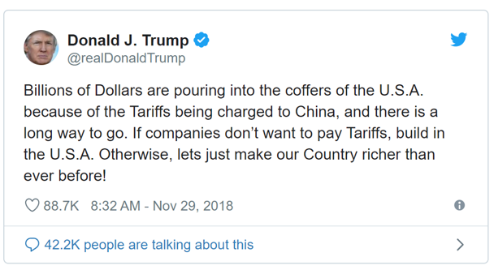
```

The graph shows that the tax revenue comes out of **consumer surplus**, so foreign companies don't bear the cost of tariffs, domestic consumers do.

</div>

```{r fig.width=5,fig.height=5, out.extra='style="float:right; padding:1px"'}
demand2 <- tibble(p= c(1,10), q= c(9,0))
supply2 <- tibble(p= c(0,9), q= c(0,9))

areaa <- tibble(p = c(10, 4, 4), q = c(0, 6, 0)) 
areab <- tibble(p = c(4, 4, 3, 3), q = c(0, 4, 3, 0))
areac <- tibble(p = c(4, 3, 3), q = c(4, 4, 3))
aread <- tibble(p = c(4, 4, 3, 3), q = c(4, 6, 6, 4))
areae <- tibble(p = c(4, 3 ,3), q = c(6, 7, 6))
areaf <- tibble(p = c(3, 3, 0), q = c(0 ,3, 0))

ggplot(mapping = aes(x = q, y = p)) + 
  ## Base Graph Begin**
  geom_path(data = demand2, color = color2, size = 1.2) + 
  annotate("text", x=9.2, y=.9, label = "D", color = color2, size = 6, parse = TRUE) +
  geom_path(data = supply2, color = color3, size = 1.2) + 
  annotate("text", x=9.2, y=9.1, label = "S", color = color3, size = 6, parse = TRUE) +
  coord_equal() +
  theme_classic(base_family = "sans") +
  theme(plot.title = element_text(size = rel(1.4))) +
  ## End Base Graph ##

  ## Shading in Surplus
  geom_polygon(data = areaa, fill = color2, alpha = .9) +
  geom_polygon(data = areab, fill = color5, alpha = .7) +
  geom_polygon(data = areac, fill = color4, alpha = 1) +
  geom_polygon(data = aread, fill = color5, alpha = 1) +
  geom_polygon(data = areae, fill = color4, alpha = 1) +
  geom_polygon(data = areaf, fill = color3, alpha = 1) +

  ## Label Surplus
  annotate("text", x=1, y=6, label = "1", color = color1, size = 6, hjust = .5, vjust = .5) +
  annotate("text", x=1, y=3.5, label = "2", color = color1, size = 6, hjust = .5, vjust = .5) +
  annotate("text", x=3.8, y=3.5, label = "3", color = color1, size = 6, hjust = .5, vjust = .5) +
  annotate("text", x=5, y=3.5, label = "4", color = color1, size = 6, hjust = .5, vjust = .5) +
  annotate("text", x=6.2, y=3.5, label = "5", color = color1, size = 6, hjust = .5, vjust = .5) +
  annotate("text", x=1, y=2, label = "6", color = color1, size = 6, hjust = .5, vjust = .5) +

    
  ## Graph Labels -- Change title and subtitle as needed ##
  labs(x = "Quantity", y = "Price",
       title = "Tariffs",
       subtitle = expression(paste("Tariffs decrease total surplus"))) + # Subtitle
  
  ##editing the x and y axes for the equilibria.  If dots aren't needed, still need to keep limit and expand##
  scale_x_continuous(expand = c(0,0), limit = c(0,10), breaks = c(5,3,7, 4, 6), labels = expression(Q[1], Q[S[1]], Q[D[1]], Q[S[2]], Q[D[2]])) + ## Set breaks = equilibrium Q
  scale_y_continuous(expand = c(0,0), limit = c(0,10), breaks = c(5,3,4), labels = expression(P[1], P[w], P[w]+T)) + ## Set breaks = equilibrium P
  

  
  ## Dashed Lines for initial equilibrium
  annotate("segment", x=0, xend = 5, y = 5, yend = 5, linetype = "dotted") + # horizontal line
  annotate("segment", x=5, xend = 5, y = 0, yend = 5, linetype = "dotted") + # vertical line
  annotate("segment", x=0, xend = 7, y = 3, yend = 3, linetype = "dotted") + # horizontal line
  annotate("segment", x=0, xend = 8, y = 4, yend = 4, color = color4, size = 1.5) + # horizontal line
  annotate("segment", x=3, xend = 3, y = 0, yend = 3, linetype = "dotted") + # vertical line
  annotate("segment", x=4, xend = 4, y = 0, yend = 4, linetype = "dotted") + # vertical line
  annotate("segment", x=6, xend = 6, y = 0, yend = 4, linetype = "dotted") + # vertical line
  annotate("segment", x=7, xend = 7, y = 0, yend = 3, linetype = "dotted") # vertical line


```

## Tariffs and Import Quotas

<div style="float: left; width: 55%;">

If the loss to domestic consumers is greater than the gains to domestic producers, then why then does the government pass tariffs?

- Concentrated Benefits and Diffused Costs
- Lobbying diverts resources from more productive activities.

Good economic policy is often bad politically, and popular policies are often based on faulty economic reasoning.

</div>

<div style="float: right; width:45%;">

```{r out.width="100%"}
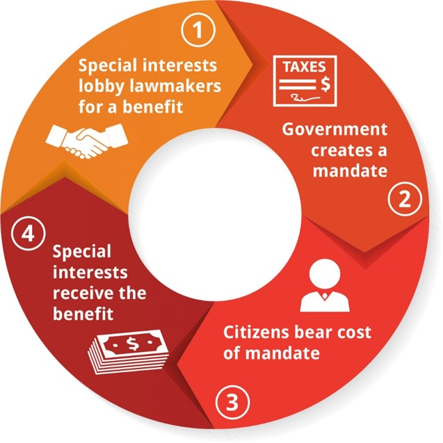
```
</div>

## Arguments Against Free Trade

Here are 6 of the most common arguments against international trade:

- Trade needs to be “balanced”
- Trade reduces the number of jobs in the U.S.
- It’s wrong to trade with countries with lax workplace standards/regulations. 
- We need to keep some industries for reasons of national security.
- We need to keep some “key” industries  because of beneficial spillovers onto other sectors.
- Infant Industry


## Trade Balance

A **trade deficit** is when the value of a country's imports exceeds the value of its exports.

A **trade surplus** is when the value of a country's exports exceeds the value of its imports.

There are two types of trade deficit people are concerned with:

- **Bilateral trade deficit** -- when a country runs a trade deficit with a single country.

- **Overall trade deficit** -- When a country runs a trade deficit with the rest of the world as a whole.

## Trade Balance

Bilateral trade deficits are a consequence of specialization and trade; it's nearly impossible for them not to exist.

- I run a trade deficit with the grocery store
- I run a trade surplus with my employer

If I didn't do both, I'd be forced to be self sufficient or rely entirely on barter.  Also, I'd be super poor.

The same is true for most people, companies, states, cities, and, of course, countries.

## Trade Balance

What about overall trade deficits?  

If the US has a trade deficit with the rest of the world, then the rest of the world is doing some combination of:

1. Giving the US free stuff
2. Hording US cash
3. Buying US capital

For the most part, the answer is: 3. Buying US capital

## Trade Balance

When people talk about trade deficits, they are typically talking about the **current account**.

- **Current Account** = trade in goods + trade in services + investment income 

A current account deficit implies a **capital account** surplus. 

- **Capital Account** = foreign direct investment (FDI) + portfolio investment + loans to US gov't and businesses

In fact, the absolute value of the capital account is roughly equal to the absolute value of the current account!

## Trade Balance

```{r include = FALSE}
getSymbols("IEANLC", src = "FRED", return.class = "data.frame") # Capital Account - need to multiply by -1
getSymbols("IEABC", src = "FRED", return.class = "data.frame") # Current Account

data <- merge(IEANLC, IEABC, by.y = "row.names", by.x = "row.names")
data$date <- data$Row.names

data <- subset(data, select = -Row.names)

data <- data %>% 
    mutate (capital = -1 * IEANLC / 1000) %>% 
    mutate (current = IEABC / 1000)

data <- na.omit(data)


data$date <- type.convert(data$date, replace = TRUE)
data$date <- as.Date(data$date)
```

<center>

```{r}
data %>% 
    ggplot(aes(date, current)) +
    geom_line(color = color2, size = .7) +
    geom_point(color = color2, size = 1.5) +
    theme_classic()+
    geom_line(aes(date,capital), color = color3, size = .7) +
    geom_point(aes(date,capital), color = color3, size = 1.5) +
    geom_hline(aes(yintercept = 0), lty = "solid", color = color4, size = 1.2) + 
    annotate(
        geom = "text",
        x = as.Date("2012-1-01"),
        y = 140,
        label = "Capital Account Surplus",
        hjust = 0,
        vjust = 0,
        color = color3
    ) +
    annotate(
        geom = "text",
        x = as.Date("2012-1-01"),
        y = -140,
        label = "Current Account Deficit",
        hjust = 0,
        vjust = 0,
        color = color2
    ) +
    labs(
        title = "Capital and Current Accounts",
        subtitle = "Quarterly US data since 1999",
        x = "Date",
        y = "Billions of USD",
        caption = "Data from U.S. Bureau of Economic Analysis, Retrieved from FRED, data series IEANLC and IEABC
        created by Matt Dobra @mattdobra"
    ) 

```

## Trade Balance

If having a trade deficit simply implies having a capital surplus, it bears asking: is having a capital surplus a problem for the US?

Two views:

1. No; this simply means the us is a great place to invest, and foreign investment in the US leads to more economic growth.

2. Yes; this implies Americans don't save enough and suggests America will have slower future growth than otherwise.

The bottom line is that most economists believe that the trade deficit is not a problem.  If anything is a problem, it's the low rate of savings, and trade restrictions are unlikely to solve a savings problem.

<center>

## Jobs

What happens when the US government uses tariffs to protect American jobs? 

<center>
```{r out.width = "35%"}
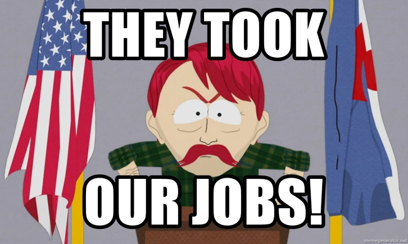
```
</center>

1. The tariffs increase the price of the protected goods.
2. Consumers now have less money to spend on other goods.
3. This implies that there will be fewer jobs in the industries that produce those other goods.

## Jobs

Moreover,recall from before that one implication of trade is that imports lead to either exports or more US capital.

Protecting jobs with tariffs therefore reduces jobs in:

- exporting industries
- jobs that receive foreign capital

## Jobs

Overall, does trade kill jobs?

Yes and no. But mostly no.

Trade kills certain jobs, but creates others at the same time.

The logic of comparative advantage implies that the jobs created by trade are more productive than those lost due to trade.


## Lax Workplace Regulations

Should the US trade with countries with weak workplace standards and regulations?

Examples:

- Use of child labor
- Lack of workplace safety
- Weak environmental standards

Or is trade with these countries unethical and thus should be prohibited? 

## Lax Workplace Regulations

If the concern is truly ethical, it is likely worse to **not** trade with them!

Consider child labor. Children in poor countries typically work out of necessity, so what sort of jobs will they get if tariffs cause businesses like clothing factories to shut down?

The alternative is often worse ethically: 

An 1997 Oxfam study followed a group of young girls who were fired from a Bangladeshi sweatshop due to foreign tariffs.  

- They found that many "were found working in more hazardous situations, in unsafe workshops where they were paid less, or in prostitution." 

## Lax Workplace Regulations

<div style="float: left; width: 40%;">

Not trading with countries employing child labor doesn't end the practice of child labor, because child labor is a consequence of poverty.

Another way to think about this: educating one's children is a normal good.  

So are environmental quality and strict workplace safety regulations.

</div>

```{r include=FALSE}
curyear <- lubridate::year(Sys.Date())
labor <- tibble(WDI(country = "all", 
                    indicator = c("mlabor" = "SL.TLF.0714.MA.ZS",
                                  "flabor" = "SL.TLF.0714.FE.ZS", 
                                  gdp = "NY.GDP.PCAP.PP.KD", 
                                  "pop" = "SP.POP.TOTL"), 
                    start = 2005, 
                    end = curyear, 
                    extra = TRUE, 
                    cache = NULL))

# labor <- lab %>% mutate(labor = row_mean)
labor$labor <- (labor$mlabor + labor$flabor)/2
labor <- na.omit(labor)
# labor$region[labor$region == list(c("8S", "Z4", "ZQ"))] <- "Asia"
# labor$region[labor$region == list(c("Z7"))] <- "Europe"
# labor$region[labor$region == list(c("ZG"))] <- "Africa"
# labor$region[labor$region == list(c("ZJ"))] <- "Americas"
labor$region <- factor(labor$region)

```


```{r fig.width=6 , fig.height=5, out.extra = 'style="float:right; padding:1px"', message = FALSE, warning = FALSE}

labor %>% 
  group_by(iso2c) %>% 
  slice(which.max(year)) %>% 
  mutate(continent = ifelse(region == "Sub-Saharan Africa" | country == "Egypt, Arab Rep." | country == "Algeria" | region == "Middle East & North Africa", "Africa", ifelse(region == "Europe & Central Asia", "Europe", ifelse(region == "East Asia & Pacific" | region == "South Asia", "Asia", "Americas")))) %>% 
  arrange(desc(pop)) %>% 
  ggplot(aes(x = gdp, y = labor)) +
    geom_point(aes(size = pop, color = continent)) +
    geom_smooth(aes(x = gdp, y = labor)) +
    geom_text(aes(label = country), size = 4, check_overlap = TRUE, vjust = "inward", hjust = "inward", show.legend = FALSE) +
    scale_color_manual(name = "Continent", values = c(color2, color3, color4, color5)) +
    guides(size = FALSE) +
    labs(title = "Prevalence of Child Labor",
         subtitle = "Child labor is more intensive in countries with lower GDP per capita", 
         y = "Average Weekly Hours of Child Labor",
         x = "GDP per Capita (2017 USD)", 
         caption = "Data from World Bank WDI using most recent available data for each country") 
  

```

## Trade and National Security

Some industries should probably be protected.

- e.g., vaccines, military hardware

The problem is that this argument is prone to significant abuse

- For example, military hardware includes **mohair**

## Key Industry Argument

Arguments of this sort look like:

- Industry X is the next super productive industry so we want it here.
  - e.g. biotech, AI
-Some industries are characterized by large spillovers to other industries.
  - e.g. the tech industry trains high-skill workers which benefits a large number of firms
  
  
## Key Industry Argument

To the extent these are plausible, OK, but:

- Subsidies are better options than tariffs.
- It is hard to determine which industries are "key" industries, so you might hamper the economy for no reason.

<center>
```{r out.width = "50%"}
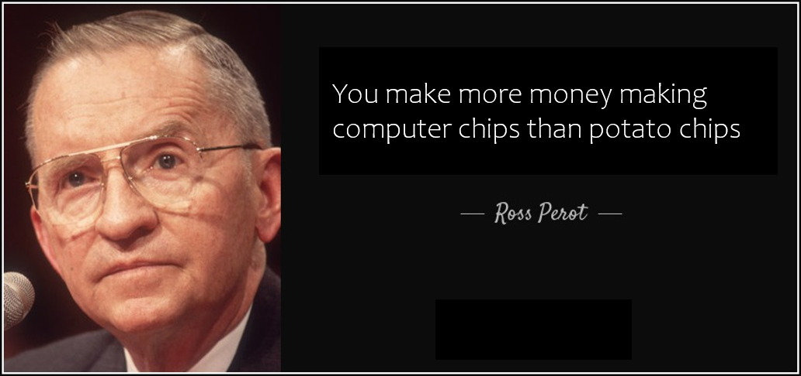
```
</center>

## Infant Industries

“Young” industries don’t have economies of scale, so protection in their early stages from foreign competitors with economy of scale will allow them to build.

- Problem:  Abused by those who want protection
- Problem:  Impossible to tell which industries might actually “grow up”
  - Example: In the 1980s, Brazil protected their nascent computer industry
  - Brazil never made computers, so protectionism hurt their economy.
  
## Trade and Globalization

Globalization is not new 

Periods of increased trade and the spread of ideas have been among the best for human progress.

