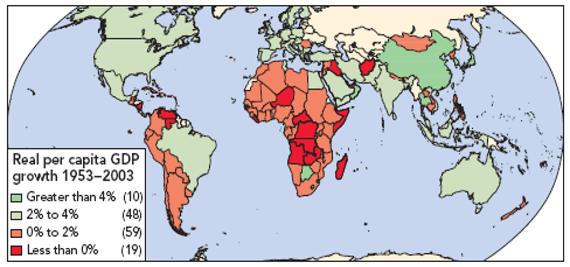
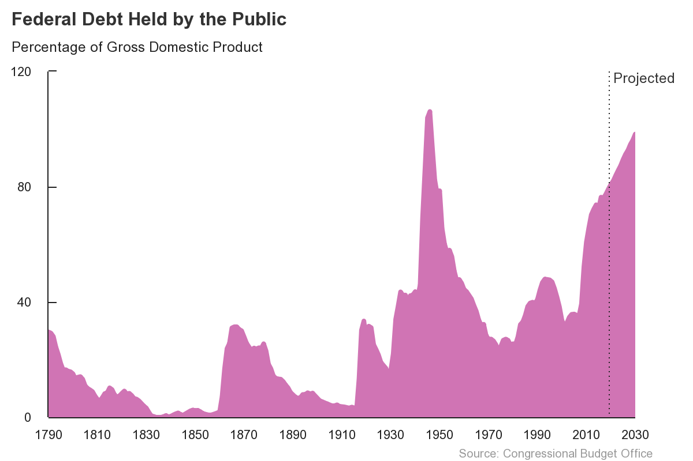
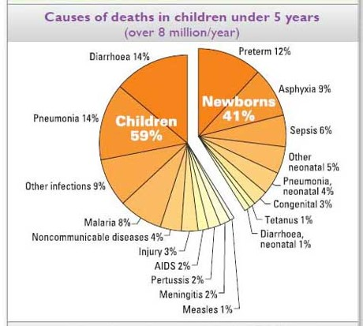
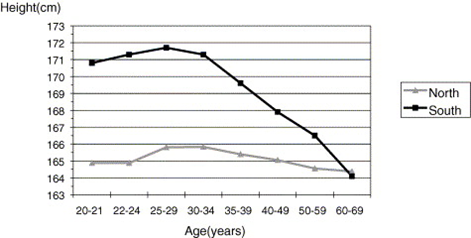
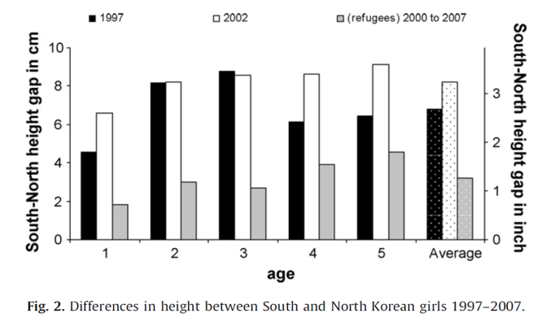

```{r setup, include=FALSE}
library(knitr)
library(tidyverse)
library(dplyr)
library(kableExtra)
library(ggthemes)
library(ggpubr)
library(DiagrammeR)
library(WDI) # World Development Indicators
library(quantmod) # Gets FRED data
library(scales)
theme_set(theme_classic())
knitr::opts_chunk$set(echo = FALSE, dev.args=list(bg="transparent"))

demand <- tibble(p = c(2,8), q = c(8,2))
demandright <- tibble(p = c(3,9), q = c(9,3))
demandleft <- tibble(p = c(1,7), q = c(7,1))
supply <- tibble(p=c(2,8), q=c(2,8))
supplyright <- tibble(p=c(1,7), q=c(3,9))
supplyleft <- tibble(p = c(3,9), q = c(1, 7))

###Color Themes
color1 <- "#FFFFFF" # white
color2 <- "#00205B" # med blue
color3 <- "#0A863D" # green
color4 <- "#99999A" # gray
color5 <- "#041C2C" # Navy

#
# 
# demand <- tibble(p= c(2,8), q=c(8,2))
# demandright <- tibble(p = c(3,9), q = c(9,3))
# demandleft <- tibble(p = c(1,7), q = c(7,1))
# supply <- tibble(p=c(2,8), q=c(2,8))
# supplyright <- tibble(p=c(1,7), q=c(3,9))
# supplyleft <- tibble(p = c(3,9), q = c(1, 7))

## Create Recession dataframe
getSymbols("USREC",src="FRED")
USREC <- USREC["1855/"]
start <- index(USREC[which(diff(USREC$USREC)==1)])
end   <- index(USREC[which(diff(USREC$USREC)==-1)-1])
if(length(end)<length(start)){
end <- c(end, Sys.Date())    
}
recession.df <- data.frame(start=start, end=end)


```

# GDP
## Introduction

GDP and GDP per capita are measures used to measure the size of an economy and the economic well being of people within that economy.

While not perfect measures, they are widely regarded as the best measures for measuring differences in standards of living and tracking those changes over time.

## GDP
<div style="float: left; width: 40%;">

```{r include=FALSE}
trgtyear <- lubridate::year(Sys.Date())-3
gdp1 <- tibble(WDI(country = "all", indicator = c("gdppercap" = "NY.GDP.PCAP.PP.KD", "gdp" = "NY.GDP.MKTP.PP.KD"), start = trgtyear, end = trgtyear, extra = TRUE, cache = NULL))

gdp1 <- na.omit(gdp1)
gdp1 <- gdp1 %>% 
    filter(capital != "")

```
GDP can be used to compare the size of economies, while GDP per capita is a better measure of the well being of people within an economy.

The right panel displays the world's 10 largest economies in `r trgtyear`.

Clearly, having a large economy (GDP) is not the same as having a high standard of living (GDP per capita).

</div>


<div style = "float: right; width: 60%;">

```{r fig.width=5,fig.height=5, out.extra='style="float:right; padding:1px"'}

gdp1 %>% 
    arrange(desc(gdp)) %>% 
    filter(row_number() < 11) %>% 
    select(country, gdp, gdppercap) %>% 
    mutate(gdp = gdp/1000000) %>% 
    mutate(gdp = scales::dollar(gdp)) %>% 
    mutate(gdppercap = scales::dollar(gdppercap)) %>% 
    kable(format = "html", table.attr = "class=\"rmdtable\"", col.names = c("Country", "GDP (Millions of USD)",
                           "GDP per Capita (USD)")) %>% 
    column_spec(1, background = color2, color = color1)


```

</div>

## GDP

```{r include = FALSE}
getSymbols("A939RX0Q048SBEA", src = "FRED", return.class = "data.frame") # Real Quarterly US GDP per capita
getSymbols("USREC", src = "FRED", return.class = "data.frame") # Recession dates
usgdp <- merge(A939RX0Q048SBEA, USREC, by.y = "row.names", by.x = "row.names") 
usgdp$date <- usgdp$Row.names
usgdp <- subset(usgdp, select = -Row.names)
usgdp <- rename(usgdp, rec = USREC)
usgdp <- rename(usgdp, gdp = A939RX0Q048SBEA)
usgdp$date <- type.convert(usgdp$date, replace = TRUE)
usgdp$date <- as.Date(usgdp$date)


```

<div style="float: left; width: 30%;">


The change in standards of living over time is best looked at by looking at the growth of GDP per capita.  

The right panel displays US GDP per capita since 1947, and the shaded regions demarcate economic recessions.

</div>


<div style = "float: right; width: 70%;">


<center>

```{r warning = FALSE}

ggplot() +
    geom_line(data = usgdp, aes(x = date, y = gdp), color = color2, size = 1.2) + 
    geom_rect(data = recession.df, aes(xmin = start, xmax = end, ymin = -Inf, ymax = +Inf), fill = color5, alpha = .3) +
    scale_x_date(
        limits = as.Date(c("1948-01-01", Sys.Date())),
        labels = date_format("%Y"),
        breaks = function(x)
            seq.Date(
                from = as.Date("1950-01-01"),
                to = as.Date(Sys.Date()),
                by = "10 years"
            )) +
    # ylim(0,max(usgdp$gdp)) +
    theme_classic()+
    labs(
        title = "US GDP per Capita",
        subtitle = "Quarterly data since 1947",
        x = "Date",
        y = "Constant 2012 USD",
        caption = "Data from U.S. Bureau of Economic Analysis, Retrieved from FRED, data series A939RX0Q048SBEA
        created by Matt Dobra @mattdobra"
    ) 


   

```
</div>

## GDP

**Gross Domestic Product** (GDP) is the ***market value*** of all ***final*** ***goods and services*** ***produced*** within a ***country*** in a ***year***.

***GDP per capita*** is simply GDP divided by a country's population.

Let's examine more closely at the underlined parts of the definition.

## GDP Calculates Market Value

GDP measures total production.  This raises a couple practical issues:

1. How do you add up different goods and services and get a number that makes sense?  
2. Some goods should count more than others -- producing a house is a significantly bigger deal than producing a toothpick.  

The solution to both of these issues is to denominate production in dollar terms, so we multiply the quantities of final goods and services by their market prices and add up these values.

## GDP Calculates Market Value

Assume that the US economy produces 10 million automobiles and 2 billion pencils each year.

Next, assume that the average price of an automobile is \$40,000 and the average price of a pencil is \$0.10.

This implies that the market value of automobiles is $10{,}000{,}000\times\$40{,}000=\$400{,}000{,}000{,}000$ and the market value of pencils is $2{,}000{,}000{,}000\times\$0.10=\$200{,}000{,}000$.

Adding these together, the GDP generated from automobiles and pencils is $\$400{,}000{,}000{,}000 + \$200{,}000{,}000 = \$400{,}200{,}000{,}000$

## GDP Only Includes Final Products

**Intermediate goods** are sold to firms and then bundled or processed with other goods or services for sale at a later stage.

**Final goods** are the finished goods sold to final users and then consumed or held in personal inventories.

To avoid double-counting, *only final goods are included in GDP*.

## GDP Includes Goods and Services

**Goods** are *tangible*. e.g. cars, food, clothes.

**Services** are *intangible*. Transportation, haircuts, medical care.

Both are included in GDP

## GDP Includes Goods and Services

<div style = "float:left; width:30%">

Since the 1950s, the portion of the economy created by services nearly doubled.

Most of that increase happened before the year 2000.

</div>

<div style = "float: right; width: 70%;">

```{r include = FALSE}
getSymbols("DSERRE1Q156NBEA", src = "FRED", return.class = "data.frame") # Services as share of GDP
services <- DSERRE1Q156NBEA
rm(DSERRE1Q156NBEA)
services <- rename(services, services = DSERRE1Q156NBEA)
services <- rownames_to_column(services, "date")
services$date <- as.Date(services$date)
```

```{r warning = FALSE, out.extra='style="float:right; padding:1px"'}

ggplot() +
    geom_line(data = services, aes(x = date, y = services), color = color2, size = 1.2) + 
    geom_rect(data = recession.df, aes(xmin = start, xmax = end, ymin = -Inf, ymax = +Inf), fill = color5, alpha = .3) +
    xlim(as.Date("1947-01-01"), Sys.Date()) +
    # ylim(0,max(usgdp$gdp)) +
    theme_classic()+
    scale_y_continuous(breaks = seq(25,45, by = 5)) +
    labs(
        title = "Services as a Share of US GDP",
        subtitle = "Quarterly data since 1947",
        x = "Date",
        y = "Percent of GDP",
        caption = "Data from U.S. Bureau of Economic Analysis, Retrieved from FRED, data series DSERRE1Q156NBEA
        created by Matt Dobra @mattdobra"
    ) 
```
</div>

## GDP Includes Goods and Services

<div style = "float:left; width:30%;">

Since 2000, the shares of services, durable goods, and non durable goods has remained roughly constant.

**Durable Goods** -- Goods that are expected to last for a year or more
**Nondurable Goods** -- Goods that are expected to be used up within a year

</div>

<div style = "float:right; width:70%;">

```{r include = FALSE, fig.width=5,fig.height=5, out.extra='style="float:right; padding:1px"'}
getSymbols("DDURRE1Q156NBEA", src = "FRED", return.class = "data.frame") # Durables as share of GDP
durables <- DDURRE1Q156NBEA
rm(DDURRE1Q156NBEA)
durables <- rename(durables, durables = DDURRE1Q156NBEA)
durables <- rownames_to_column(durables, "date")
durables$date <- as.Date(durables$date)

getSymbols("DNDGRE1Q156NBEA", src = "FRED", return.class = "data.frame") # Nondurables as share of GDP
nondurables <- DNDGRE1Q156NBEA
rm(DNDGRE1Q156NBEA)
nondurables <- rename(nondurables, nondurables = DNDGRE1Q156NBEA)
nondurables <- rownames_to_column(nondurables, "date")
nondurables$date <- as.Date(nondurables$date)
```

```{r warning = FALSE}

ggplot() +
    geom_line(data = services, aes(x = date, y = services), color = color2, size = 1.2) + 
    annotate("text", x = as.Date("2005-01-01"), y = 45.5, label = "Services", color = color2, size = 5) +
    geom_line(data = durables, aes(x = date, y = durables), color = color3, size = 1.2) + 
    annotate("text", x = as.Date("2005-01-01"), y = 11, label = "Durable Goods", color = color3, size = 5) +
    geom_line(data = nondurables, aes(x = date, y = nondurables), color = color4, size = 1.2) + 
    annotate("text", x = as.Date("2005-01-01"), y = 17, label = "Nondurable Goods", color = color4, size = 5) +
    geom_rect(data = recession.df, aes(xmin = start, xmax = end, ymin = -Inf, ymax = +Inf), fill = color5, alpha = .3) +
    xlim(as.Date("2000-01-01"), Sys.Date()) +
    # ylim(0,max(usgdp$gdp)) +
    theme_classic()+
    scale_y_continuous(breaks = seq(5,50, by = 5)) +
    labs(
        title = "Components of US Consumption",
        subtitle = "Quarterly data since 2000",
        x = "Year",
        y = "Percent of GDP",
        caption = "Data from U.S. Bureau of Economic Analysis, Retrieved from FRED, data series DSERRE, DNDGRE, & DDURRE
        created by Matt Dobra @mattdobra"
    ) 
```

## GDP Measures Production

GDP only calculates what is produced, not what already exists. Thus:

- The sale of used goods are not included
- The sale of financial assets (stocks, bonds, etc.) are not included
    - The services of people selling used goods or financial assets *are* included, however
    
## GDP Has a Geographic Focus

GDP only includes production that takes place within the borders.

- Typically we talk about national GDP, but we can also talk about subnational GDP (state GDP, county GDP, etc).

Examples:

- Cars produced in Mexico by American car companies are NOT included in US GDP, they go in Mexican GDP.
- Cars produced in the U.S. by German car companies are included in US GDP, not German GDP.

**Gross National Product** (GNP) is a measure that looks at the nationality of the person doing the production, not the location of the production.

## GDP is Temporal

GDP is a flow measure of income:

- it measures a rate of production during a given time period

This is contrast to a nation’s wealth: 

- the value of a nation’s assets at a point in time

## GDP

Putting the definition back together:

**Gross Domestic Product** (GDP) is the ***market value*** of all ***final*** ***goods and services*** ***produced*** within a ***country*** in a ***year***.

***GDP per capita*** is simply GDP divided by a country's population.

## GDP

Questions: 

- John Deere buys steel to make into tractors.  Does their purchase of steel add to GDP?
- On eBay you sell your collection of Magic: The Gathering cards.  Does your sale add to GDP? 
- An immigrant from Namibia works as a cook in a restaurant in San Francisco. Is the money he earns considered part of the GDP of the U.S. or Namibia?

## GDP Growth

The growth rate of GDP tells us how rapidly a country's production is rising or falling over time.

The formula for calculating the growth rate from year 1 to year 2 $\frac{GDP_{y2}-GDP_{y1}}{GDP_{y1}}$

For example, in 2004 US GDP was \$11.7T and in 2005 it was \$12.5T.

GDP growth was therefore $\frac{\$12.5T-\$11.7T}{\$11.7T} = 6.8\%$

## GDP Growth

If GDP in 1990 was \$5.8 trillion and GDP in 1991 was \$6.0 trillion, what was the growth rate of (nominal) GDP? 

If GDP in 2008 was \$14.4 trillion and GDP in 2009 was \$13.9 trillion, what was the growth rate of (nominal) GDP?

## Nominal vs. Real GDP

**Nominal variables**, such as nominal GDP, have not been adjusted for changes in prices.

**Real variables**, such as real GDP, have been adjusted for changes in prices.

Economists usually are more interested in real GDP because increases in real GDP reflect increases in the standard of living.

Whenever one is looking at changes in a monetary variable over time, it is essential to use **real** variables

## Nominal vs. Real GDP

In 2005, Nominal GDP was \$12.4T
in 1995, Nominal GDP was \$7.4T

The Growth of Nominal GDP was therefore $\frac{\$12.4T-\$7.4T}{\$7.4T} = 67.6\%$

The problem with this calculation is that **2** things changed between 1995 and 2005:

- More stuff was produced
- The prices of that stuff went up

Converting from nominal to real GDP eliminated the effect of the price change, so you are only measuring the increase in production.

## Nominal vs Real GDP

2005 GDP was \$12.4T, which was the amount of stuff produced in 2005 valued at 2005 prices.  

1995 GDP was \$7.4T, which was the amount of stuff produced in 1995 valued at 1995 prices. 

What if we calculated 1995 GDP using 2005 prices instead?  

1995 production valued at 2005 prices was \$9.0T

Real GDP growth between 1995 and 2005, therefore, was $\frac{\$12.4T-\$9.0T}{\$9.0T} = 37.8\%$

## US Real GDP Growth

<div style = "float:left; width:30%;">

Most economists would choose real GDP growth as the best single indicator of economic performance.

Real Growth per Capita is the best reflection of changing living standards.  

</div>

<div style = "float:right; width:70%;">

```{r include = FALSE}

usgdp <- usgdp %>% 
    mutate(growth = (gdp - lag(gdp, 4))/lag(gdp,4))

```

```{r warning = FALSE}
ggplot() +
    geom_line(
        data = usgdp,
        aes(x = date, y = growth),
        color = color2,
        size = 1.2
    ) +
    geom_rect(
        data = recession.df,
        aes(
            xmin = start,
            xmax = end,
            ymin = -Inf,
            ymax = +Inf
        ),
        fill = color5,
        alpha = .3
    ) +
    geom_hline(aes(yintercept = 0),
               lty = "dashed",
               color = color3,
               size = 1.2) +
    #    xlim(as.Date("1948-01-01"), Sys.Date()) +
    theme_classic() +
    scale_y_continuous(breaks = seq(-.1, .2, by = .02),
                       labels = scales::percent_format(accuracy = 1)) +
    scale_x_date(
        limits = as.Date(c("1948-01-01", Sys.Date())),
        labels = date_format("%Y"),
        breaks = function(x)
            seq.Date(
                from = as.Date("1950-01-01"),
                to = as.Date(Sys.Date()),
                by = "10 years"
            )
    ) +
    labs(
        title = "Growth Rate of Real GDP per Capita",
        subtitle = "US data since 1947",
        x = "Year",
        y = "Growth Rate",
        caption = "Data from U.S. Bureau of Economic Analysis, Retrieved from FRED, data series A939RX0Q048SBEA
        created by Matt Dobra @mattdobra"
    ) 
```

## Real GDP per Capita Growth

<center>
```{r out.width = "80%"}

```
</center>

```{r CPIData, include = FALSE}
getSymbols("CPIAUCSL", src = "FRED", return.class = "data.frame") # CPIData
CPI <- rename(CPIAUCSL, cpi = CPIAUCSL)
CPI <- rownames_to_column(CPI, "date")
CPI$date <- as.Date(CPI$date)
rm(CPIAUCSL)

CPI <- CPI %>% 
    filter(lubridate::month(date) == 01) %>% 
    mutate(year = lubridate::year(date)) %>% 
    mutate(year = as.numeric(year))

curyear <- lubridate::year(Sys.Date())

CPIlastdate<-lubridate::year(CPI[nrow(CPI),1])

## not sure what these next 4 lines are supposed to do? I think this is solving the January problem.
if(curyear!=CPIlastdate) {
  CPIlastrow<-slice_tail(CPI, n = 1)
  CPIlastrow$year <- curyear 
  CPI <- rbind(CPI, CPIlastrow)
  }


```

## US Growth in Pictures

<center>

```{r out.width = "80%"}

```
</center>

To convert these prices to current prices, multiply by `r round(CPI$cpi[CPI$year == lubridate::year(Sys.Date())]/CPI$cpi[CPI$year == 1973], 2) `

## US Growth in Pictures

<div style = "float:right; width:70%;">

<center>
```{r out.width = "100%"}

```
</center>
</div>

<div style = "float:left; width:30%;">

To convert these prices to current prices, multiply by `r round(CPI$cpi[CPI$year == lubridate::year(Sys.Date())]/CPI$cpi[CPI$year == 1982], 2) `

</div>

## US Growth in Pictures

<center>
```{r out.width = "80%"}

```
</center>

To convert these prices to current prices, multiply by `r round(CPI$cpi[CPI$year == lubridate::year(Sys.Date())]/CPI$cpi[CPI$year == 1957], 2) `

Another way to put this in perspective: roughly speaking, a typewriter in 1957 cost about the same as a basic calculator in 1973, a microwave in 1982, and an iPhone today.


# Fluctuations
## Recessions

A recession is:

> …a significant, widespread decline in economic activity spread across the economy, lasting for more than a few months, normally visible [as a decline] in real GDP, real income, employment, industrial production, and wholesale-retail sales.
> <br>
> ---National Bureau of Economic Research (NBER)

The NBER is an economic research institution located in Cambridge, Massachusetts.

They are the most authoritative source of identifying recessions.

## Recessions

<div style = "float:right; width:30%;">

How often do recessions occur?

- There have been 12 recessions since 1948
- There have been 4 recessions since 1990 

</div>
 
<div style = "float: left; width: 70%;">

```{r include = FALSE}
avggrowth <- psych::geometric.mean(usgdp$growth, na.rm=TRUE)
```

```{r GDP_Growth, warning = FALSE, out.width = "100%"}
ggplot() +
    geom_line(
        data = usgdp,
        aes(x = date, y = growth),
        color = color2,
        size = 1.2
    ) +
    geom_rect(
        data = recession.df,
        aes(
            xmin = start,
            xmax = end,
            ymin = -Inf,
            ymax = +Inf
        ),
        fill = color5,
        alpha = .3
    ) +
    geom_hline(aes(yintercept = 0),
               lty = "solid",
               color = color3,
               size = 1.2) +
    geom_hline(aes(yintercept = avggrowth),
               lty = "dashed",
               color = color3,
               size = 1.2) +
    annotate(geom = "text",
             label = paste("Average growth\nrate = ", round(100*avggrowth,1), "%"),
             x = as.Date("2012-1-01"),
             y = .045,
             color = color3) +
    theme_classic() +
    scale_y_continuous(breaks = seq(-.1, .2, by = .02),
                       labels = scales::percent_format(accuracy = 1)) +
    scale_x_date(
        limits = as.Date(c("1948-01-01", Sys.Date())),
        labels = date_format("%Y"),
        breaks = function(x)
            seq.Date(
                from = as.Date("1950-01-01"),
                to = as.Date(Sys.Date()),
                by = "10 years"
            )
    ) +
    labs(
        title = "Growth Rate of Real GDP per Capita",
        subtitle = "US data since 1947",
        x = "Year",
        y = "Growth Rate",
        caption = "Data from U.S. Bureau of Economic Analysis, Retrieved from FRED, data series A939RX0Q048SBEA
        created by Matt Dobra @mattdobra"
    ) 
```

</div>

## Recessions

Defining when a recession begins and ends is not easy.

- Quarterly data are not available until almost a month after the quarter is over.
- There are often significant revisions to the GDP estimates.
    - These updates can occur *years* later.
- Not all downturns are recessions

## Recessions

Example: Dating the 2001 Recession.

- The official NBER starting date is March 2001.
- Data revisions have led many economists to conclude that the recession actually begain in late 2000.

Who cares?  

- The US presidency changed in January, 2001.
    - Democrats argue that the recession was the fault of the policies of the Bush administration
    - Republicans argue that the recession began under Clinton

## Recessions

Example: Dating the 2020 Recession.

- The official NBER starting date is February 2020.
- Many who look at the data conclude that it started in March 2020.

Who cares?

- If it started in March, it is fairly clear that the Covid-19 crisis is to blame, but...
- If it started in February, one could claim that the recession may actually be the result of bad Trump policies and Covid-19 simply made it worse.


# National Income Accounting

## National Income Accounting

There are two common ways of splitting GDP

- National spending approach: 
    - $GDP = C + I + G + NX$
- Factor income approach:
    - $GDP = Wages + Rent + Interest + Profit$
    
Both approaches are useful for understanding business cycles and economic growth.

## National Income Accounting

The national spending identity is: 

- $Y = C + I + G + NX$
    - $Y =$ Nominal GDP
    - $C =$ The market value of consumption goods and  services
    - $I =$ The market value of investment goods
    - $G =$ The market value of government purchases (not incuding transfers!)
    - $NX =$ Net exports (market value of exports minus market value of imports)

## National Income Accounting

<div style = "float:right; width:30%;">

These shares have remained fairly constant since WWII

Government spending does not include *transfers*, so this graph does not capture the increase in government.

</div>
 
<div style = "float: left; width: 70%;">

```{r Make_Nat_Inncome_data, include = FALSE}
consumption <- getSymbols("DPCERE1A156NBEA", src = "FRED", return.class = "data.frame", env=NULL) # Consumption
investment <- getSymbols("A006RE1A156NBEA", src = "FRED", return.class = "data.frame", env=NULL) # Investment
government <- getSymbols("A822RE1A156NBEA", src = "FRED", return.class = "data.frame", env=NULL) # Government
netexports <- getSymbols("A019RE1A156NBEA", src = "FRED", return.class = "data.frame", env=NULL) # Net Exports

consumption <- rename(consumption, share = DPCERE1A156NBEA)
investment <- rename(investment, share = A006RE1A156NBEA)
government <- rename(government, share = A822RE1A156NBEA)    
netexports <- rename(netexports, share = A019RE1A156NBEA)

consumption <- rownames_to_column(consumption, "date")
consumption <- mutate(consumption, date = lubridate::year(date))
consumption <- mutate(consumption, spend = "Consumption")

investment <- rownames_to_column(investment, "date")
investment <- mutate(investment, date = lubridate::year(date))
investment <- mutate(investment, spend = "Investment")

government <- rownames_to_column(government, "date")
government <- mutate(government, date = lubridate::year(date))
government <- mutate(government, spend = "Government")

netexports <- rownames_to_column(netexports, "date")
netexports <- mutate(netexports, date = lubridate::year(date))
netexports <- mutate(netexports, spend = "Net Exports")

dat <- bind_rows(list(consumption, investment, government, netexports))

dat$spend <- factor(dat$spend, levels = c("Government", "Investment", "Consumption","Net Exports"))
```

```{r Nat_Income_Stacked, warning = FALSE}
ggplot() +
    geom_col(data = dat, aes(x = date, y = share, fill = spend, color = spend)) +
    theme_classic() +
    theme(axis.line.x = element_blank(), axis.line.y = element_blank()) +
    labs(title = "National Income Accounting",
         subtitle = "Share of total GDP, US",
         y = "Share",
         x = "Year",
         caption = "Data from BEA, Retrieved from FRED
        created by Matt Dobra @mattdobra" ) +
    scale_color_manual(values = c(color2, color4, color3, color5))+
    scale_fill_manual(values = c(color2, color4, color3, color5)) +
    scale_x_continuous(expand = c(0,0)) +
    scale_y_continuous(expand = c(0,0)) 

    
# Alternate Caption    caption = "Data from BEA, Retrieved from FRED, data series DPCERE, A006RE, A822RE & A019RE
#        created by Matt Dobra @mattdobra" 


```

</div>


## National Income Accounting

<div style = "float:right; width:30%;">

During the Great Depression, spending was roughly 20% of GDP. 

Between WWI and the Depression, spending was around 12%.

Prior to WWI, government spending accounted for about 7% of GDP.

</div>
 
<div style = "float: left; width: 70%;">

```{r Make_govt_size_data, include = FALSE}
# transfers <- getSymbols("A084RC1Q027SBEA", src = "FRED", return.class = "data.frame", env=NULL) # Transfers
# transfers <- rename(transfers, xfers = A084RC1Q027SBEA)
# transfers <- rownames_to_column(transfers, "date")
# # transfers <- mutate(transfers, date = lubridate::year(date))
# 
# govtspend <- getSymbols("GCE", src = "FRED", return.class = "data.frame", env=NULL) # Transfers
# govtspend <- rename(govtspend, govtspend = GCE)
# govtspend <- rownames_to_column(govtspend, "date")
# # govtspend <- mutate(govtspend, date = lubridate::year(date))
# 
# nomgdp <- getSymbols("GDP", src = "FRED", return.class = "data.frame", env=NULL) # Transfers
# nomgdp <- rename(nomgdp, gdp = GDP)
# nomgdp <- rownames_to_column(nomgdp, "date")
# # nomgdp <- mutate(nomgdp, date = lubridate::year(date))
# 
# 
# dat <- bind_cols(list(transfers, govtspend, nomgdp))
# dat <- mutate(dat, govtsize = (govtspend + xfers)/gdp)
# dat <- mutate(dat, date = as.Date(date))

###

transfers <- getSymbols("A084RC1Q027SBEA", src = "FRED", return.class = "data.frame", env=NULL) # Transfers
transfers <- rename(transfers, xfers = A084RC1Q027SBEA)
transfers <- rownames_to_column(transfers, "date")
# transfers <- mutate(transfers, date = lubridate::year(date))

govtspend <- getSymbols("GCE", src = "FRED", return.class = "data.frame", env=NULL) # Transfers
govtspend <- rename(govtspend, govtspend = GCE)
# govtspend <- mutate(govtspend, date = lubridate::year(date))

nomgdp <- getSymbols("GDP", src = "FRED", return.class = "data.frame", env=NULL) # Transfers
nomgdp <- rename(nomgdp, gdp = GDP)
# nomgdp <- mutate(nomgdp, date = lubridate::year(date))


dat <- bind_cols(list(transfers, govtspend, nomgdp))
dat <- mutate(dat, govtsize = (govtspend + xfers)/gdp)
dat <- mutate(dat, date = as.Date(date))


```

```{r Govt_Growth, warning = FALSE, out.width = "100%"}
# dat %>% 
#     mutate(date = as.Date(date)) %>% 
 ggplot() +
    geom_line(
        data = dat,
        aes(x = date, y = govtsize),
        color = color2,
        size = 1.2
    ) +
    geom_rect(
        data = recession.df,
        aes(
            xmin = start,
            xmax = end,
            ymin = -Inf,
            ymax = +Inf
        ),
        fill = color5,
        alpha = .3
    ) +
    theme_classic() +
    scale_y_continuous(breaks = seq(from = .2, to =.6, by = .02),
                       labels = scales::percent_format(accuracy = 1)) +
    scale_x_date(
        limits = as.Date(c("1948-01-01", Sys.Date())),
        labels = date_format("%Y"),
        breaks = function(x)
            seq.Date(
                from = as.Date("1950-01-01"),
                to = as.Date(Sys.Date()),
                by = "10 years"
            )
    ) +
    labs(
        title = "Growth of Government",
        subtitle = "Government consumption plus transfers as a share of GDP",
        x = "Year",
        y = "Size of Government",
        caption = "Data from BEA, Retrieved from FRED
        created by Matt Dobra @mattdobra"
    ) 
```

</div>

<div style = "float:left; width:99%;">

Since the end of WWII, the size of government (spending + transfers) has increased by over 50%.  

</div>

## National Income Accounting

WHen money gets spent, it winds up as some else's income.  This gives rise to the the Factor Income Approach:

$Y = Wages + Rent + Interest + Profit$ 

In theory, adding up GDP this way should give the same answer as the spending approach.

# Limitations of GDP
## Limitations of GDP

A major issue with GDP calculations is that there are many products for which we do not actually know the market value:

- GDP doesn't include the underground economy
    - Purchase of illegal goods/services, working "under the table"
    
- GDP doesn't count nonmarket production
    - Household work, bartered goods/services

The next few slides have some examples of the problems these issues may cause.
    
## Limitations of GDP

The entry of women into the workplace since the 1950s may have biased GDP growth upward.

- The share of woomen in the labor force has almost doubled since 1950
- When women were at home, unpaid work was not counted in GDP
- Now, much of the same work is paid for and therefore counted 
    - e.g., use of paid nannies, preschools, housekeepers, dining out

## Limitations of GDP

GDP differences between developed and less developed countries may be exaggerated.

- Non-market activity is far more prevalent in less developed countries.

GDP may be overstated in times of government expansion

- There is no "market price" for many products the government buys, and the government is likely to pay a higher price than these items' value.

## Limitations of GDP

In addition to these issues regarding accurately measuring *output*, there are additional issues with respect to GDP as a measure of *well being*.

Some examples:

- GDP does not count leisure
- GDP does not include things like environmental quality, crime, pollution, etc.
- GDP does not account for the *distribution of income*
- Some very valuable things are given away at zero price (e.g. YouTube, open-source software, etc.)
- GDP does a poor job in adjusting for changes in product quality over time
- GDP does a poor job accounting for newly invented products.

# Federal Budgets
## Federal Budget

Let's look more closely at the taxing and spending plan of the US Federal government.

- A **budget deficit** exists in years when the amount of money the government spends is greater than tax revenues.  

- Typically, buget deficits are financed by borrowing, If the government has a deficit, this gets added to the **National Debt**

- A **budget surplus** occurs when the government spends less than it collects in taxes.  Budget surpluses reduce the debt

## Federal Budget Deficits

<div style="float:right; width:70%;">
```{r include = FALSE}
getSymbols("FYFSGDA188S", src = "FRED", return.class = "data.frame") # Services as share of GDP
deficit <- FYFSGDA188S
rm(FYFSGDA188S)
deficit <- rename(deficit, deficit = FYFSGDA188S)
deficit <- rownames_to_column(deficit, "date")
deficit$date <- as.Date(deficit$date)
```

```{r warning = FALSE, out.width = "100%", out.extra='style="float:right; padding:1px"'}

ggplot() +
    geom_line(data = deficit, aes(x = date, y = deficit), color = color2, size = 1.2) + 
    geom_rect(data = recession.df, aes(xmin = start, xmax = end, ymin = -Inf, ymax = +Inf), fill = color5, alpha = .3) +
    geom_hline(yintercept = 0, color = color3, size = 1.2) +
    theme_classic()+
    scale_y_continuous(breaks = seq(-30,5, by = 5)) +
    scale_x_date(limits = as.Date(c("1929-01-01", Sys.Date())),
        expand = c(0,0),   
        labels = date_format("%Y"),
        breaks = function(x)
            seq.Date(
                from = as.Date("1930-01-01"),
                to = as.Date(Sys.Date()),
                by = "10 years"
            )) +
    labs(
        title = "Federal Deficit",
        subtitle = "Deficit as a share of GDP, quarterly data since 1929",
        x = "Date",
        y = "Percent of GDP",
        caption = "Data from FRED, created by Matt Dobra @mattdobra"
    ) 
```
</div>

<div style="float:left; width:30%;">

The government has run a debt for most of the last century.

Deficits spike during recessions, creating debt, but the debt rarely gets paid off afterwards.

This is an example of the **flypaper effect** or the **ratchet effect**.

</div>

## Deficits Become Debts

<div style="float:left; width:60%;">

```{r warning = FALSE, out.width = "100%"}

```
</div>

<div style="float:left; width:40%;">

The Congressional Budget Office (CBO) net government debt as a share of GDP since 1790.  

They project debt to increase sharply for the foreseeable future.

This graph pre-dates Covid-19!

</div>

## Net Debt, Gross Debt

The CBO reports **net debt**, which excludes intergovernmental debt.  

- Most intergovernmental debt is held by the Social Security Administration and various federal pension programs.
- Intergovernmental debt has less effect on short-term financial markets than debt held by the public.

Because intergovernmental debt must eventually be paid with taxes, many people prefer to use **gross debt**, which is intergovernmental debt plus debt held by the public.

## Gross Debt

<div style="float:right; width:70%;">
```{r include = FALSE}
getSymbols("GFDEGDQ188S", src = "FRED", return.class = "data.frame") # Gross Debts share of GDP
grossdebt <- GFDEGDQ188S
rm(GFDEGDQ188S)
grossdebt <- rename(grossdebt, grossdebt = GFDEGDQ188S)
grossdebt <- rownames_to_column(grossdebt, "date")
grossdebt$date <- as.Date(grossdebt$date)
```

```{r warning = FALSE, out.width = "100%", out.extra='style="float:right; padding:1px"'}

ggplot() +
    geom_line(data = grossdebt, aes(x = date, y = grossdebt), color = color2, size = 1.2) + 
    geom_rect(data = recession.df, aes(xmin = start, xmax = end, ymin = -Inf, ymax = +Inf), fill = color5, alpha = .3) +
    theme_classic()+
    scale_y_continuous(breaks = seq(30,140, by = 10)) +
    scale_x_date(limits = as.Date(c("1966-01-01", Sys.Date())),
        expand = c(0,0),          
        labels = date_format("%Y"),
        breaks = function(x)
            seq.Date(
                from = as.Date("1965-01-01"),
                to = as.Date(Sys.Date()),
                by = "5 years"
            )) +
    labs(
        title = "National Debt",
        subtitle = "Gross debt as a share of GDP, quarterly data since 1966",
        x = "Date",
        y = "Percent of GDP",
        caption = "Data from FRED, created by Matt Dobra @mattdobra"
    ) 
```
</div>
<div style = "float:left; width:30%;">

The national debt has expanded considerably since the 1980s.  

Some argue that this may be misleading, as interest rates have fallen during this time period.  

But could the government pay its debt down to 1970s levels if interest rates rose again?
</div>

## National Debt Clock

The [US Debt Clock](https://www.usdebtclock.org/index.html) is a great resource for looking at the various components of federal spending and revenue sources.

Reducing debts and deficits is difficult:

- very little spending is discretionary spending 
- over half of federal spending is entitlement spending.

## Debt Outlook

The long-term federal budget outlook has worsened considerably since 2010.

Federal debt as a share of GDP is approaching WWII levels

CBO projections are for debt to continue to rise for *at least* 25 years.  

- This is mostly a product of changing American demographics. 

The CBO expects:

- GDP growth (and thus tax revenue growth) to slow down due to population aging and low birth rates
- Government expenditures to accelerate from a combination of increased health expenditures and Social Security benefits to aging Boomers.

## Debt Outlook

This CBO projection shows no end in sight for federal budget deficits.

<br>

<center>
```{r out.width = "69%"}
knitr::include_graphics("https://www.cbo.gov/sites/default/files/images/full-reports/56020-revenues-outlays.png")
```
</center>

## Debt Outlook

Dealing with the debt is difficult because most people do not understand the source of the debt.

Polling generally shows that the American public:

- vastly overestimates the size of many small programs, especially foreign aid.
- grossly underestimates the costs of Social Security, Medicare, and Medicaid, especially relative to military spending.

## Debt Outlook

Government debt has real economic consequences due to a phenomenon called **crowding out**.

When the government finances deficits by borrowing, interest rates rise in financial markets.

- An interest rate is simply the price of borrowing money.
- Supply and Demand tells us that when prices go up, quantity goes down

Thus, rising interest rates reduce, or **crowd out**, private borrowing and private investment.

## Debt Outlook

There are significant negative consequences of a large and growing federal debt:

- Lowered long-run savings and growth
- Rising costs of debt servicing, which limits what government can spend on.
- Limit the government's ability to deal with crises.  
- Increase governmnet interest rate risk: if interest rates rise quickly, the government will be in a very bad fiscal position.

# Development

## Develompent Economics

Development Economics focuses on understanding the economic and social conditions in developing countries.

- Why are some nations wealthy why others are poor?
- Why are some nations getting wealthier faster than others?
- Does a poverty trap exist?
- What sort of concerns are specific to developing countries?
- What can these countries do to improve their economic and social conditions?
- What can outsiders do to help, if anything?

## Development Economics

<div style="float:left; width:55%;">

<br>
<br>

While many things that are important for quality of life are not included in GDP, they tend to be correlated with GDP.

For example, health outcomes tend to be far better in developed countries than in less-developed countries

</div>

<div style = "float:right; width:45%;">


```{r out.width="100%"}

```


## Development Economics

The Gapminder website has some interesting visualizations of the relationship between economic outcomes and health outcomes.  

[Life Expectancy and GDP](https://www.gapminder.org/tools/#$state$time$value=1800;;&chart-type=bubbles)

[Child Mortality and GDP](https://www.gapminder.org/tools/#$state$time$value=1800;&marker$axis_y$which=child_mortality_0_5_year_olds_dying_per_1000_born&domainMin:null&domainMax:null&zoomedMin:null&zoomedMax:null&scaleType=genericLog&spaceRef:null;;;&chart-type=bubbles)

## Development Economics

Three stylized facts.

1. The differences in GDP per capita between poor and rich nations are huge.

2. This is a relatively recent change -- not so long ago, everyone in the world was poor.

3. Some countries are growth miracles, some are growth disasters.

## Variation in GDP per Capita

```{r include=FALSE}
gdp2 <- gdp1 %>% 
  mutate(population = gdp / gdppercap) %>% 
  arrange(gdppercap) %>% 
  mutate(worldpop = sum(population)) %>% 
  mutate(popshare = population/worldpop) %>% 
  mutate(popplace = cumsum(popshare)) 

a1 <- floor(mean(weighted.mean(gdp2$gdppercap, gdp2$population)))  

pointstolabel <- c("United States", "Argentina", "China", "Germany", "India", "France", "Nigeria", "Indonesia")
min1 <- min(gdp2$gdppercap)
country1 <- gdp2$country[gdp2$gdppercap == min1]
max1 <- max(gdp2$gdppercap)
country2 <- gdp2$country[gdp2$gdppercap == max1]

ratio1 <- round(max1/min1, 1)
ratio2 <- round(gdp2$gdppercap[gdp2$country == "United States"]/ min1, 1)

```

<div style = "float:left; width:70%;">
```{r}
gdp2 %>% 
  ggplot() +
    annotate(geom = "text", x = .2, y = a1+5000, color = color3, label = paste("World GDP per Capita  = $", a1)) +
    annotate(geom = "text", x = 0, y = min1+35000, color = color5, label = paste(country1, "has the lowest\nGDP per capita at $", round(min1,0)), hjust = "inward") +
      annotate(geom = "text", x = .8, y = max1 - 10000, color = color5, label = paste(country2, "has the highest\nGDP per capita at $", round(max1,0))) +
      geom_text(aes(x = popplace, y = gdppercap, label = country), data = gdp2[gdp2$country %in% pointstolabel, ], nudge_x = -.08, nudge_y = 4000, color = color5) +
    geom_step(aes(y = gdppercap, x = popplace), color = color2, size = 1.6) +
    geom_hline(yintercept = a1, color = color3, size = 1.3, lty = "dashed") +
    theme_classic() +
    labs(title = "Inequality Between Nations",
         subtitle = paste("Distribution of world income by country average GDP per capita,", trgtyear),
         x = "Cumulative Population (% of World)",
         y = "GDP per Capita",
         caption = "Data from WDI, created by Matt Dobra @mattdobra") +
     scale_x_continuous(labels = scales::percent_format(accuracy = 1)) +
     scale_y_continuous(labels = scales::dollar_format())
   

```
</div>

<div style = "float:right; width:30%;">


The richest country in the world, `r country2`, has `r ratio1` times the GDP per capita as the poorest country in the world, `r country1`.  

The US, which is more representative of developed countries than `r country2`, has GDP per capita `r ratio2` times that of `r country1`.

</div>

## Everyone Used to be Poor


```{r include = FALSE}
library(maddison)
max1 <- max(maddison$gdp_pc[maddison$year == as.Date("0001-01-01")], na.rm = TRUE)
maddison %>% 
  filter(year == as.Date("0001-01-01")) %>% 
  filter(gdp_pc == max1)

max1 <- max(maddison$gdp_pc[maddison$year == as.Date("1500-01-01")], na.rm = TRUE)
maddison %>% 
  filter(year == as.Date("1500-01-01")) %>% 
  filter(gdp_pc == max1)


max1 <- max(maddison$gdp_pc[maddison$year == as.Date("1800-01-01")], na.rm = TRUE)
maddison %>% 
  filter(year == as.Date("1800-01-01")) %>% 
  filter(gdp_pc == max1)

max1 <- max(maddison$gdp_pc[maddison$year == as.Date("1870-01-01")], na.rm = TRUE)
maddison %>% 
  filter(year == as.Date("1870-01-01")) %>% 
  filter(gdp_pc == max1)

max1 <- max(maddison$gdp_pc[maddison$year == as.Date("1900-01-01")], na.rm = TRUE)
maddison %>% 
  filter(year == as.Date("1900-01-01")) %>% 
  filter(gdp_pc == max1)


```
Economic Historian Angus Maddison has Approximated GDP per Capita for various civilizations throughout history all the way back to the year 1 AD.

In 1 AD, the richest regions in the world were what is modern day Greece and Italy, with per capita GDP around $800.

1500 years later, Italy was still the richest region in the world with GDP per capita near $1,500.

300 years after that, in 1800 AD, the Netherlands was the richest region of the world with $2,600 per capita GDP.

The divergence between rich and poor countries doesn't really begin until the late 1800s.

## Everyone Used to be Poor

While the vast majority of economic growth in human history has happened in the past 100 years, the difference in growth rates is shockingly small.

The **Rule of 70** states that the amount of time it takes for an economy to double in size is $\frac{70}{growth  rate}$

- If GDP per capita grows at 4\% per year, then it will double in $\frac{70}{4}=17.5$ years.
- If GDP per capita grows at 1\% per year, then it doubles in $\frac{70}{1}=70$ years

## Everyone Used to be Poor

```{r Korea_data, include = FALSE}
library(gapminder)
gapminder %>% 
  filter(country == "Korea, Dem. Rep." | country == "Korea, Rep.")

nk1972 <- gapminder %>% 
  filter(country == "Korea, Dem. Rep.") %>% 
  filter(year == 1972) %>% 
  summarize(mean = mean(gdpPercap))

nk1972 <- round(nk1972$mean[1])

nk1992 <- gapminder %>% 
  filter(country == "Korea, Dem. Rep.") %>% 
  filter(year == 1992) %>% 
  summarize(mean = mean(gdpPercap))

nk1992 <- round(nk1992$mean[1])

nk2007 <- gapminder %>% 
  filter(country == "Korea, Dem. Rep.") %>% 
  filter(year == 2007) %>% 
  summarize(mean = mean(gdpPercap))

nk2007 <- round(nk2007$mean[1])

sk1972 <- gapminder %>% 
  filter(country == "Korea, Rep.") %>% 
  filter(year == 1972) %>% 
  summarize(mean = mean(gdpPercap))

sk1972 <- round(sk1972$mean[1])

sk1992 <- gapminder %>% 
  filter(country == "Korea, Rep.") %>% 
  filter(year == 1992) %>% 
  summarize(mean = mean(gdpPercap))

sk1992 <- round(sk1992$mean[1])

sk2007 <- gapminder %>% 
  filter(country == "Korea, Rep.") %>% 
  filter(year == 2007) %>% 
  summarize(mean = mean(gdpPercap))

sk2007 <- round(sk2007$mean[1])

```

The Rule of 70 implies that small differences in growth rates can create huge differences in a short period of time.  

Example:  In 1972 North Korean per capita GDP was `r scales::dollar(nk1972)` while South Korea was at `r scales::dollar(sk1972)`.  

Between 1972 and 1992, North Korea grew at a rate of `r scales::percent((log(nk1992)-log(nk1972))/20, accuracy = .01)` per year, while South Korea's annual growth rate was `r scales::percent((log(sk1992)-log(sk1972))/20, accuracy = .01)`

In 1992, North Korea's GDP per capita was `r scales::dollar(nk1992)`, but South Korea jumped considerably ahead with GDP per capita of `r scales::dollar(sk1992)`.

## Everyone Used to be Poor

Another way to think about this idea:

Poverty is not the phenomenon to be explained. The 200,000 year history of Homo sapiens is roughly 190,000 years of poverty, 9,900 years of very slow growth, and 100 years of massive increases in prosperity in a small handful of places.   

Poverty is the norm. Prosperity is the outlier and is the thing to be explained.  

## Miracles and Disasters

Many of the developed countries in the world (US, Canada, Australia, New Zealand, Western Europe) became developed by sustaining moderate growth rates over the past century or two.

Growth Miracles -- Some countries that are rich today were poor in the mid 1900s.

- Japan had growth rates around 8% per year between 1950 and 1970
- South Korea grew at roughly 7% in the 1970s and 1980s

Growth Disasters -- Some countries have simply failed to grow.

- Argentina was among the richest countries in 1900 but has had almost no growth since them.

## Factors of Production

What does an economy need to grow?

- **Physical Capital**: tools, structures, natural resources, and equipment
- **Human Capital**: productive knowledge, know-how, and skills that people attain through education and experience.
- **Technology**: knowledge of science, IT, etc, that is useful for production

## Factors of Production

These factors are *necessary but not sufficient* for economic growth and development.

- *Why* do some countries have more physical and human capital?
- *Why* do some countries use more advanced technology?
- *Why* are some countries more productive than others?

The answers lie in the institutions that these countries adopt

## Institutions

Institutions are the rules that structure social interaction and give rise to economic incentives

Some key institutions of economic growth:

- Property rights
- Open and transparent government
- Political stability
- Rule of law
- Free and competitive markets

## Institutions

A fascinating case study in economic institutions is in looking at North vs. South Korea.

- North and South Korea divided in the early 1950s.
  - At this time, the two countries were very similar in terms of human capital, physical capital, technology, climate, culture, etc.
- North Korea, under the rule of the Kim family (Kim Il-sung, Kim Jong-il, Kim Jong-un) adopted a totalitarian state with a socialist economy
- South Korea adopted a capitalist, market economy in the 1970s and democratic government in the late 1980s.

## Institutions

<div style = "float:left; width: 30%;">
These institutional differences had significant and wide ranging effects.  

In terms of GDP per capita, North Korea has not progressed since the end of the Korean War, while South Korea is a developed country.

</div>

<div style = "float:right; width: 70%;">

```{r}
# WDI doesn't have North Korean Data :(


gapminder %>%
  filter(!(gdpPercap > 58000)) %>%
  mutate(class = case_when(
    country == "Korea, Rep." ~ "South Korea",
    country == "Korea, Dem. Rep." ~ "North Korea",
    TRUE ~ "Other Country")) %>% 
  mutate(class = factor(class, levels = c("South Korea", "North Korea", "Other Country"))) %>% 
  ggplot(aes(x = year, y = gdpPercap, color = class)) +
    geom_point() +
    geom_point(
      data = filter(gapminder, country == "Korea, Rep."),
      color = color3,
      size = 4
    ) +
    geom_line(
      data = filter(gapminder, country == "Korea, Rep."),
      color = color3,
      size = 1,
      lty = "dashed"
    ) +
    geom_point(
      data = filter(gapminder, country == "Korea, Dem. Rep."),
      color = color2,
      size = 4
    ) +
    geom_line(
      data = filter(gapminder, country == "Korea, Dem. Rep."),
      color = color2,
      size = 1,
      lty = "dashed"
    ) +
  scale_x_continuous(breaks=seq(from = 1952, to = 2007, by = 5)) +
  scale_y_continuous(labels = scales::dollar, expand = c(0,0)) +
  labs(title = "North and South Korean GDP",
       subtitle ="GDP per capita by country between 1952 and 2007",
       y = "GDP per Capita",
       x = "year", 
       color = "Country",
       caption = "Data from Gapminder, created by Matt Dobra @mattdobra") +
  scale_color_manual(values = c(color3, color2 , color4))

  
       


```
</div>

## Institutions

<div style="float:left; width:40%;">
```{r out.width = "100%"}

```

```{r out.width = "100%"}

```
</div>

<div style="float:right; width:56%;">
<br>

The graphs on the left are from Sunyoung Pak (2004, top), and Pak and Daniel Schwekendiek (2009, bottom). 

They found significant differences in the heights of North and South Koreans among both adults and children.

The graph of children's height probably *understates* the differences between the North and South; according to UNICEF, North Korea has a child mortality rate about 6x that of South Korea.

</div>

## Institutions

Another stark difference is in access to basic utilities -- the image below is NASA satellite of the Korean Peninsula at night.

<center>

```{r out.width = "60%"}

```

</center>

## Institutions

**Private property rights** are essential for economic growth and development. They:

- Provide incentives for hard work.
- Encourage investment in physical capital
- Encourage education and protcts against "brain drain"
- Encourage innovation

## Institutions

```{r include = FALSE}
library("jsonlite")

json_file <- 'https://datahub.io/core/corruption-perceptions-index/datapackage.json'
json_data <- fromJSON(paste(readLines(json_file), collapse=""))

# get list of all resources:
print(json_data$resources$name)

# print all tabular data(if exists any)
for(i in 1:length(json_data$resources$datahub$type)){
    if(json_data$resources$datahub$type[i]=='derived/csv'){
        path_to_file = json_data$resources$path[i]
        transparency <- read.csv(url(path_to_file))
        print(data)
    }
}
```

<div style = "float:left; width:30%;">
```{r}
transparency %>%
  select(c(Jurisdiction, X2015)) %>%
  filter(X2015 != "-") %>%
  mutate(X2015 = as.numeric(X2015)) %>%
  slice_max(X2015, n = 10) %>%
  kable(format = "html", table.attr = "class=\"rmdtable\"", col.names = c("Country", "CPI")) %>%   column_spec(1, background = color2, color = color1)
```
</div>
<div style = "float:left; width:30%;">


```{r}
transparency %>%
  select(c(Jurisdiction, X2015)) %>%
  filter(X2015 != "-") %>%
  mutate(X2015 = as.numeric(X2015)) %>%
  slice_min(X2015, n = 10) %>%
  kable(format = "html", table.attr = "class=\"rmdtable\"", col.names = c("Country", "CPI")) %>%
  column_spec(1, background = color2, color = color1)
```
</div>
<div style = "float:right; width:35%;">

These tables show the most and least corrupt countries in 2015 according to Transparency International's Corruption Perception Index (CPI).

CPI ranges from 0 (very corrupt) to 100 (very transparent).

In 2015, the United States was tied with Austria as the 16th least corrupt country with CPI=76.

```{r include = FALSE}
transparency %>%
    select(c(Jurisdiction, X2015)) %>%
  filter(X2015 != "-") %>%
  mutate(X2015 = as.numeric(X2015)) %>%
  mutate(rank = rank(desc(X2015))) %>%
  arrange(desc(X2015))
```

## Institutions

**Open and transparent governments** are essential for protecting the rights (including property rights) of citizens.

Corrupt governments severely hamper an economy by siphoning resources out of the private sector and government to corrupt officials. 

[Transparency and GDP](https://www.gapminder.org/tools/#$state$time$value=2012;&marker$axis_x$which=corruption_perception_index_cpi&domainMin:null&domainMax:null&zoomedMin:null&zoomedMax:null&scaleType=linear&spaceRef:null;&axis_y$which=income_per_person_gdppercapita_ppp_inflation_adjusted&domainMin:null&domainMax:null&zoomedMin:null&zoomedMax:null&scaleType=log&spaceRef:null;;;&chart-type=bubbles)

## Institutions

**Political stability** is essential for economic growth

When governments change via violent means (e.g. civil war, military coup), economic agents face uncertainty and invest far less in human and/or physical capital.

Orderly succession of governments from one regime to the next (and one party to the next) create a stable environment for economic flourishing.

## Institutions

**Rule of law** refers to the notion that laws are clear, publicly known, fair, enforced, and applied evenly to all members in society.  

In the economic context, this facilitates contracts and allows for trade, without which an economy will struggle to grow.

## Institutions

**Free and competitive markets** allow for resources to be used in ways that enhance growth and well being. Governments often impede markets in a variety of ways:

- Regulation
- Red tape
- Government created monopolies
- Restricting/barring international trade

## Institutions

Ultimately, what is preventing growth in less developed countries? Institutions that generate bad incentives.  

Where do institutions come from?

- Culture?
- History?
- Geography?
- Luck?

