```{r setup, include=FALSE}
library(knitr)
library(tidyverse)
library(dplyr)
library(kableExtra)
library(ggthemes)
library(ggpubr)
library(DiagrammeR)
library(WDI) # World Development Indicators
library(quantmod) # Gets FRED data
library(scales)
theme_set(theme_classic())
knitr::opts_chunk$set(echo = FALSE, dev.args=list(bg="transparent"))

# demand <- tibble(p = c(2,8), q = c(8,2))
# demandright <- tibble(p = c(3,9), q = c(9,3))
# demandleft <- tibble(p = c(1,7), q = c(7,1))
# supply <- tibble(p=c(2,8), q=c(2,8))
# supplyright <- tibble(p=c(1,7), q=c(3,9))
# supplyleft <- tibble(p = c(3,9), q = c(1, 7))

###Color Themes
color1 <- "#FFFFFF" # white
color2 <- "#00205B" # med blue
color3 <- "#0A863D" # green
color4 <- "#99999A" # gray
color5 <- "#041C2C" # Navy

## Create Recession dataframe
getSymbols("USREC",src="FRED")
USREC <- USREC["1855/"]
start <- index(USREC[which(diff(USREC$USREC)==1)])
end   <- index(USREC[which(diff(USREC$USREC)==-1)-1])
if(length(end)<length(start)){
end <- c(end, Sys.Date())    
}
recession.df <- data.frame(start=start, end=end)
rm(start)
rm(end)
rm(USREC)

```

# Inflation
## Inflation 

**Inflation** is a sustained increase in the general price level within an economy.

If the price level falls, then we have **Deflation**.

The price level going up is not the same thing as one or two prices rising.

- For example, the gasoline price rising is not evidence of inflation.
- Inflation is when the price of all (or most) things rise.  

Inflation also implies a decrease in the purchasing power of money.

## Inflation

A **Price Index** is used to measure inflation.

An index is only a number, it is not measured in dollars.

It is the ratio of the average prices in one year relative to the prices in a base year.

There are many price indexes that economists use:

- Consumer Price Index (CPI)
- Producer Price Index (PPI)
- GDP Deflator

## Inflation

The Consumer Price index is the most commonly used measure.

The CPI is the average price of goods bought by a typical American consumer

- Includes roughly 80,000 goods
- Is a weighted average and heavily weights goods that consumers consume more of

## Inflation


<div style="float:right; width:70%;">
```{r get_CPI, include = FALSE}
getSymbols("CPIAUCNS", src = "FRED", return.class = "data.frame") # U3 Unemployment Rate
cpi <- CPIAUCNS
rm(CPIAUCNS)
cpi <- rename(cpi, cpi = CPIAUCNS)
cpi <- rownames_to_column(cpi, "date")
cpi$date <- as.Date(cpi$date)

curcpi <- cpi[length(cpi$cpi), ]
cpi20 <- cpi[length(cpi$cpi)-12, ]
cpi1972 <-cpi[cpi$date == "1972-01-01",]


lubridate::month(as.Date(curcpi$date[1]), label = TRUE, abbr = FALSE)

```

```{r warning = FALSE, out.width = "100%", out.extra='style="float:right; padding:1px"'}

ggplot() +
    geom_line(data = cpi, aes(x = date, y = cpi), color = color2, size = 1.2) + 
    geom_rect(data = recession.df, aes(xmin = start, xmax = end, ymin = -Inf, ymax = +Inf), fill = color5, alpha = .3) +
     theme_classic()+
    scale_y_continuous(breaks = seq(0,400, by = 20), 
                       limits = c(0,NA),
                       expand = c(0,0)) +
    scale_x_date(limits = as.Date(c("1913-01-01", Sys.Date())),
        expand = c(0,0),   
        labels = date_format("%Y"),
        breaks = function(x)
            seq.Date(
                from = as.Date("1910-01-01"),
                to = as.Date(Sys.Date()),
                by = "10 years"
            )) +
    labs(
        title = "Consumer Price Index",
        subtitle = "CPI for all urban consumers: all items",
        x = "Date",
        y = "CPI",
        caption = "Data from FRED, created by Matt Dobra @mattdobra"
    ) 
```
</div>

<div style="float:left; width:30%;">

The CPI as of `r lubridate::month(as.Date(curcpi$date[1]), label = TRUE, abbr = FALSE)`, `r lubridate::year(as.Date(curcpi$date[1]))` is `r round(curcpi$cpi[1],1)`.

On its own, the CPI doesn't tell us much.  However, it becomes very useful when we look at how it changes over time for: 

- Converting nominal prices to real prices
- Measuring Inflation

</div>

## Inflation

Inflation is measured using the equation:

$Inflation\: Rate = \pi = \dot{P} = \frac{P_{t} - P_{t-1}}{P_{t-1}}$

Where $P_{t}$ is the average price level (i.e. value of a price index) in year $t$.

Recall that CPI in `r lubridate::month(as.Date(curcpi$date[1]), label = TRUE, abbr = FALSE)`, `r lubridate::year(as.Date(curcpi$date[1]))` is `r round(curcpi$cpi[1],1)`.  The CPI in `r lubridate::month(as.Date(cpi20$date[1]), label = TRUE, abbr = FALSE)`, `r lubridate::year(as.Date(cpi20$date[1]))` was `r round(cpi20$cpi[1],1)`.

Therefore, inflation between those two dates was $\frac{`r round(curcpi$cpi[1],1)` - `r round(cpi20$cpi[1],1)`}{`r round(cpi20$cpi[1],1)`} = `r round(100*(curcpi$cpi[1] - cpi20$cpi[1])/cpi20$cpi[1], 1)`\%$.

## Inflation

CPI is also useful for converting prices between time periods.  

A **nominal price** is a price denominated in the dollar terms of the era the price appeared.

A **real price** is a price that has been converted into a different time period's dollars for purposes of comparison

The conversion is simple: $Real\; Price=Nominal\;Price \frac{CPI_{Target Year}}{CPI_{Original Year}}$

## Inflation

For example, imagine a product cost \$100 in 1972 and \$400 today.  

While the price of this product has clearly increased in *nominal* terms, has it increased in *real* terms?  The CPI in 1972 was `r round(cpi1972$cpi[1],1)`.

$Real\;Price=Nominal\;Price\frac{CPI_{`r lubridate::year(as.Date(curcpi$date[1]))`}}{CPI_{1972}}=\$100\frac{`r round(curcpi$cpi[1],1)`}{`r round(cpi1972$cpi[1],1)`}=\$`r round(100*curcpi$cpi[1]/cpi1972$cpi[1],2)`$

Therefore, this product has actually become *cheaper* in real terms: the *real* price, in current dollars, is $\$`r round(100*curcpi$cpi[1]/cpi1972$cpi[1],2)`$!

## Inflation

```{r make_inflation, include = FALSE}
inflation <- cpi %>% 
    mutate(inflation = (cpi-lag(cpi,12))/lag(cpi,12))

curinflation <- inflation[length(inflation$inflation), ]
```
<div style="float:right; width:70%;">


```{r warning = FALSE, out.width = "100%", out.extra='style="float:right; padding:1px"'}

ggplot() +
    geom_line(data = inflation, aes(x = date, y = inflation), color = color2, size = 1.2) + 
    geom_rect(data = recession.df, aes(xmin = start, xmax = end, ymin = -Inf, ymax = +Inf), fill = color5, alpha = .3) +
    geom_hline(yintercept = 0, color = color3) +
     theme_classic()+
    scale_y_continuous(labels = scales::percent_format(accuracy = 2),
#                       breaks = seq(-.2,3, by = .05),
                       limits = c(NA,NA),
                       expand = c(0,0)) +
    scale_x_date(limits = as.Date(c("1914-01-01", Sys.Date())),
        expand = c(0,0),   
        labels = date_format("%Y"),
        breaks = function(x)
            seq.Date(
                from = as.Date("1910-01-01"),
                to = as.Date(Sys.Date()),
                by = "10 years"
            )) +
    labs(
        title = "Inflation",
        subtitle = "Annual change in the CPI, monthly data since 1914",
        x = "Date",
        y = "Inflation Rate",
        caption = "Data from FRED, created by Matt Dobra @mattdobra"
    ) 
```
</div>

<div style="float:left; width:30%;">

This graph provides a long-term look at US inflation since the creation of the Federal Reserve.

US inflation rates were far more volatile and had a larger range prior to the 1980s.  

The annual inflation rate from `r lubridate::month(as.Date(curinflation$date[1]), label = TRUE, abbr = FALSE)` `r lubridate::year(as.Date(curinflation$date[1]))-1` to `r lubridate::month(as.Date(curinflation$date[1]), label = TRUE, abbr = FALSE)` `r lubridate::year(as.Date(curinflation$date[1]))` was `r 100*round(curinflation$inflation[1],3)`%.

</div>

## Inflation

<div style="float:right; width:70%;">


```{r warning = FALSE, out.width = "100%", out.extra='style="float:right; padding:1px"'}

inflation %>% 
    filter(date>=as.Date("1985-01-01")) %>% 
    ggplot() +
    geom_line(aes(x = date, y = inflation), color = color2, size = 1.2) + 
    geom_rect(data = recession.df, aes(xmin = start, xmax = end, ymin = -Inf, ymax = +Inf), fill = color5, alpha = .3) +
    geom_hline(yintercept = 0, color = color3) +
     theme_classic()+
    scale_y_continuous(labels = scales::percent_format(accuracy = 2),
#                       expand = c(.04,.04),
                       breaks = seq(-.2,3, by = .02),
                       limits = c(NA,NA)) +
    scale_x_date(limits = as.Date(c("1985-01-01", Sys.Date())),
        expand = c(0,0),   
        labels = date_format("%Y"),
        breaks = function(x)
            seq.Date(
                from = as.Date("1910-01-01"),
                to = as.Date(Sys.Date()),
                by = "5 years"
            )) +
    labs(
        title = "Inflation",
        subtitle = "Annual change in the CPI, monthly data since 1985",
        x = "Date",
        y = "Inflation Rate",
        caption = "Data from FRED, created by Matt Dobra @mattdobra"
    ) 
```
</div>

<div style="float:left; width:30%;">

The Federal Reserve worked to drastically cut inflation in the early 1980s.  

This is known as the **Volcker Disinflation**.

The graph on the right shows the much smaller range of US inflation following the Volcker Disinflation.  

</div>

## Inflation

<div style="float:right; width:70%;">


```{r warning = FALSE, out.width = "100%", out.extra='style="float:right; padding:1px"'}

inflation %>% 
    filter(date>=as.Date("2018-01-01")) %>% 
    ggplot() +
    geom_line(aes(x = date, y = inflation), color = color2, size = 1.2) + 
    geom_rect(data = recession.df, aes(xmin = start, xmax = end, ymin = -Inf, ymax = +Inf), fill = color5, alpha = .3) +
    geom_hline(yintercept = 0, color = color3) +
     theme_classic()+
    scale_y_continuous(labels = scales::percent_format(accuracy = 2),
#                       expand = c(.04,.04),
                       breaks = seq(-.2,3, by = .02),
                       limits = c(NA,NA)) +
    scale_x_date(limits = as.Date(c("2018-01-01", Sys.Date())),
        expand = c(0,0),   
        labels = date_format("%Y"),
        breaks = function(x)
            seq.Date(
                from = as.Date("1910-01-01"),
                to = as.Date(Sys.Date()),
                by = "1 year"
            )) +
    labs(
        title = "Inflation",
        subtitle = "Annual change in the CPI, monthly data since 2018",
        x = "Date",
        y = "Inflation Rate",
        caption = "Data from FRED, created by Matt Dobra @mattdobra"
    ) 
```
</div>

<div style="float:left; width:30%;">

```{r}
tempinf <- inflation %>% 
  filter(date>=as.Date("2019-01-01")) 
covidmaxinf <- max(tempinf$inflation)
tempinf1 <- tempinf %>% 
  filter(inflation == covidmaxinf)
tempinf2 <- inflation %>% 
  filter(inflation > covidmaxinf)
tempinf3 <- tail(tempinf2,1)
```

US inflation spiked following the Covid recession.  

The post-Covid inflation peak of `r 100*round(covidmaxinf,3)`%, recorded in `r lubridate::month(as.Date(tempinf1$date[1]), label = TRUE, abbr = FALSE)`, `r lubridate::year(as.Date(tempinf1$date[1]))` marked the highest inflation rate in the US since `r lubridate::month(as.Date(tempinf3$date[1]), label = TRUE, abbr = FALSE)` of `r lubridate::year(as.Date(tempinf3$date[1]))`!

</div>

## Inflation

<div style = "float:right; width:30%;">

<br>
<br>

Most developed economies aim to keep their rates of inflation stable and low, with typical inflation targets in the 1\% - 3\% range.

</div>

<div style = "float:left; width:70%;">

```{r message=FALSE, warning=FALSE, out.width = "99%"}

trgtyear <- lubridate::year(Sys.Date())-6
intinf <- tibble(WDI(country = "all", indicator = c("inflation" = "FP.CPI.TOTL.ZG"), start = trgtyear, end = lubridate::year(Sys.Date()), extra = TRUE, cache = NULL))

intinf2 <- intinf %>% 
  filter(capital != "") %>% 
  filter(inflation != "NA") %>% 
  arrange(desc(year)) %>% 
  group_by(country) %>% 
  slice(1) %>% 
  select(iso2c, country, inflation, year, iso3c) %>% 
  rename(iso_a3 = iso3c) 

intinf2$infcat <- cut(intinf2$inflation, breaks = c(-100, 0, 5, 10, 50, 100, 1000000), labels = c("<0%", "0%-5%", "5%-10%", "10%-50%", "50%-100%", "100%+")) 

library(sf)

mapworld <- rnaturalearth::ne_countries(returnclass = "sf")

mdyr <- median(intinf2$year)

map2 <- left_join(mapworld, intinf2) 

ggplot(map2) +
  geom_sf() +
  geom_sf(aes(fill = infcat)) +
  scale_fill_brewer(palette = "Blues", direction = 1) +
  coord_sf() +
  # coord_map(projection = "bonne", lat0 = 0) +
  scale_y_continuous(limits = c(-60,90)) +
  labs(fill = "Inflation",
       title = "Inflation",
       subtitle = paste("International inflation,", mdyr, "or most recent available year"),
       caption = "Data from WDI and Natural Earth, created by Matt Dobra @mattdobra")

# worldmap <- map_data("world")
# inflationmap <- left_join(intinf2, worldmap, by = "region")
# ggplot(inflationmap, aes(x = long, y = lat, group = group)) +
#   geom_polygon(aes(fill = inflation), color = "white")
```

</div>

## Inflation

If low inflation rates are beneficial for the economy, why do some countries have higher inflation rates?

Many governments inflate their currency to fund government deficits or pay off debts.

While this may solve short term budgetary problems, this typically creates far worse long run issues.

Left unchecked, this often leads to **hyperinflation**.  **Hyperinflation** refers to very high rates of inflation; a common definition is that hyperinflation is when inflation exceeds 50% *per month*. 

## Hyperinflation

Some historical examples of hyperinflation (Hanke and Krus):

```{r}
hyper <- tibble(country = c("Hungary", "Zimbabwe", "Yugoslavia", "Greece", "Germany", "China", "Venezuela"), period = c("1945-1946", "2007-2008", "1992-1994", "1941-1945", "1922-1923", "1947-1949", "2016-2020"), monthly = c("41 Quadrillion", "19 Billion", "313 Million", "13,800", "29,500", "5,070", "221"), dbl = c("15 hours", "24 hours", "1.4 days", "4.3 days", "3.7 days", "5.3 days", "18 days" ))
  
  # tibble(country = c("America", "Peru", "Yugoslavia", "Greece", "Germany", "Zimbabwe", "Hungary", "Venezuela"), period= c("1777-1780", "1987-1992", "1993-1994", "1941-1944", "1919-1923", "2001-2008", "1945-1946", "2016-2020" ), cumulative = c("2,702", "18 million", "1.6 billion", "160 billion", "500 billion", "853 sextillion", "1.3 septillion", "55 million"), month = c("1,302", "1,031", "5 quadrillion", "8.5 billion", "3.2 million", "19 billion", "41 quadrillion", "344 thousand"))

hyper %>% 
    kable(format = "html", table.attr = "class=\"rmdtable\"", col.names = c("Country", "Period", "Highest Month (%)", "Prices doubled every...")) %>% 
    kable_styling(full_width = F, position = "center") %>% 
    column_spec(1, background = color2, color = color1)

```

## Hyperinflation

The worst hyperinflation on record: Hungarian pengo, 1945 - 1946.

An item that would have cost 1 pengo in 1945 would cost 1.3 septillion pengo by the end of the hyperinflation!

- A septillion is a big number: 1,300,000,000,000,000,000,000,000

Dubious distinction: the largest denomination banknote ever was the 100 quintillion pengo note.

<center>

```{r out.width = "40%"}
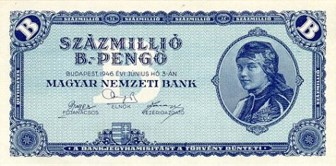
```

</center>

## Zimbabwean Hyperinflation in Pictures
<center>
```{r out.width = "80%"}
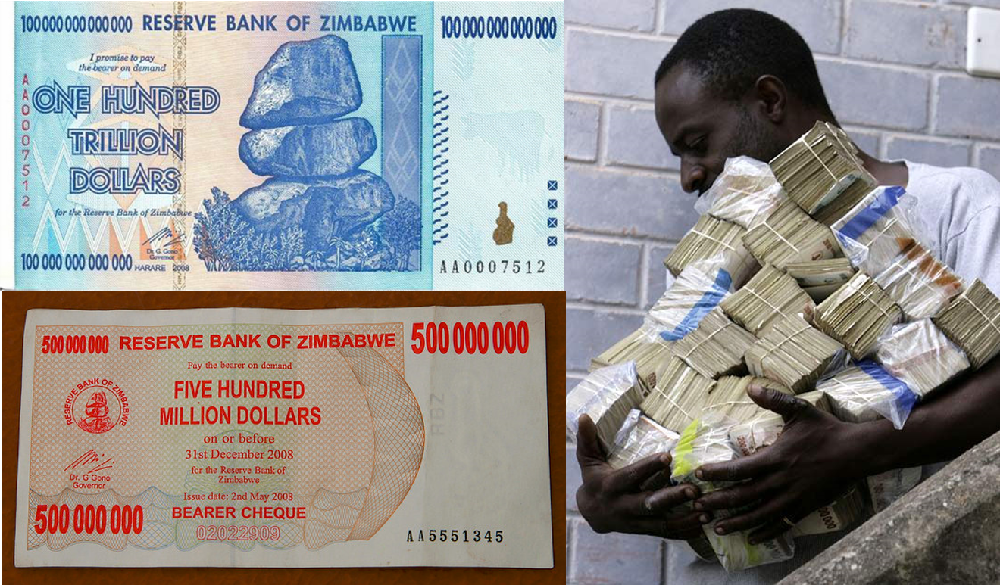
```
</center>

## Zimbabwean Hyperinflation in Pictures

<center>
```{r out.width = "90%"}
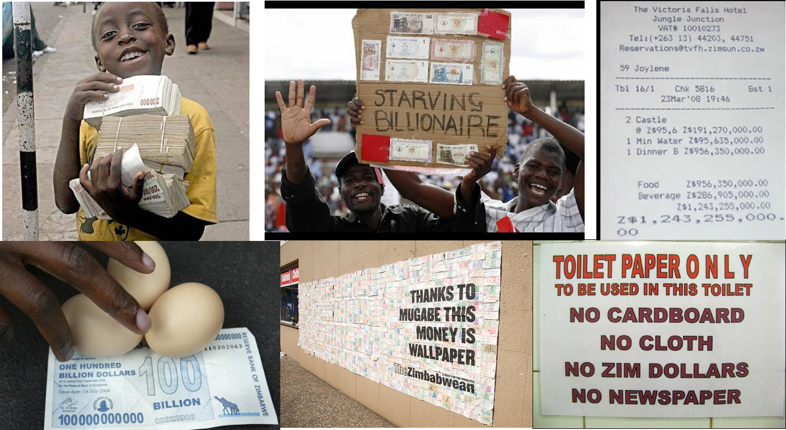
```
</center>

# What Causes Inflation?

## Causes of Inflation

<div style = "float:left; width:50%;">

Given the high rates of inflation in the US beginning in late 2021, this question has come back into public discourse.

The classic economics answer comes from Milton Friedman:  "Inflation is always and everywhere a monetary phenomenon."

In other words, inflation is determined by the rate at which money is created and spent, and NOT by microeconomic forces.

</div>

<div style = "float:right; width:50%;">

<br>

```{r out.width = "90%"}

```

</div>

## Causes of Inflation

In the 2021 inflation, politicians and political pundits argued that microeconomic forces were the cause of inflation.  

We will see some examples on the next few slides.  

## Causes of Inflation

<div style = "float:left; width:50%;">

```{r out.width = "70%", fig.align = 'center'}
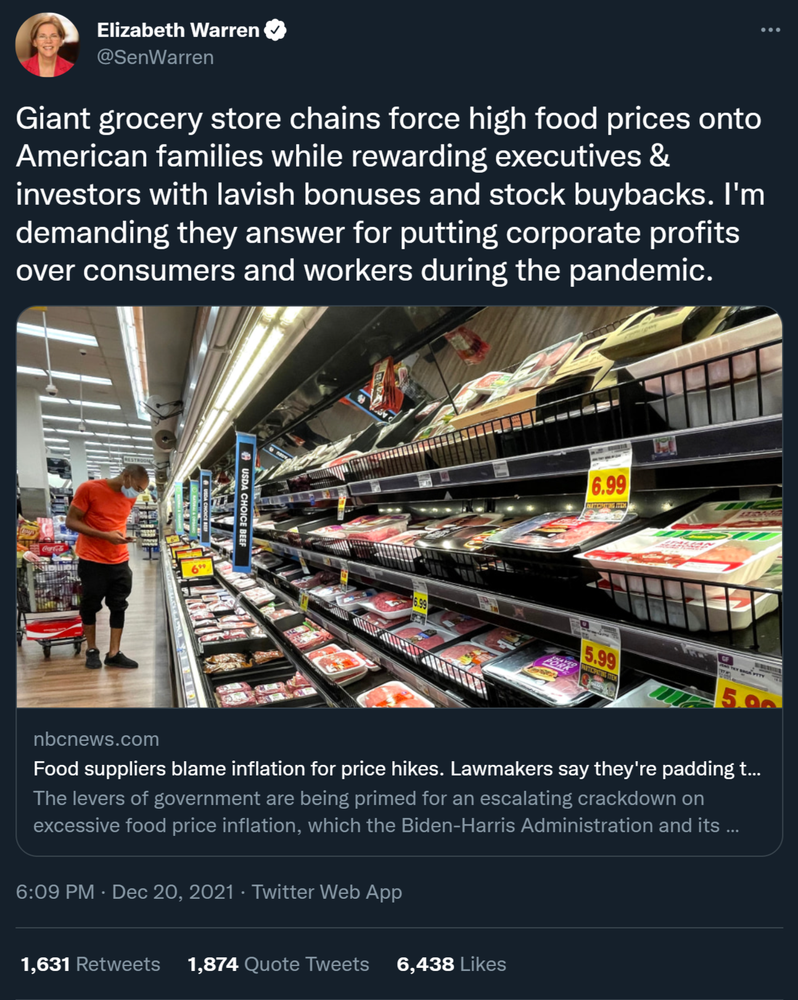
```

</div>

<div style = "float:right; width:50%;">

<br>

```{r out.width = "70%", fig.align = 'center'}
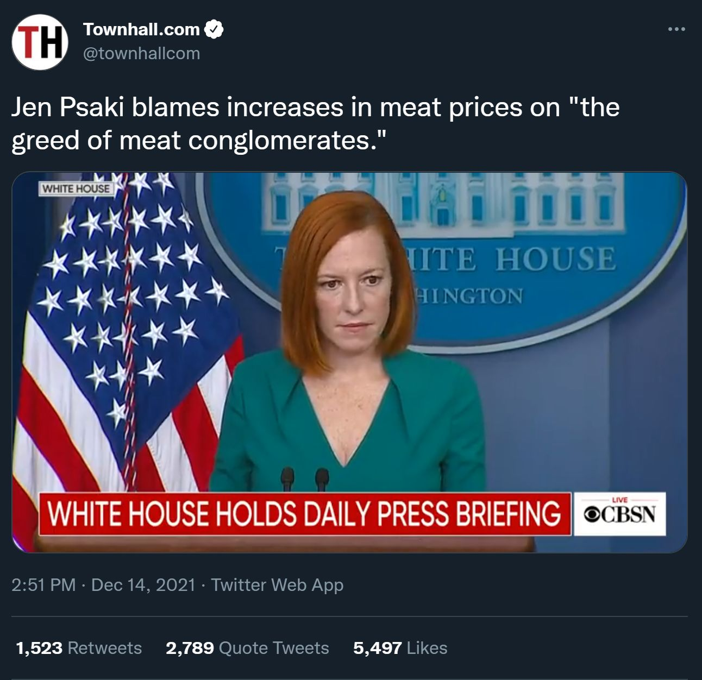
```

</div>

## Causes of Inflation

<div style = "float:left; width:50%;">

```{r out.width = "70%", fig.align = 'center'}
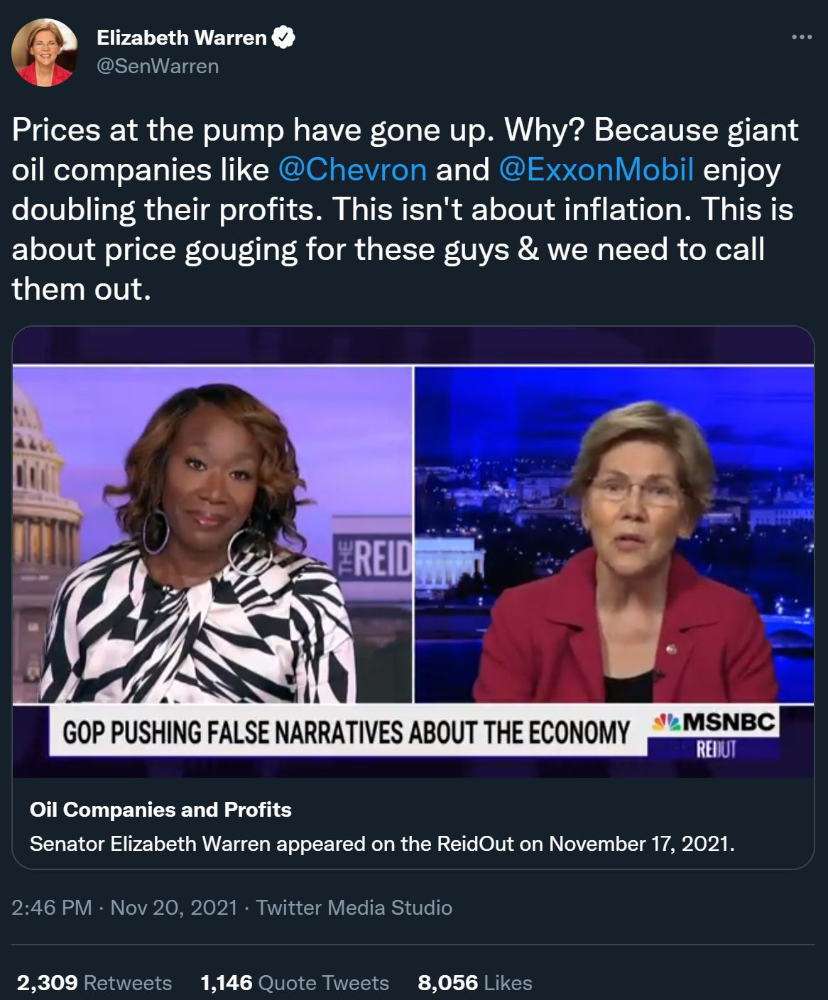
```

</div>

<div style = "float:right; width:50%;">

```{r out.width = "70%", fig.align = 'center'}
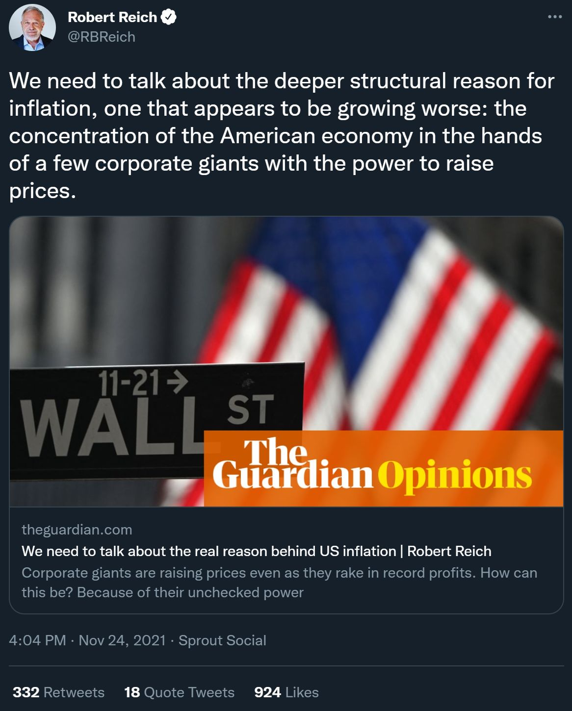
```

</div>

## Causes of Inflation

<div style = "float:left; width:50%;">

<br>

```{r out.width = "80%", fig.align = 'center'}
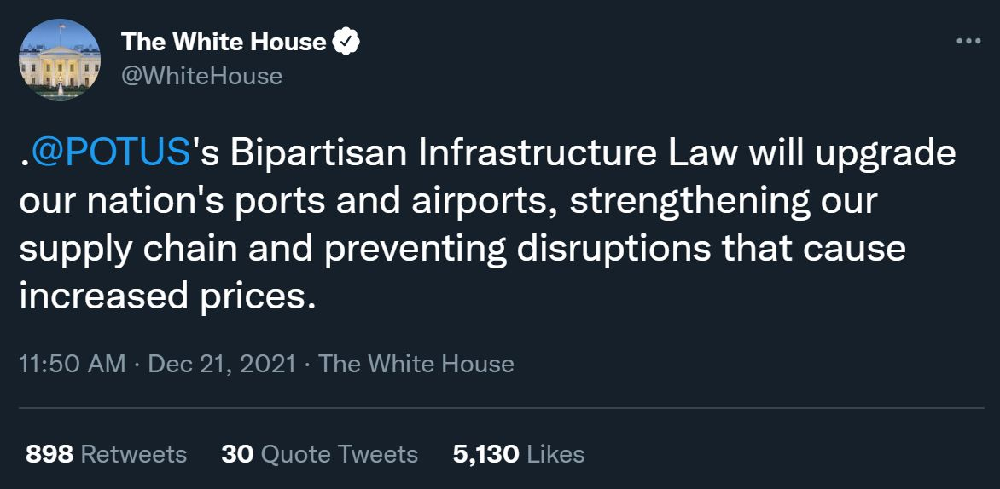
```

</div>

<div style = "float:right; width:50%;">

```{r out.width = "70%", fig.align = 'center'}
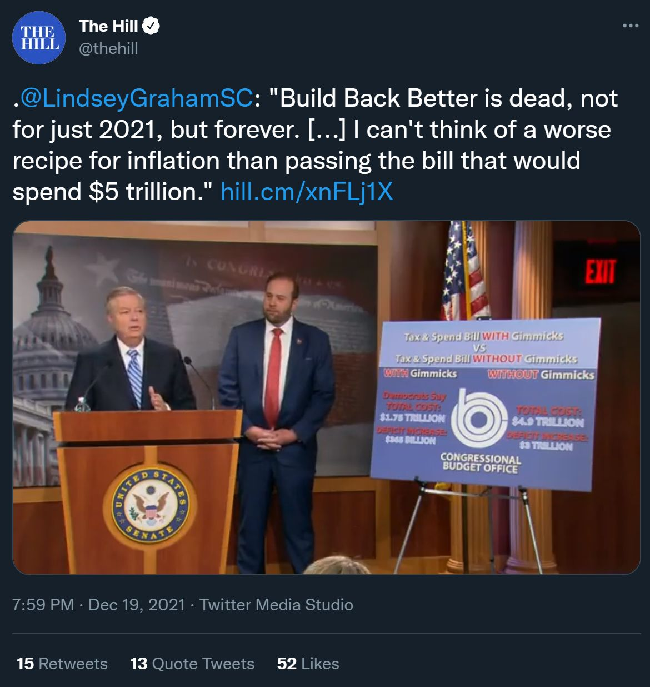
```

</div>

## Causes of Inflation

The preceding tweets illustrated 4 prominent theories on the cause of inflation, none of which are terribly good:

* Greed
* Lack of competition
* Supply chain disruption
* Government spending

## Causes of Inflation

Blaming inflation on corporate greed is the worst of the bunch.

You can't explain a variable with a constant!

Were corporations *less* greedy when inflation was lower?

## Causes of Inflation

While it is true that, *ceteris paribus*, prices tend to be higher in less competitive industries, there still needs to be a mechanism for *why* prices would rise:  

* Is industry concentration rising in the industries in which prices are going up?

Moreover, this view misunderstands inflation--inflation is not a rise in a specific price or set of prices, it is a rise in all prices.

* Most industries carry such small weights in the CPI calculations that this mechanism can't explain inflation.

## Causes of Inflation

Supply chain issues are an example of what is termed "cost-push inflation," the notion that rising consumer prices are a result of rising costs of production.

If inflation refers to prices rising across the economy, the cost-push needs to be economy wide, otherwise the result is just changing relative prices at the microeconomic level.

The supply chain in the global economy is worldwide; if supply chain issues are the cause of US inflation, they should cause inflation everywhere.

* Many developed countries did not experience higher than usual inflation in 2021, and none had as big a jump as did the US.

## Causes of Inflation

In 2021, conservatives argued that increased government spending was the cause of inflation. This is, at best, partially true.  We will cover why this is in more detail when we get to the next set of lecture notes (covering macroeconomic policy), but:

What is false: Government deficit spending, when financed through borrowing during a recession, would be expected to have minimal effect on inflation.  

What is true: deficit spending done *outside* of a recession is likely to increase inflation.

## Causes of Inflation

The upshot is that policies targeting these issues will not affect inflation. 

<div style = "float:left; width:50%;">

```{r out.width = "70%", fig.align = 'center'}
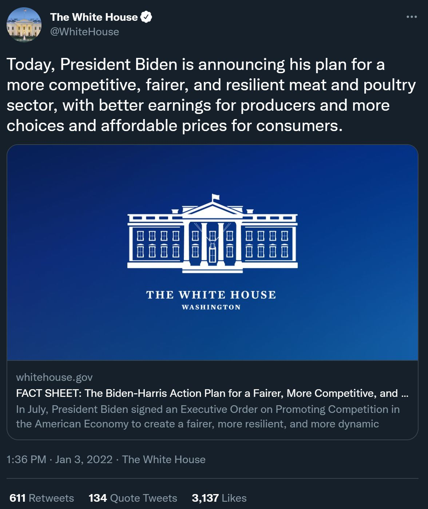
```

</div>

<div style = "float:right; width:50%;">

```{r out.width = "70%", fig.align = 'center'}
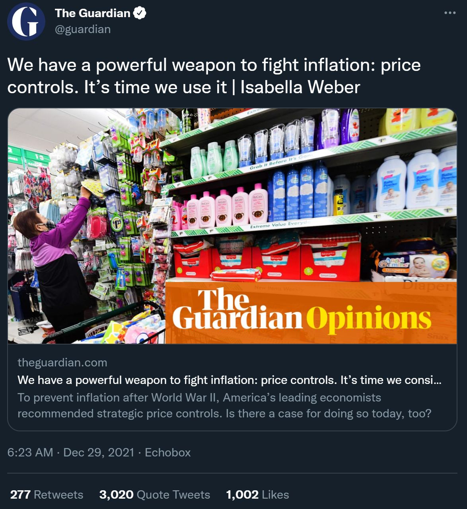
```

</div>

# The Quantity Theory of Money
## The Quantity Theory of Money

The **Quantity Theory of Money** sets forth the general relationship between inflation, money, real GDP, and the price level

The general form of the quantity theory is $M \cdot V=P \cdot Y$, where

- $M =$ Money supply
- $V =$ Velocity of Money
- $P =$ Price level
- $Y =$ real GDP
  
**Velocity** ($V$) is the average number of times that a dollar is used to purchase goods/services in a year.

## The Quantity Theory of Money

It is often more useful to think of the quantity theory in terms of growth rates,  $\dot{M}+\dot{V}=\dot{P}+\dot{Y}$, where

- $\dot{M}$ is the growth rate of the money supply
- $\dot{V}$ is the growth rate of velocity
- $\dot{P}$ is inflation
- $\dot{Y}$ is real GDP growth.

With this formulation, we can rewrite this as a theory of inflation:

$\dot{P}=\dot{M}+\dot{V}-\dot{Y}$

## The Quantity Theory of Money

If $\dot{P}=\dot{M}+\dot{V}-\dot{Y}$, what has to happen for $\dot{P}$ to be a huge number, as in a hyperinflating economy?

Generally speaking, $\dot{V}$ and $\dot{Y}$ tend to be very small numbers.

Real GDP growth, $\dot{Y}$, is limited by an economy's factors of production--capital, human capital, technology.  In most economies, $\dot{Y}$ is a number like 1 or 2 percent.  

$\dot{V}$ is also generally a very small number.  Intuitively, it measures increases or decreases in spending.  The factors that move $\dot{V}$ change slowly.

## The Quantity Theory of Money


<div style = "float:left; width:50%;">
<br>

If $\dot{V}$ and $\dot{Y}$ tend to be very small numbers, and $\dot{P}$ is large, it can only mean one thing.  $\dot{M}$ must be a large number.

As Milton Friedman said, "Inflation is always and everywhere a monetary phenomenon."

</div>

<div style = "float:right; width:50%;">

<br>

```{r out.width = "90%"}

```

</div>

## The Quantity Theory of Money

<div style = "float:left; width:70%;">

```{r include = FALSE}
getSymbols("M2V", src = "FRED", return.class = "data.frame")
getSymbols("CPIAUCSL", src = "FRED", return.class = "data.frame")
getSymbols("GDPC1", src = "FRED", return.class = "data.frame")
getSymbols("M2SL", src = "FRED", return.class = "data.frame")

data <- merge(CPIAUCSL, GDPC1, by.y = "row.names", by.x = "row.names")

data$date <- data$Row.names
data <- subset(data, select = -Row.names)

data2 <- merge(M2V, M2SL, by.y = "row.names", by.x = "row.names")

data2$date <- data2$Row.names
data2 <- subset(data2, select = -Row.names)

qtom <- merge(data, data2, by = "date")

qtom <- qtom %>% 
    mutate(inflation = (CPIAUCSL - lag(CPIAUCSL, 4))/lag(CPIAUCSL,4)) %>% 
    mutate(velocity = (M2V - lag(M2V, 4))/lag(M2V,4)) %>% 
    mutate(growth = (GDPC1 - lag(GDPC1, 4))/lag(GDPC1,4)) %>% 
    mutate(moneysupply = (M2SL - lag(M2SL, 4))/lag(M2SL,4))

qtom <-na.omit(qtom) 
qtom$date <- type.convert(qtom$date)
qtom$date <- as.Date(qtom$date)

qtom <- qtom %>% 
    mutate(quantitytheory = moneysupply+velocity-growth)


qtom20 <- qtom %>% 
    filter(date>as.Date("1984-12-31"))
```

```{r warning = FALSE}
ggplot(qtom20) +
   geom_rect(data = recession.df, aes(xmin = start, xmax = end, ymin = -Inf, ymax = +Inf), fill = color5, alpha = .3) +
    geom_line(aes(x = date, y = inflation), color = color2, size = 1) +
    geom_line(aes(date, quantitytheory),
              color = color3,
              # linetype = "dashed",
              size = 1) +
    theme_classic() +
    geom_hline(aes(yintercept = 0), lty = 2, color = color5) +
    labs(
        title = "Inflation and the Quantity Theory of Money",
        subtitle = "US Data",
        x = "Date",
        y = "Inflation",
        caption = "Expected inflation is calculated as: Change in M2 + Change in M2 velocity - Real growth
         Changes calculated as percentage change over previous year.
         Data from FRED, created by Matt Dobra @mattdobra"
    ) +
    scale_x_date(limits = as.Date(c("1985-01-01", Sys.Date())),
        expand = c(0,0),   
        labels = date_format("%Y"),
        breaks = function(x)
            seq.Date(
                from = as.Date("1910-01-01"),
                to = as.Date(Sys.Date()),
                by = "5 years"
            )) +
    scale_y_continuous(labels = percent_format(accuracy = 0.1))+
    annotate(
        geom = "text",
        x = as.Date("2010-1-01"),
        y = .049,
        label = "CPI Inflation Rate",
        hjust = 0,
        vjust = 0,
        color = color2
    ) +
    annotate(
        geom = "text",
        x = as.Date("2010-1-01"),
        y = .044,
        label = "Expected Inflation Rate",
        hjust = 0,
        vjust = 0,
        color = color3
    ) 


```

</div>

<div style = "float:right; width:30%;">

<br>
<br>

Even in an economy like that of the US, where inflation is kept low, the quantity theory does a pretty good job of predicting inflation.

</div>

## The Quantity Theory of Money

**Deflation** is when price levels fall.  Based on the quantity theory, this would imply that $\dot{M}+\dot{V}<\dot{Y}$.

Economists are mixed on whether or not deflation is bad for an economy

- Is deflation a cause or symptom of economic slowdown?

## The Quantity Theory of Money
  
The stability of $\dot{V}$ doesn't always hold up under extreme economic conditions.

- Recessions and depressions reduce spending, meaning that falling $\dot{Y}$ causes $\dot{V}$ to fall. - In periods of hyperinflation, $\dot{V}$ tends to spike because money is losing its value so quickly.

# Costs of Inflation
## Costs of Inflation

Why is inflation a problem?

- Inflation creates "noisy" prices
- Inflation distorts taxes
- Inflation leads to "shoe-leather" and "menu" costs
- Inflation redistributes wealth
- Inflation undermines financial markets
- Inflation is painful to stop

## Noisy Prices

Prices generated within the supply and demand framework do two very important things in an economy:

- Transmit information about the scarcity of resources, and
- Incentivize people to economize on their use of scarce resources.

Inflation messes with prices, and thus reduces the ability of a market to function.

## Noisy Prices

**Price confusion** exists when people in the economy cannot determine whether or not price changes are due to inflation or changes in supply and demand.

If a small business owner finds that she can raise her prices, is this because:

- demand for her products has increased? If so, she should expand her output!
- inflation is happening?  If so, she should not expand.

Inflation increases the likelihood that decision makers will make the wrong economic decisions.

## Noisy Prices

**Money Illusion** is the notion that pepole think in nominal terms, not real terms.  

If a person gets a raise, what has happened to their real purchasing power?  

- If there is no inflation, their purchasing power has gone up by the amount of their raise.  They can consume more if they choose.
- If there is inflation, then their purchasing power has changed by the amount of their raise *less the rate of inflation*.  
  - If their raise is perfectly offset by inflation, a person suffering from money illusion will consume more, even though their purchasing power has not changed.

## Inflation and Taxes

Inflation is inherently a form of tax called **seigniorage**.

If the government prints more money, some of the purchasing power in your money gets transferred into the newly printed money. 

Moreover, inflation produces tax burdens and liabilities that typically harm taxpayers. For example: 

- capital gains taxes are paid on nominal gains.  
- Depreciation is based on initial purchase price.

In either case, taxpayers will pay more in tax if there is inflation.

## Menu and Shoe-Leather Costs

When inflation is high, the value of money falls.

This encourages people to spend their money faster than they otherwise would.

**Shoe-Leather Costs** refers to the extent this inflation makes people waste their time and energy trying to avoid the costs of inflation.

Similarly, **Menu Costs** are the costs to businesses of changing their prices through such means as printing new menus, new catalogs, reprogramming POS systems, changing advertising, etc.

## Inflation Redistributes Wealth

Inflation redistributes wealth in a number of ways.

As seen before, seigniorage redistributes wealth from private citizens to the government.

Inflation also redistributes wealth between borrowers and lenders.

## Inflation Redistributes Wealth

To see this, let's look at the Fisher Equation: $r=i-\pi$

Where:

- $r$ is the real rate of return (or real interest rate)
- $i$ is the nominal rate of return (or nominal interest rate)
- $\pi$ is $\dot{P}$ or the inflation rate.

## Inflation Redistributes Wealth

The intuition of the Fisher Equation is as follows:

Say you borrow \$100 at 10\% interest for one year, so you will pay back \$10 in a year's time.

If there is no inflation, the \$110 you pay back has 10\% more purchasing power than the \$100 you borrowed, so he lender is earning a *real* rate of return of 10\%. 

What if there is $\pi=\dot{P}=10\%$ instead?  When you pay back your loan of \$110 in a year, that \$110 has the same purchasing power as the \$100 you borrowed initially.  The lender gets a 0\% *real* rate of return!

## Inflation Redistributes Wealth

Lenders aren't dumb. They know that inflation will erode their rate of return.

Nominal interest rates, $i$, have *expected inflation* $\pi^{e}$ built in to them: this is called the **Fisher effect**.

If actual inflation is *higher* than unexpected inflation $(\pi>\pi^{e})$ then inflation transfers wealth from lenders to borrowers.

If actual inflation is *lower* than unexpected inflation $(\pi<\pi^{e})$ then inflation transfers wealth from borrowers to lenders.


## Inflation Undermines Financial Markets

The Fisher effect leads into the next problem with inflation: inflation is very detrimental to financial markets.

This is because inflation volatility increases with inflation rates.    

Recall the Fisher equation, $r=i-\pi^{e}$, and assume $\pi^{e}$ is accurate within 25\%.

if $\pi^{e}$ is 2\%, then $\pi$ will lie between 1.5\% and 2.5\%; lenders are willing to take on inflation risk.

But if $\pi^{e}$ is 20\%, and thus $\pi$ will be something between 15\% and 25\%, lenders are likely to be scared off.

## Inflation Undermines Financial Markets

For example, during the Venezuelan hyperinflation, private lending fell by 95\%.

If Financial institutions cannot operate, markets that rely on lending are disrupted, greatly hampering the economy.

## Inflation is Painful to Stop

A final reason to avoid inflation is that ending inflation has the potential to create a recession.

The Volcker Disinflation provides a good exmaple.

US inflation in the 70s hovered around 10\%. The Volcker Disinflation reduced inflation to around 3\%.

Cutting inflation was necessary, however the short term effect was that this caused the US to go into a recession.

# The Federal Reserve
## The Federal Reserve

The Federal Reserve is the Central Bank of the United States and is broken into 12 districts.

<center>

```{r out.width = "45%"}
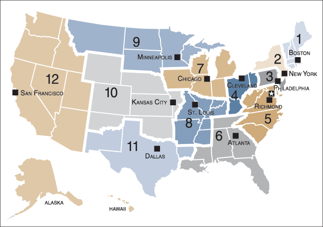
```

</center>

You many not be aware of this, but you have been seeing references to this system your whole life.

## The Federal Reserve

Each piece of paper currency is marked with the Federal Reserve branch that issued it!

- Small notes (especially \$1s) and older notes have the seal of the reserve bank just to the left of the portrait.
- Most modern notes have an identifier (A1, B2, ... , L12) beneath the serial number on the top left. The number is a reference to the issuing reserve bank.

## The Federal Reserve

The Federal Reserve performs anumber of functions. They:

- Issue and create money
- Have two sets of customers 
  - US federal government 
  - Banks
- Regulate the financial sector (especially banks)
- Manage the clearinghouse payment system

## Money

**Money** is anything that is generally accepted as a medium of exchange.

Today, most monies are created by a government body, but they needn't be (e.g. cryptocurrency, bank issued money)

Money can emerge spontaneously without central design.

## Money

In the US, the three most important definitions of the money supply are:

- The **Monetary Base** (MB): currency outstanding plus total reserves at the Fed.
- **M1**: MB plus checkable deposits.
- **M2**: M1 plus savings deposits, money-market deposits, and short-term CDs. 

**Liquidity** refers to how quickly an asset can be converted into cash.  

MB is perfectly liquid since it *is* cash, M1 is very liquid since it incldues immediately accessible deposits, and M2 is pretty liquid as well since it is money that people could access very quickly if they chose.

## Money

The Federal Reserve wants to control M1 and M2, however they only have direct control over MB

- M1 and M2 are influenced by the actions of private citizens and banks.

M1 and M2 are created by banks due to Fractional reserve banking.

**Fractional Reserve Banking** refers to a system in which banks only keep a fraction of their deposits on reserve.  

## Money

Fractional reserve banking allows banks to simply create money.

How much money they create depends on the **reserve ratio**--the fraction of deposits banks keep as reserve.

$Reserve\;Ratio=\frac{Value\;of\;Reserves}{Value\;of\;Deposits}$

While the Fed sets a minimum Reserve ratio, if banks want to be more liquid they can set their reserve ratio higher.

## Money

If the Fed doesn't control the reserve ratio, then they cannot control the money multiplier.

The **money multiplier** is the amount by which the money supply expands for every dollar increase in reserves.

$Money\;Multiplier=\frac{1}{Reserve\;Ratio}$

## Money

Assume that banks have a reserve ratio of 10\% 

- the money multiplier is then $\frac{1}{10\%}=10$

Also, assume and that the Fed creates \$10,000 in new money that they simply put in your account.  

- Thus, M goes up by \$10,000.

Because the reserve ratio is 10\%, the bank keeps \$1,000 on reserve and loans out \$9,000.

## Money

Assume I borrow that \$9,000.  Either I put it in my bank, or buy something and it winds up in someone else's bank.  

- M goes up by *an additional* $9,000, and the bank lends out \$8,100.

This process continues *ad infinitum* until $\$10,000(\frac{1}{10\%})=\$100,000$ new money has been created.

## Money

The Fed uses three primary means by which to control the money supply

- Open market operations: buying and selling US government bonds on the open market
- Discount rate lending: lending various financial institutions, especially banks
- Changing bank reserves: adjusting the required reserve ratio, or paying interest on reserves held at the Fed

## Open Market Operations

**Open Market Operations** refers to the Federal Reserve buying and selling US treasury bonds.

If the Fed buys bonds, they are trying to *stimulate the economy* 

- Buying bonds is the same as lending to the private sector, so they are adding money to the economy.
- Buying bonds reduces interest rates, encouraging private borrowing.  

If the Fed sells bonds, they are trying to *control inflation* 

- Selling bonds is the same thing as borrowing from the private sector, so they are taking money out of the economy.
- Selling bonds increases interest rates, discouraging private borrowing.

## Open Market Operations

Typically, the Fed communicates their intentions through announcements regarding the interest rate.

If the Fed announces an *increase* in interest rates, they are selling bonds and reducing the money supply.

if the Fed announces a *decrease* in interest rates, they are buying bonds and increasing the money supply.

## The Fed as a Lender

The Fed has the greatest influence over the **Federal Funds rate** - the interest rate banks charge each other for overnight loans.

The Fed also controls the **Discount Rate** - the rate the fed charges banks on loans.

Banks typically only borrow from the Fed as a last resort in a crisis.
The two major crises that banks might face are solvency crises and liquidity crises.

## The Fed as a Lender


A **Solvency crisis** is when the value of a bank's liabilities exceeds the value of its assets.

- This tends to happen when a lot of a bank's loans default at once.
- To ensure against this, banks hold "capital" - safe assets like government bonds.
- To help prevent solvency crises, the Fed imposes capital requirements.

A **Liquidity crisis** is when a lot of a bank's depositors want to get their money at the same time

- This can impact even healthy banks
- The danger here is contagion effects and bank runs
- The FDIC is designed to avoid liquidity crises.

## The Fed as a Lender

What happens if a bank is insolvent?

- Typically, the FDIC steps in and pays depositors and the bank is closed.
- In 2008, so many banks were insolvent at the same time that the fed bailed many of them out instead.
  - The Fed lent an estimated \$9 trillion in overnight loans between March 2008 and May 2009 to try to stave off a full-blown depression.
  
## Bank Reserves

The Fed can adjust the required reserve ratio (recall that the money multiplier is a function of the reserve ratio).

- Increasing the reserve requirement decreases the money supply, decreasing the requirement increases the money supply
- But, the required reserve ratio is a *minimum*, and cautious banks can choose to keep their ratio higher.  

## Bank Reserves

Starting in 2008, the Fed offered interest rates on the deposits banks held at the fed.

- Higher interest rates will encourage banks to sit on their money, reducing the money supply.
- Lower rates encourage banks to lend more, increasing the money supply

