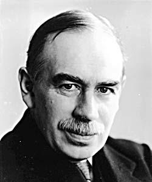
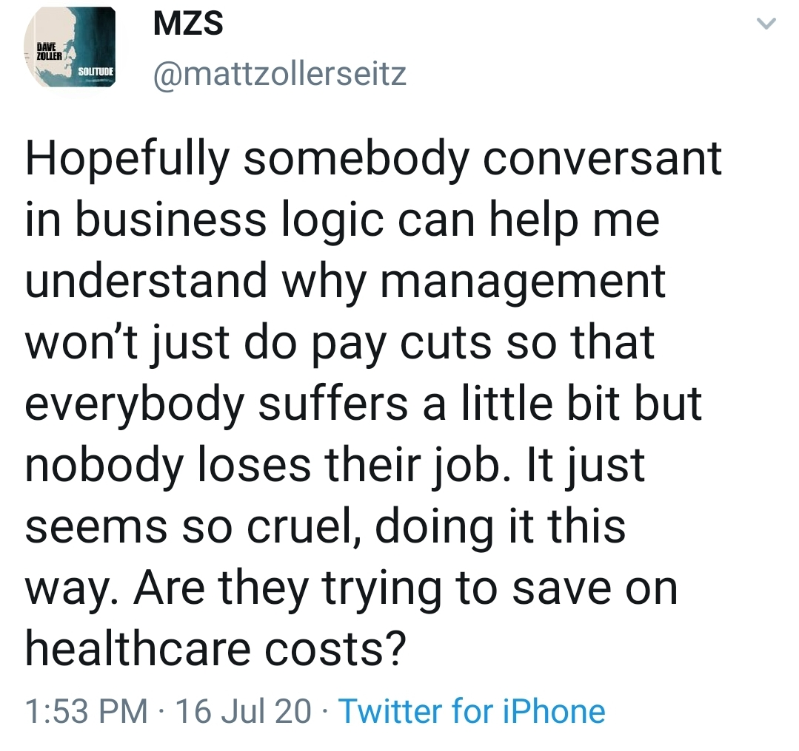
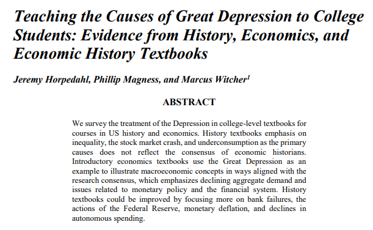
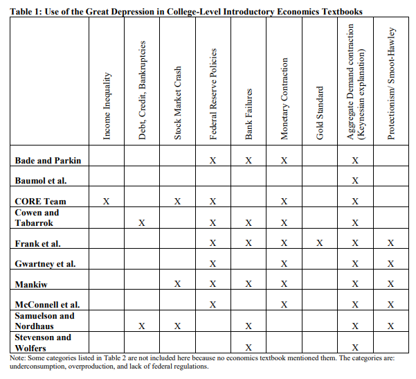
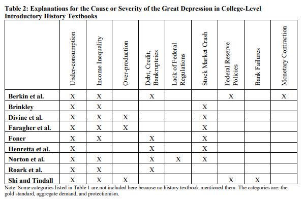
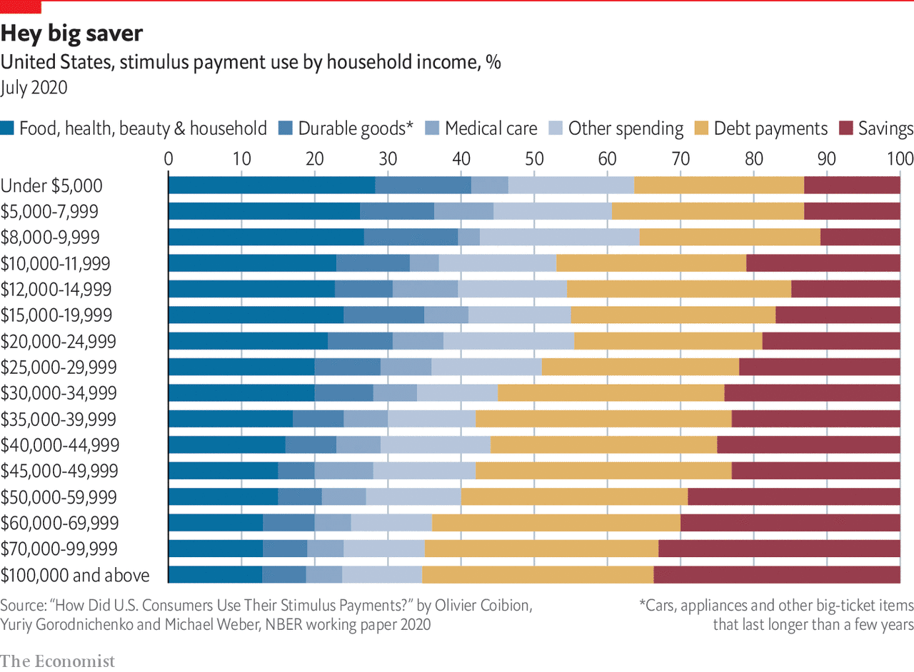

# Business Cycles
## Business Cycles

<div style = "float:right; width:30%;">

**Business cycle**: the notion that the actual growth rate of an economy fluctuates around its long term growth trend the movement.

The business cycle has 4 phases: expansion, peak, contraction, and trough.

</div>
 
<div style = "float: left; width: 70%;">


</div>
## Business Cycles

<div style="float:right; width:70%;">


</div>

<div style="float:left; width:30%;">

<br> 

Business cycles, particularly the contraction and the trough, have significant consequences.

For example, unemployment tends to spike during recessions.

</div>

## Modeling the Business Cycle

To understand *why* business cycles happen, and what can be done to prevent/mitigate them, we will examine two models:

- The **New Classical** or the **Real Business Cycle** (RBC) Model
- The **New Keynesian** Model

The New Keynesian model is built on top of the RBC model.

## Modeling the Business Cycle

These models are built in the **aggregate demand** - **aggregate supply** (AD-AS) framework.

- Long Run Aggregate Supply (LRAS)
- Aggregate Demand (AD)
- Short Run Aggregate Supply (SRAS)

The difference between the two models is that the New Keynesian model includes all three curves but the RBC model does not include SRAS.

## Modeling the Business Cycle

The AD-AS framework can be expressed as either be a **static model** or a **dynamic model**.

A **static model** looks at the economy at one point in time.

- This means AD-AS looks at the relationship between Real GDP and the price level.

A **dynamic model** looks at how the economy is changing over time.

- AS-AD becomes a model of Real GDP growth and inflation.

These notes discuss the **dynamic** version of AD-AS.

Either way, the graphs look roughly the same!

# The New Classical Model
## Long Run Aggregate Supply

The **Long Run Aggregate Supply (LRAS)** curve represents an economy's maximum growth rate.

Key assumption: if supply or demand shifts in a microeconomic market, the price in that market will adjust immediately.  

- If this happens, then the economy will grow at its maximum rate.

## Long Run Aggregate Supply

<div style="float: left; width: 50%;">

Inflation, $\dot{P}$, is on the y-axis.

Real growth, $\dot{Y}$, is on the x-axis.

The Long Run Aggregate Supply curve is perfectly vertical.  Why?

- If prices in the economy adjust immediately, then the growth rate of the economy is independent of the inflation rate!

</div>


## Long Run Aggregate Supply

<div style="float: left; width: 50%;">

**Productivity Shocks** cause LRAS to shift

- A shock that increases productivity shifts LRAS to the right
- A shock that decreases productivity shifts LRAS to the left

</div>


## Aggregate Demand

**Aggregate Demand** shows the relationship between spending, inflation, and growth.

We've already seen an equation that looks at this relationship: the quantity theory of money.

$\dot{M}+\dot{V}=\dot{P}+\dot{Y}$, where

- $\dot{M}$ is the growth rate of the money supply
- $\dot{V}$ is the growth rate of velocity
- $\dot{P}$ is inflation
- $\dot{Y}$ is real GDP growth.

## Aggregate Demand

The left side of the quantity theory equation, $\dot{M}+\dot{V}$, says that spending increases come from:

- There is more money in the economy than before, so $\dot{M}$ has increased, and/or
- People are spending their money faster than before, so $\dot{V}$ has increased.

If spending has increased, the right side of the equation tells us what that extra spending is going toward. The two candidates are:

- More goods and services, thus $\dot{Y}$ has increased, and/or
- Goods and services simply cost more than before, and $\dot{P}$ has increased

## Aggregate Demand

<div style="float:left; width:70%;">

The quantity theory equation, then, can be thought of as saying:

$Change\:in\:Spending =\dot{P}+\dot{Y}$

The Aggregate Demand curve traces out the different combinations of $\dot{P}$ and $\dot{Y}$ that correspond to a given change in spending.  

The table on the right shows some of the possible combinations of $\dot{P}$ and $\dot{Y}$ that correspond to $\dot{M}+\dot{V}=5\%$

</div>

<div style="float:right; width:30%;">

<table class="rmdtable table" style="width: auto !important; margin-left: auto; margin-right: auto;">
 <thead>
  <tr>
   <th style="text-align:right;"> $\dot{M}+\dot{V}$ </th>
   <th style="text-align:right;"> $\dot{P}$ </th>
   <th style="text-align:right;"> $\dot{Y}$ </th>
  </tr>
 </thead>
<tbody>
  <tr>
   <td style="text-align:right;color: #FFFFFF !important;background-color: #00205B !important;"> 5 </td>
   <td style="text-align:right;"> 0 </td>
   <td style="text-align:right;"> 5 </td>
  </tr>
  <tr>
   <td style="text-align:right;color: #FFFFFF !important;background-color: #00205B !important;"> 5 </td>
   <td style="text-align:right;"> 1 </td>
   <td style="text-align:right;"> 4 </td>
  </tr>
  <tr>
   <td style="text-align:right;color: #FFFFFF !important;background-color: #00205B !important;"> 5 </td>
   <td style="text-align:right;"> 2 </td>
   <td style="text-align:right;"> 3 </td>
  </tr>
  <tr>
   <td style="text-align:right;color: #FFFFFF !important;background-color: #00205B !important;"> 5 </td>
   <td style="text-align:right;"> 3 </td>
   <td style="text-align:right;"> 2 </td>
  </tr>
  <tr>
   <td style="text-align:right;color: #FFFFFF !important;background-color: #00205B !important;"> 5 </td>
   <td style="text-align:right;"> 4 </td>
   <td style="text-align:right;"> 1 </td>
  </tr>
  <tr>
   <td style="text-align:right;color: #FFFFFF !important;background-color: #00205B !important;"> 5 </td>
   <td style="text-align:right;"> 5 </td>
   <td style="text-align:right;"> 0 </td>
  </tr>
</tbody>
</table>

</div>


## Aggragate Demand

<div style="float: left; width: 50%;">

As with the LRAS graph:

- Inflation, $\dot{P}$, is on the y-axis.

- Real growth, $\dot{Y}$, is on the x-axis.

The aggregate demand curve is downward sloping with a slope of -1.

</div>


## Aggregate Demand

<div style="float: left; width: 50%;">

As shown in the graph to the right, increases in either $\dot{M}$ or $\dot{V}$ shift the AD curve to the right.

By the same logic, decreases in either $\dot{M}$ or $\dot{V}$ shift the AD curve to the left.

</div>


## The New Classical Model

<div style="float: left; width: 50%;">

The New Classical, or Real Business Cycle (RBC) model, includes the two curves introduced above.

The RBC model is in equilibrium where the two curves intersect.

If spending growth is $\dot{M}+\dot{V}=5\%$ and the LRAS gives $\dot{Y} = 3\%$, then inflation must be $\dot{P} = 2\%$

</div>


## The New Classical Model

The goal of the AS-AD model is to explain fluctuations in the economy, or why $\dot{Y}$ moves around.

This means looking at what might cause the equilibrium in our RBC model to move, particularly to the left or the right.

What are the effects of shifting the LRAS and/or AD curve on the macroeconomic equilibrium?

## The New Classical Model

<div style="float: left; width: 50%;">

Suppose a positive productivity shocks shifts the LRAS to the right, and the new growth potential is 4%.

The equilibrium moves from point A to point B

- the growth rate increases to 4\%
- the inflation rate falls to 1\%

</div>


## The New Classical Model

<div style="float: left; width: 50%;">

A decline in productivity, on the other hand, shifts LRAS to the left.  

The graph on the right shows a shift to LRAS = 2%.

The equilibrium moves from point A to point B

- the growth rate falls to 2\%
- the inflation rate rises to 3\%

</div>


## The New Classical Model

<div style="float: left; width: 50%;">

An increase in spending shifts the AD curve to the right.  

Assume spending increases from $\dot{M}+\dot{V}=5\%$ to $\dot{M}+\dot{V}=7\%$

As the economy moves from point A to point B, $\dot{P}$ increases but $\dot{Y}$ remains unchanged.

Similarly, a decrease in AD would reduce inflation, but would not affect growth.

</div>


## The New Classical Model

The only causes of the business cycle in the RBC model are productivity shocks.  

If the RBC model is correct, then most of what the government does to stave off recessions--fiscal policy to increase $\dot{V}$ and monetary policy to increase $\dot{M}$--has no hope of working.

- This is a result of the model's assumption -- that prices in microeconomic markets adjust very quickly.
- Most economists believe this assumption to be false.  While prices may adjust in the long run, they may not in the short run.

# The New Keynesian Model
## The New Keynesian Model

<div style = "float: left; width:70%;">

The New Keynesian Model is sometimes referred to as the "Neoclassical Synthesis."

- It is the fusion of the New Classical model and the Keynesian model.

the term "Keynesian" refers to John Maynard Keynes (1883-1946) and, in particular, his ideas in "The General Theory of Employment, Interest, and Money" from 1936.

Keynes was trying to explain the Great Depression

Key idea: if prices do not adjust quickly in he short run, changes to Aggregate Demand can cause recessions.

</div>

<div style = "float: right; width:30%;">



## The New Keynesian Model

Most economists believe prices do not adjust quickly in the short run.

- More importantly, most economists believe that some prices adjust far more quickly than others.

This phenomenon is known as **price rigidity** or **price stickiness**.

Both **sticky wages** and **sticky prices** can generate situations in which unexpected inflation encourages economic growth. 

## Sticky Prices

There are a wide variety of reasons why price may be sticky.

- Long term contracting 
- Input and/or output hedging
- Menu costs
- Psychological effects 
    - e.g. anchoring bias, status quo bias, price confusion

## Sticky Wages

Wages are likely to be particularly sticky, because many labor contracts are for 1+ years 

- While such contracts can include *expected* inflation, by definition they can't include *unexpected* inflation. 

This implies that when inflation is higher or lower than expected, companies might expect to see their the prices they sell their outputs at change quicker than the prices they pay for their inputs. 

## Sticky Wages

<div style = "float: right; width:33%;">


```{=html}
<div class="grViz html-widget html-fill-item-overflow-hidden html-fill-item" id="htmlwidget-273b60824a5e2056f84e" style="width:100%;height:432px;"></div>
<script type="application/json" data-for="htmlwidget-273b60824a5e2056f84e">{"x":{"diagram":"digraph flowchart {\n      # node definitions with substituted label text\n      node [fontname = Helvetica, shape = rectangle]        \n      tab1 [label = \"Inflation higher than expected\"]\n      tab2 [label = \"The prices firms sell their products for increase\nfaster than wages due to sticky wages\"]\n      tab3 [label = \"Revenues increase faster than costs, \n therefore firm profits rise\"]\n      tab4 [label = \"Firms produce more or expand\nin response to increased profits\"]\n\n      # edge definitions with the node IDs\n      tab1 -> tab2 -> tab3 -> tab4;\n      }","config":{"engine":"dot","options":null}},"evals":[],"jsHooks":[]}</script>
```

</div>

<div style = "float: right; width:33%;">


```{=html}
<div class="grViz html-widget html-fill-item-overflow-hidden html-fill-item" id="htmlwidget-831b2c2644535b0f3669" style="width:100%;height:432px;"></div>
<script type="application/json" data-for="htmlwidget-831b2c2644535b0f3669">{"x":{"diagram":"digraph flowchart {\n      # node definitions with substituted label text\n      node [fontname = Helvetica, shape = rectangle]        \n      tab1 [label = \"Inflation lower than expected\"]\n      tab2 [label = \"The prices firms sell their products for decrease\nfaster than wages due to sticky wages\"]\n      tab3 [label = \"Revenues decrease faster than costs, \n therefore firm profits fall\"]\n      tab4 [label = \"Firms produce less or contract\nin response to decreased profits\"]\n\n      # edge definitions with the node IDs\n      tab1 -> tab2 -> tab3 -> tab4;\n      }","config":{"engine":"dot","options":null}},"evals":[],"jsHooks":[]}</script>
```

</div>

<div style = "float: left; width:33%;">

The two diagrams show the effect of unanticipated inflation/disinflation with sticky wages.

Unanticipated: 

- inflation $\rightarrow$ faster growth
- disinflation $\rightarrow$ slower growth

This implies that the Short Run Aggregate Supply (SRAS) curve will be upward sloping!

</div>

## Sticky Prices

<div style="float: left; width: 50%;">

Keynes argued that prices (especially wages) should be far more sticky *downward* than *upward*.  

Thus,if there is unanticipated disinflation, workers won't accept pay cuts, so you are more likely to see layoffs.  

- This implies the SRAS should be relatively flat on the left side of the LRAS

</div>


## Why Are Wages Sticky Downward

<div style="float: left; width: 70%;">

Consider this tweet from journalist Matt Zoller Seitz shortly after layoffs at Vulture Magazine.

Why don't companies just cut pay across the board? Benefits may be part of the story, but also:

- Pay cuts lower morale of workers.
  - "When is pay going back up?" becomes constant question.
  - Layoffs may lower morale too, but likely less so.
- Layoffs can be made based on productivity.
- Remaining workers work harder.
- Pay cuts lead to your best workers getting poached.


</div>

<div style="float: left; width: 30%;">

<br>
<br>



</div>

## Sticky Prices

<div style="float: left; width: 50%;">

Conversely, the SRAS curve must eventually go vertical.  

Ultimately, there is a limit to how fast an economy can grow; no amount of inflation can turn growth infinite!

</div>


## The New Keynesian Model

<div style="float: left; width: 50%;">

The SRAS is drawn for a specific rate of *expected inflation*. Here, $\pi^{e}=2\%$.

The New Keynesian model is in long run equilibrium if there is a point where LRAS=SRAS=AD.

This requires actual inflation, $\dot{P}$ or $\pi$, to equal expected inflation $\pi^{e}$

The SRAS curve shifts when $\pi^{e}$ changes.

</div>


## The New Keynesian Model

<div style="float: left; width: 50%;">

For now, ignore AD and assume the economy is at point A.

If $\pi^{e}=2$ but $\pi=4$, unanticipated inflation leads to increased profits, firms expand their production, and the economy moves to B.

The economy **cannot stay** at B indefinitely, as expectations will adjust to match actual inflation

SRAS shifts up to SRAS~2~, and the economy moves to point C.

</div>


## The New Keynesian Model

New Classical/Real Business Cycles model implied that AD shocks have no effect on growth.

This is not the case in the New Keynesian model.

- Sticky prices allow the economy to move off the LRAS in the short run

## The New Keynesian Model

<div style="float: left; width: 50%;">

Assume the economy starts at point A and spending growth rises to $\dot{M}+\dot{V}=7\%$.

In the short run, the economy moves to point B. Inflation and growth increase.

The economy can't stay at B, $\pi^{e}<\pi$. Inflation expectations adjust upward, and SRAS shifts up.

The economy eventually adjusts to point C, growth slows back down and inflation rises.

</div>


## The New Keynesian Model

What might cause a change in spending?

Changes in $\dot{M}$ are typically the result of monetary policy.

Changes to $\dot{V}$ are likely more varied

It is useful to think about changes in $\dot{V}$ via changes to the 4 components of GDP:

- $\dot{C}$, $\dot{I}$, $\dot{G}$, $\dot{NX}$

In other words, spending might fall because of a drop in private consumption, private investment, government purchases, or a change in the balance of trade.

## The New Keynesian Model

The New Keynesian Model suggests that positive AD shocks only generate short run boosts to growth.

It also suggests that negative AD shocks will only have temporary reductions in growth.

This is a key difference between New Keynesian and traditional Keynesian theory -- traditional Keynesian theory argued a slow growth economy can get "stuck" there.

## The New Keynesian Model

<div style="float: left; width: 50%;">

Assume the economy starts at point A and spending growth falls to $\dot{M}+\dot{V}=3\%$ due to a drop in consumption.

In the short run, the economy moves to point B. Inflation and growth decrease.

The economy can't stay at B. Inflation expectations could adjust downward, but remember: sticky prices. 

In this case it is likely for consumption to simply return to its original level and the AD curve to shift back.

</div>


## The New Keynesian Model

<div style = "float: left; width:70%;">


</div>

<div style = "float: right; width:30%;">

The idea of a self-correction is a mainstream economic idea.

Note the graph on the left's prediction of the post-Great Recession economy - Obama's economists predicted the economy would recover on its own eventually.


## The New Keynesian Model

<div style = "float: left; width:70%;">


</div>

<div style = "float: right; width:30%;">

If a recession will fix itself, what is the point of macroeconomic policy?  

Typically, the goal is to *speed up* the recovery. 

## The New Keynesian Model

The key insight of the New Keynesian Model:

- changes in AD cause the business cycle

What causes these changes?

## The New Keynesian Model

<div style = "float:right; width:49%;">

Factors that might increase the AD:

- Increasing the money supply
- Consumer confidence
- Positive wealth shocks
- Lower taxes
- Government Stimulus
- Increased exports
- Decreased imports

</div>

<div style = "float:left; width:49%;">

Factors that might decrease the AD:

- Cutting the money supply
- Consumer fear
- Negative wealth shocks
- Higher taxes
- Government Spending Cuts
- Decreased exports
- Increased imports

</div>

## The Great Depression 

Does the New Keynesian Model help us understand the Great Depression?

The Great Depression(1929-1940) was the worst economic period in the US

- GDP fell by 27%
- Unemployment hit 25\%
- The DJIA fell by roughly 90\%
- As a world-wide event, gave rise to National Socialism movement in Germany

## The Great Depression

The Great Depression began with the stock market crash in October 1929

- Stock Market crashes are negative wealth shocks, which reduce spending.
- The stock market crashed in part because the Fed was reducing the money supply

These two combine to shift the AD left

Consistent with New Keynesian Theory, the economy started to recover quickly on its own.

- Unemployment peaked at 9\% in December 1929/January 1930
- By June 1930, unemployment had already begun to recover and was around 6.3\%

## The Great Depression

There are 2 competing theories about the Great Depression.

1. President Hoover failed to react to the Depression, allowed it to get worse and the Depression was evidence of the failure of free market economies. FDR's New Deal was ultimately the thing that saved America.
2. The Great Depression was prolonged by government policies intended to reduce the severity and duration of the Depression. This includes policies enacted by both Hoover and FDR.

## The Great Depression

<div style = "float: right; width:65%;">



</div>

<div style = "float: left; width:33%;">

Horpedahl et. al. (2024) examined the treatment of the great depression in college textbooks:

* The first story is the one commonly told in history classrooms in the US
* The second theory is far more consistent with the economic record. 

</div>

## The Great Depression

<div style = "float: left; width:49%;">



</div>

<div style = "float: right; width:49%;">



</div>


## The Great Depression

Ultimately, the Great Depression was made worse by government policies.

June 1930 marks the beginning of government intervention to end the Great Depression (Smoot-Hawley Tariff).

Following the passage of the Tariff, unemployment started to rise quickly into double-digits and stayed above 10\% for the rest of the 1930s.

## The Great Depression

The deepening of the Depression causes consumers to lose confidence in banks and withdraw their money.

During the first 4 years of the Great Depression, roughly half of all US banks went bankrupt.

This led to fewer loans, and private investment fell.

Fewer loans, via the money multiplier, reduced the money supply even further.

Most of these issues could have been fixed/lessened by simply increasing the money supply.

## The Great Depression

Contrast these behaviors with those of the Great Recession (2009-2011).

Like the Great Depression, the Great Recession was brought on by a wealth shock 

- housing price collapse (housing bubble)

Unlike during the Great Depression, the Federal Reserve pumped tons of liquidity into the financial sector to try to prevent another depression.

## The Great Depression

In addition to AD shocks, productivity shocks may have shifted the LRAS to the left.

- Bank failures decimated the financial sector, making it difficult for savers and investors to lend/borrow.
- The Smoot-Hawley Tariff of 1930 was intended to boost demand for US made goods.
    - Instead, the rest of the world responded with retaliatory tariffs.
    - Eliminating international trade is a big negative productivity shock
- The Dust Bowl: natural disasters are typically negative productivity shocks.

# Fiscal Policy

## Fiscal Policy

Governments have two major policy tools at their disposal for responding to recessions.

The general goal is to try to *speed up* the recovery of Aggregate Demand after it shifts to the left.  

- *Monetary Policy*: actions undertaken by the Central Bank to increase $\dot{M}$
- *Fiscal Policy*: actions undertaken by the Congress/President, typically in the form of government stimulus or tax cuts, to increase $\dot{V}$

In either case, the goal is to shift the AD curve back to the right.

## Fiscal Policy

<div style="float: left; width: 50%;">

Assume the economy starts at point A and spending growth falls to $\dot{M}+\dot{V}=3\%$ due to a drop in consumption (i.e. $\dot{C}$ falls, therefore $\dot{V}$ falls).

The economy moves toward point B. Inflation and growth decrease.

Rather than waiting for $\dot{C}$ to recover, the government might simply spend more, increasing $\dot{G}$.

If done quickly enough, the economy may not even get all the way to point B!


</div>


## Fiscal Policy

If the government is going to spend more money, where does that money come from?

1. Increased taxes
2. Selling bonds (borrowing)

Both of these, however, reduce AD further. 

This implies that fiscal policy only works if the economy is in a recession.

- Increasing spending in a healthy economy simply cannibalizes the more productive private sector.
- In a recession, resources (capital, workers) are idle, so this is less likely.

## Fiscal Policy

Government spending turns into private sector income.  

This private sector income turns into private consumption and investment and gives rise to the:

**Keynesian Multiplier**: If the economy is operating below full employment, an increase in government spending will generate increases in private spending.

The practical effect of the Keynesian Multiplier is that government spending does not need to fully offset any private drops in AD. 

# Limits of Fiscal Policy

## Limits of Fiscal Policy

Fiscal policy holds the potential to smooth out economic fluctuations. 

There are, however, a number of reasons why it may not be effective.

- Crowding out
- Long and variable lags
- Politics trumps economics
- Can't fix LRAS/productivity shocks with AD.

## Crowding Out

**Crowding Out**: Increases in government spending reduce spending in other parts of the economy.

Fiscal stimulus implies either more government spending or reduced taxes.

Either way, the government needs to get more money, either via:

- Raising taxes, or
- Selling bonds (borrowing).

Both can generate crowding out.

## Crowding Out

Why does raising taxes to finance fiscal policy generate crowding out?

- Answer is straightforward: higher taxes reduce private spending ($\Downarrow \dot{C}$ or $\dot{I}$)

Crowding out is only avoided if taxpayers wouldn't have spent their money.

## Crowding Out

Borrowing money to finance fiscal policy crowds out private spending as well.

- Why? Because government borrowing pushes up interest rates.
- Rising interest rates reduces investment and purchases of interest sensitive products.

Crowding out is only avoided if there is little saving/borrowing activity in the private sector.

To see why, let's look at the **Market for Loanable Funds**.

## Market for Loanable Funds

<div style="float: left; width: 50%;">

- The **Market for Loanable Funds** looks at the **supply** of loans and the **demand** for borrowing. 
- The **price** in this market is the **nominal interest rate**.
- We start with this market in equilibrium of **private** borrowing only: D~1~ only includes demand from the private sector.
- The amount of **private borrowing** is Q~1~.

</div>


## Market for Loanable Funds

<div style="float: left; width: 50%;">

- Increased government borrowing shifts demand to D~2~.
- Demand shifting right **increases** interest rates to i~2~.
- At i~2~, **total** borrowing increases to Q~2~, *but this includes both public and private borrowing*!


</div>


## Market for Loanable Funds

<div style="float: left; width: 50%;">

- Recall that D~1~ is still **private** borrowing demand, so Q~0~ is the amount of private borrowing.
- Q~2~ - Q~0~ is government borrowing, but some of that government borrowing is **crowding out** private borrowing that would have happened had the interest rate been lower!
- Q~1~ - Q~0~ is the amount of private borrowing that has been crowded out.

</div>


## Crowding Out

Does crowding out apply if the government cuts taxes instead of increases government spending? 

Yes!  

If the government cuts taxes, they *increase* the budget deficit. 

To close that deficit, they need to borrow money, which again leads to rising interest rates and crowding out.

## Crowding Out

The logic of tax cuts stimulating the economy is twofold:

- **Income effect**: taxpayers have more money, and thus are likely to spend more.
- **Incentive effect**: at lower tax rates, people want to work more.  

The income effect is only likely to happen if tax cuts are *permanent*

In 2008, Bush distributed \$80 billion in tax rebates, a flat amount of $300 per person.

- Because this didn't change tax rates, there was no incentive effect.
- Because it was a one-time event, there was little income effect.


## Crowding Out

<div style = "float: left; width:65%;">



</div>

<div style = "float: right; width:33%;">

Similar to the Bush rebates from 2008, the Covid stimulus was a one-time flat amount per recipient (\$1200) and consequently had minimal income and incentive effects.  

Early estimates of the stimulus impact found that only 42% of the stimulus was spent, while 27% was saved and 31% paid off debts.

</div>

## Crowding Out

If governments cut taxes and borrow money to finance their budget deficit, what should a rational taxpayer do?

**Ricardian Equivalence**: Rational taxpayers should realize that a budget deficit now is effectively a promise to raise taxes later.  If the government cuts taxes now, taxpayers might be better off saving because their tax bills will eventually go up.

The Ricardian Equivalence is an extreme version of crowding out.

## Crowding Out

Could the government simply **print** the money it needs? This is the suggestion of *Modern Monetary Theory* (MMT) economists.

This is perhaps possible for very small amounts of money, maybe a couple percent of GDP.

Beyond that you get inflation or hyperinflation, and crowding out occurs because the purchasing power of money in private hands declines. 

The MMT response is to simply combat inflation with taxes, but taxes will be contractionary.

## Crowding Out


```{=html}
<div class="grViz html-widget html-fill-item-overflow-hidden html-fill-item" id="htmlwidget-c58a7503388fd10ebddc" style="width:100%;height:432px;"></div>
<script type="application/json" data-for="htmlwidget-c58a7503388fd10ebddc">{"x":{"diagram":"digraph flowchart {\n      # node definitions with substituted label text\n      node [fontname = Helvetica, shape = rectangle]        \n      tab1 [label = \"Fiscal Policy to boost AD\"]\n      tab2 [label = \"Stimulus\"]\n      tab3 [label = \"Tax cuts\"]\n      tab4 [label = \"Tax increases\"]\n      tab5 [label = \"Sell bonds/borrow\"]\n      tab6 [label = \"Consumption is crowded out\"]\n      tab7 [label = \"Interest rates rise, crowding\nout consumption and investment\"]\n      \n      # edge definitions with the node IDs\n      tab1 -> tab2 -> tab4 -> tab6;\n      tab1 -> tab3 -> tab5 -> tab7;\n      tab2 -> tab5\n      }","config":{"engine":"dot","options":null}},"evals":[],"jsHooks":[]}</script>
```

## Long and Variable Lags

If the economy is self-correcting, poorly timed policy will have limited effect, or even a negative effect.  

If the government has poor *timing*, then the government's ability to fix problems is undermined.

There are many relevant lags here that can impact policy timing by **years**!

## Long and Variable Lags

**Inside Lag** is the time it takes for the government (or central bank) to respond to an economic shock.  Inside lag includes:

- *Recognition lag*: it takes time to realize there is a problem
- *Decision lag*; it takes time for the government to come up with a plan, vote on it, etc.
- *Implementation lag*: it takes time for the plan to actually go into effect

**Outside Lag** is the time it takes for the implemented policy to actually have an effect.

Monetary policy generally has shorter inside lags than fiscal policy.

## Long and Variable Lags

Examples:

- Kennedy Tax Cut
  - Kennedy cut taxes by about 30%.
  - Passing the law (inside lag) took 3 years (1961-1964)
  - Effect wasn't really felt until 1965-1967
- Bush Tax Cuts
  - In response to 2001 recession, Bush pushed a tax cut act
  - Tax cuts were phased in over 3 years
  - By the time the 2003 cuts hit, the economy had mostly recovered.
  - Most rate cuts were on the rich, who spend a smaller proportion of their income.
  
## Long and Variable Lags

Some policies designed to explicitly not have lags.

**Automatic Stabilizers** are policies that automatically kick in during a recession to stimulate AD without requiring congressional/presidential action.

Examples:

- Welfare
- Unemployment insurance

## Politics and Economics

Good economic policy is not necessarily popular politically, and politically appetizing policies are often bad economics. 

Partisan politics plays a big role in choosing policy

- Democrats tend to choose stimulus
- Republicans tend to choose tax cuts

## Politics and Economics

Ideally, fiscal policy will:

- increase spending in a down economy, and 
- pay off the debt during good times.

In actuality, governments:

- increase spending in a down economy, and
- increase spending during good times.

The result is ever-rising debt

## Politics and Economics

With higher debt, a larger share of a governments budget goes toward paying interest.

Countries with high debt have significant risk of default, capital flight, depression, recession,  social unrest, etc

Recent and notable examples: 

- Argentina
- Cyprus 
- Greece
- Latin American debt crisis - La Década Perdida (1980s)

## Fiscal Policy and Real Shocks

The discussion thus far has implicitly assumed that if the economy is in a recession, it is due to an AD shock.

Not all recessions are AD shocks, some are LRAS shocks.

Stimulating AD in response to an AD shock does little more than drive up inflation.

## Fiscal Policy

What are the implications of these potential limitations of fiscal policy?

To be effective, fiscal policy should:

- be in response to an immediate and obvious emergency (to minimize effects of lag)
- not be done in mild contractions (to minimize crowding out)
- not be done in response to productivity shocks (because all you get is inflation)
