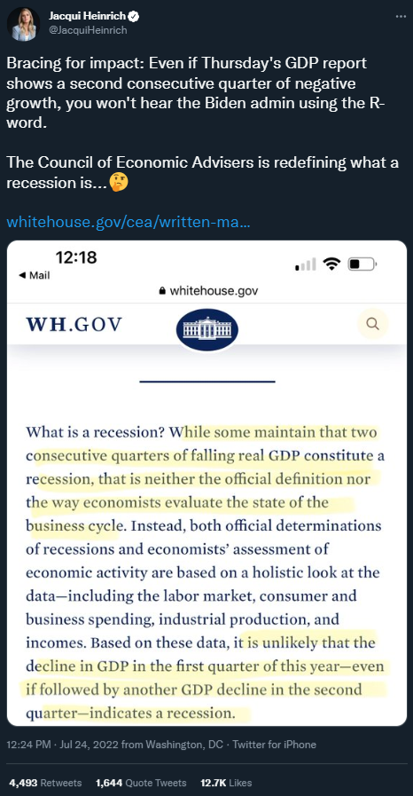

```{r setup, include=FALSE}
library(knitr)
library(tidyverse)
library(dplyr)
library(kableExtra)
library(ggthemes)
library(ggpubr)
library(DiagrammeR)
library(WDI) # World Development Indicators
library(quantmod) # Gets FRED data
library(scales)
theme_set(theme_classic())
knitr::opts_chunk$set(echo = FALSE, dev.args=list(bg="transparent"))

demand <- tibble(p = c(2,8), q = c(8,2))
demandright <- tibble(p = c(3,9), q = c(9,3))
demandleft <- tibble(p = c(1,7), q = c(7,1))
supply <- tibble(p=c(2,8), q=c(2,8))
supplyright <- tibble(p=c(1,7), q=c(3,9))
supplyleft <- tibble(p = c(3,9), q = c(1, 7))

###Color Themes
color1 <- "#FFFFFF" # white
color2 <- "#00205B" # med blue
color3 <- "#0A863D" # green
color4 <- "#99999A" # gray
color5 <- "#041C2C" # Navy

## Create Recession dataframe
getSymbols("USREC",src="FRED")
USREC <- USREC["1855/"]
start <- index(USREC[which(diff(USREC$USREC)==1)])
end   <- index(USREC[which(diff(USREC$USREC)==-1)-1])
if(length(end)<length(start)){
end <- c(end, Sys.Date())    
}
recession.df <- data.frame(start=start, end=end)
rm(start)
rm(end)
rm(USREC)

```


## Market for Loanable Funds

<div style="float: left; width: 50%;">

- The **Market for Loanable Funds** looks at the **supply** of loans and the **demand** for borrowing. 
- The **price** in this market is the **nominal interest rate**.
- We start with this market in equilibrium of **private** borrowing only: D~1~ only includes demand from the private sector.
- The amount of **private borrowing** is Q~1~.

</div>
```{r fig.width=5,fig.height=5, out.extra='style="float:right; padding:1px"'}


ggplot(mapping = aes(x = q, y = p)) + 
    ## Base Graph Begin**
    geom_path(data = demand, color = color2, size = 1.2) + 
    annotate("text", x=8.4, y=2, label = "D[1]", color = color2, size = 6, parse = TRUE) +
    geom_path(data = supply, color = color3, size = 1.2) + 
    annotate("text", x=8.4, y=8, label = "S[1]", color = color3, size = 6, parse = TRUE) +
    coord_equal() +
    theme_classic(base_family = "sans") +
    theme(plot.title = element_text(size = rel(1.4))) +
    ## End Base Graph ##
    ## Graph Labels -- Change title and subtitle as needed ##
    labs(x = "Quantity of Loans", y = "Interest Rate",
         title = "Market for Loanable Funds",
         subtitle = "The interest rate serves as the price in this market") + # Subtitle
    
    ##editing the x and y axes for the equilibria.  If dots aren't needed, still need to keep limit and expand##
    scale_x_continuous(expand = c(0,0), limit = c(0,10), breaks = c(5), labels = expression(Q[1])) + ## Set breaks = equilibrium Q
    scale_y_continuous(expand = c(0,0), limit = c(0,10), breaks = c(5), labels = expression(i[1])) + ## Set breaks = equilibrium Q
  
    ## Dashed Lines for equilibria
    
    annotate("segment", x=0, xend = 5, y = 5, yend = 5, linetype = "dotted") + # horizontal line
    annotate("segment", x=5, xend = 5, y = 0, yend = 5, linetype = "dotted") # vertical line


```

## Market for Loanable Funds

<div style="float: left; width: 50%;">

- Increased government borrowing shifts demand to D~2~.
- Demand shifting right **increases** interest rates to i~2~.
- At i~2~, **total** borrowing increases to Q~2~, but this includes both public and private borrowing.


</div>

```{r fig.width=5,fig.height=5, out.extra='style="float:left; padding:1px"'}
ggplot(mapping = aes(x = q, y = p)) + 
    ## Base Graph Begin**
    geom_path(data = demand, color = color2, size = 1.2) + 
    annotate("text", x=8.4, y=2, label = "D[1]", color = color2, size = 6, parse = TRUE) +
    geom_path(data = supply, color = color3, size = 1.2) + 
    annotate("text", x=8.4, y=8, label = "S[1]", color = color3, size = 6, parse = TRUE) +
    coord_equal() +
    theme_classic(base_family = "sans") +
    theme(plot.title = element_text(size = rel(1.4))) +
    ## End Base Graph ##
    
    ## Demand Right Shift ##
    geom_path(data = demandright, color = color2, size = 1.2, linetype = "dashed") + 
    annotate("text", x=9.4, y=3, label = "D[2]", color = color2, size = 6, parse = TRUE) +
    annotate("segment", x = 3.2, xend = 3.8, y = 7.2, yend = 7.8,
             arrow = arrow(length = unit(.5, "lines")), colour = color4, size = 1) +
    annotate("segment", x = 7.2, xend = 7.8, y = 3.2, yend = 3.8,
             arrow = arrow(length = unit(.5, "lines")), colour = color4, size = 1) +
    
        ## Graph Labels -- Change title and subtitle as needed ##
    labs(x = "Quantit of Loans", y = "Interest Rate",
         title = "Market for Loanable Funds",
         subtitle = "Government borrowing crowds out private borrowing") + # Subtitle
    
    ##editing the x and y axes for the equilibria.  If dots aren't needed, still need to keep limit and expand##
    scale_x_continuous(expand = c(0,0), limit = c(0,10), breaks = c(4,5,6), labels = expression(Q[0],Q[1], Q[2])) + ## Set breaks = equilibrium Q
    scale_y_continuous(expand = c(0,0), limit = c(0,10), breaks = c(5,6), labels = expression(i[1], i[2])) + ## Set breaks = equilibrium Q
    ## Arrows
       annotate("segment", x = .4, xend = .4, y = 5.2, yend = 5.8,
             arrow = arrow(length = unit(.5, "lines")), colour = color4, size = 1) +    
  
    ## Dashed Lines for equilibria
    annotate("segment", x=0, xend = 5, y = 5, yend = 5, linetype = "dotted") + # horizontal line
    annotate("segment", x=5, xend = 5, y = 0, yend = 5, linetype = "dotted") + # vertical line
    annotate("segment", x=0, xend = 6, y = 6, yend = 6, linetype = "dotted") + # horizontal line
    annotate("segment", x=4, xend = 4, y = 0, yend = 6, linetype = "dotted") + # vertical line
    annotate("segment", x=6, xend = 6, y = 0, yend = 6, linetype = "dotted") # vertical line

```

## Market for Loanable Funds

<div style="float: left; width: 50%;">

- Recall that D~1~ is still **private** borrowing demand, so Q~0~ is the amount of private borrowing.
- Q~2~ - Q~0~ is government borrowing, but some of that government borrowing is **crowding out** private borrowing that would have happened had the interest rate been lower!
- Q~1~ - Q~0~ is the amount of private borrowing that has been crowded out.

</div>

```{r fig.width=5,fig.height=5, out.extra='style="float:left; padding:1px"'}
ggplot(mapping = aes(x = q, y = p)) + 
    ## Base Graph Begin**
    geom_path(data = demand, color = color2, size = 1.2) + 
    annotate("text", x=8.4, y=2, label = "D[1]", color = color2, size = 6, parse = TRUE) +
    geom_path(data = supply, color = color3, size = 1.2) + 
    annotate("text", x=8.4, y=8, label = "S[1]", color = color3, size = 6, parse = TRUE) +
    coord_equal() +
    theme_classic(base_family = "sans") +
    theme(plot.title = element_text(size = rel(1.4))) +
    ## End Base Graph ##
    
    ## Demand Right Shift ##
    geom_path(data = demandright, color = color2, size = 1.2, linetype = "dashed") + 
    annotate("text", x=9.4, y=3, label = "D[2]", color = color2, size = 6, parse = TRUE) +
    annotate("segment", x = 3.2, xend = 3.8, y = 7.2, yend = 7.8,
             arrow = arrow(length = unit(.5, "lines")), colour = color4, size = 1) +
    annotate("segment", x = 7.2, xend = 7.8, y = 3.2, yend = 3.8,
             arrow = arrow(length = unit(.5, "lines")), colour = color4, size = 1) +
    
        ## Graph Labels -- Change title and subtitle as needed ##
    labs(x = "Quantit of Loans", y = "Interest Rate",
         title = "Market for Loanable Funds",
         subtitle = "Government borrowing crowds out private borrowing") + # Subtitle
    
    ##editing the x and y axes for the equilibria.  If dots aren't needed, still need to keep limit and expand##
    scale_x_continuous(expand = c(0,0), limit = c(0,10), breaks = c(4,5,6), labels = expression(Q[0],Q[1], Q[2])) + ## Set breaks = equilibrium Q
    scale_y_continuous(expand = c(0,0), limit = c(0,10), breaks = c(5,6), labels = expression(i[1], i[2])) + ## Set breaks = equilibrium Q
    ## Arrows
       annotate("segment", x = .4, xend = .4, y = 5.2, yend = 5.8,
             arrow = arrow(length = unit(.5, "lines")), colour = color4, size = 1) +    
  
    ## Dashed Lines for equilibria
    annotate("segment", x=0, xend = 5, y = 5, yend = 5, linetype = "dotted") + # horizontal line
    annotate("segment", x=5, xend = 5, y = 0, yend = 5, linetype = "dotted") + # vertical line
    annotate("segment", x=0, xend = 6, y = 6, yend = 6, linetype = "dotted") + # horizontal line
    annotate("segment", x=4, xend = 4, y = 0, yend = 6, linetype = "dotted") + # vertical line
    annotate("segment", x=6, xend = 6, y = 0, yend = 6, linetype = "dotted") # vertical line

```

## Recessions

<div style = "float: left; width: 65%;">

<br>
<br>

In the summer of 2022, there was a major political battle in the US over the definition of a recession. 

Consider this tweet from a Fox News anchor in advance of the Second Quarter's GDP announcement:

</div>

<div style = "float: right; width: 35%;">

```{r fig.align = 'center'}

```
</div>

## Recessions

"Two consecutive quarters of negative economic growth" is not, and never has been, the actual definition used among economists for identifying recessions.

"Two consecutive quarters..." is more of a rule of thumb:

* *Usually* (but not always) coincides with the official definition.

* Easy for the public, media, and politicians to understand.

The reality, though, is that there is not a hard-and-fast rule for identifying recessions: In other words, recessions are a vibe!

## Recessions

The practical benefit of the "two consecutive quarters" rule of thumb is that it allows for the identification of recessions in real time, which the NBER definition does not.  

* The recession beginning in December 2007 was not identified by the NBER until December 2008

* The NBER did not declare the 1969-1970 recession until September 1971

## Recessions

There is considerable overlap between the "two consecutive quarters" rule and the official NBER recessions, but it is not identical.

* The two-quarters rule would not have identified 2001 as a recession.

* The two-quarters rule would suggest that the 1973-1975 recession actually started in 1974.

Moreover, it is worth noting that GDP data gets updated months, sometimes even years, after the initial reports, which could impact  dating with the two-quarter rule.